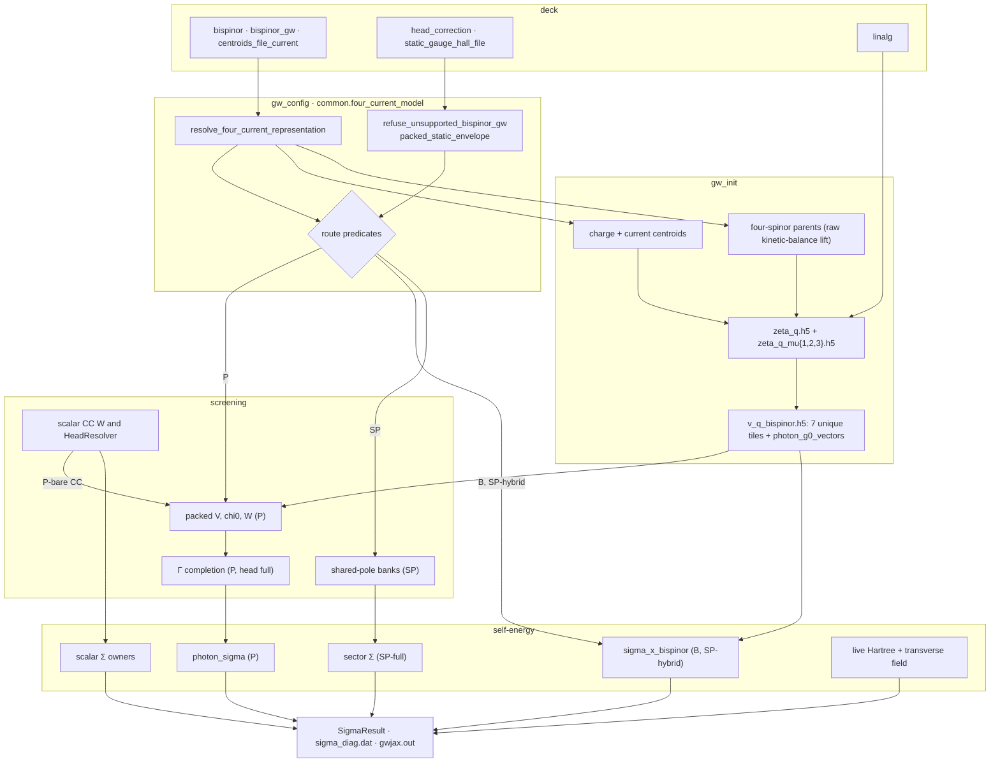

# Four-current (bispinor) wiring

This page maps the four-current layer stage by stage: for each stage, the
owning function, the object it produces with its shape and sharding, the
route it serves, what it costs and what refuses. The physics (the Γ-cell
heads, the frequency each channel carries, what is zero by construction) is
[Four-current heads and frequency](../theory/four-current-head-corrections.md).
Deck-key semantics are the [input reference](../input_reference.md)'s, and
module one-liners are [Codebase](codebase.md)'s.

Notation: $n_C$, $n_T$ are the charge and current centroid counts, and
$p_C$, $p_T$ their mesh-padded extents. $N_{\rm packed}=p_C+3p_T$. $n_q$
is the q-IBZ count, $N_k$ the full k count, and $P$ the process count.

## Routes and predicates

`bispinor_gw ∈ {bare_transverse, full_static_cohsex, full_shared_pole}`
(`gw_config.BispinorGWMode`). The value selects which Lorentz blocks are
screened and who contracts Σ; every value resolves to the same raw
kinetic-balance carrier. The retired spellings `charge_hall_cubature`,
`pauli_reference_bare_transverse` and
`isometric_kinetic_balance_bare_transverse` refuse by name
(`_RETIRED_BISPINOR_GW_MODES`, read by `coerce_bispinor_gw_mode`), and each
refusal names its replacement.

| route | predicate (`gw_config`) | current χ blocks | Σ^B contracted by |
|---|---|---|---|
| **P-screened** | `packed_photon_screens_current` (`full_static_cohsex`) | all sixteen built; one packed Dyson solve | `gw.photon_sigma`, TT part of the packed Σ |
| **P-bare** | `packed_bare_transverse_route(config)[0]` | zero by declaration; CC from the scalar owner, $W={\rm diag}(W_{00},D_{TT})$ | `gw.photon_sigma` |
| **B** (incumbent) | `bare_transverse`, none of the others | none; bare TT tiles contracted directly | `gw.sigma_x_bispinor` |
| **SP-hybrid** | `uses_bare_transverse_shared_pole` | none; CC is a shared-pole bank | `gw.sigma_x_bispinor` |
| **SP-full** | `uses_full_bispinor_shared_pole` | ordered CC/CT/TC/TT sector bank | `gw.sigma_x_bispinor` for bare exchange; the dynamic sectors by the [sector Σ consumer](../dev/sector_sigma_consumer.md) ([shared-pole model](shared_pole_model.md)) |

"P" rows below apply to both packed modes. `uses_static_photon_response`
is true on P-screened and P-bare.

Orthogonally, `compute_mode` decides how much of Σ the packed operator owns:

| compute mode | packed Σ blocks | charge Σ | predicate |
|---|---|---|---|
| `cohsex` | all sixteen (`blocks = "all"`) | the CC block of the packed operator | `packed_photon_replaces_charge_sigma` |
| `gn_ppm`, `hl_ppm` | the fifteen with a current index (`blocks = "current"`), at $\omega=0$ | scalar $\Sigma_x+\Sigma_c(\omega)$ on the scalar $W_{00}$, with the scalar head and PPM pipeline unchanged | `uses_dynamic_packed_photon_route` |

`mpa` has no packed arm. It has no independent static-role $W$, so the
bare family's CC block would have no owner.

**The packed envelope** is one table, `gw_config.packed_static_envelope(config, *, screened)`.
It yields `(accepted, got, want, class, why, derived_key)` rows, walked both
by the route predicate and by the screened mode's refusal:

| row | applies to |
|---|---|
| `compute_mode ∈ PACKED_PHOTON_COMPUTE_MODES = {cohsex, gn_ppm, hl_ppm}` | both |
| `qp_solver = one_shot_dft` | both |
| `screening_diagrams = w_rpa` | both |
| `head_correction ∈ {full, off}` | both |
| `linalg = distributed` | both |
| no scalar-head override named (`scalar_head_overrides_named`) | screened |

`sys_dim` is outside the table. P-bare treats `sys_dim = 2` as a routing
condition. P-screened refuses `sys_dim ≠ 2` only under
`head_correction = full` (`GATE static_bispinor_photon_head_slab_only`),
and one row cannot express both. The route predicate returns
`(taken, reason)`. The driver prints the reason as the `Photon route`
line, because the routes differ in their $q\to0$ mechanism. With the
default `linalg = local`, `bare_transverse` stays on B.

Further predicates:

| predicate | answers |
|---|---|
| `uses_coupled_photon_head` | packed and `head_correction = full`: run the Γ completion and keep the four literal-Γ vectors |
| `uses_bare_tt_gamma_head` | insert the bare TT overlay into $V$: SP-hybrid unless `off`; B with GN/HL or `x_only` under `full`, `sys_dim ∈ {2,3}` |
| `uses_direct_bispinor_shared_pole_head` | SP-full with `head_correction = no_local_fields` |

## The map

## Stage 1: deck to config

| key | default | lands on | read by |
|---|---|---|---|
| `bispinor` | `false` | `config.bispinor` (the master switch) | every stage |
| `bispinor_gw` | `bare_transverse` | `config.bispinor_gw` | route predicates |
| `centroids_file_current` | unset | `config.paths.centroids_file_current` | `gw_init`; a bispinor run without it refuses |
| `head_correction` | `full` | `config.head.correction` | head producers, envelope |
| `static_gauge_hall_file` | unset | `config.paths.static_gauge_hall_file` | P Γ completion. Unset means $\sigma_H=0$, announced; a named path is authenticated by the loader |
| `linalg` | `local` | the parser-cached `LinalgResolution` | Dyson plan, transverse ζ solver |

`bispinor_tt_head_correction` is a removed deck key. `read_lorrax_input`
refuses it at any value. The field `config.head.bispinor_tt_head_correction`
is wired `False`, and `GATE packed_bare_transverse_tt_head_double_count`
guards a hand-built `True` on a packed route. The overlay is decided by
`uses_bare_tt_gamma_head` alone.

**The carrier resolver.**
`common.four_current_model.resolve_four_current_representation(bispinor, model)`
returns a frozen `FourCurrentRepresentation` with the fields
`charge_bispinor`, `charge_lift`, `current_bispinor`, `current_lift`,
`scalar_head_bispinor`, `charge_representation` and
`spatial_current_representation`. It has two outcomes: scalar (all false,
source-WFN charge) and bispinor (raw kinetic-balance lift for both
families). `model` is accepted and ignored. The resolver exists because the
representation strings are the provenance stamps that the `dipole.h5`,
`kin_ion.h5` and ζ authenticators compare, and they need one producer. It
is not stored on the config: consumers call it, so grep for the function
name.

## Stage 2: initialization (`gw_init`)

| object | producer | shape, dtype | sharding | route |
|---|---|---|---|---|
| charge centroids | `file_io.centroids.load_centroid_basis` | `(n_C, 3)` | host | all |
| current centroids and `meta_transverse` | `gw_init` (refuses without `centroids_file_current`) | `(n_T, 3)` i32; `Meta` with `n_rmu = n_T`, `nspinor = npol = 4`, orbit-packed basis | host | all |
| four-spinor ψ | `common.bispinor_init.lift_to_4spinor` (via `WfnLoader`) | `(n_k, n_b, 4, n_G)` c128, $[\psi_L;\ (\alpha_{FS}/2)\sigma\cdot(k+G)\psi_L]$ | caller's | all |
| parent faces | `wavefunction_bundle.ParentGreenCarrier`, separate C and T families | `psi_nmu (n_parent, n_b, 4, μ)`, `psi_mun (n_parent, 4, μ, n_b)` | `P(None,'x',None,'y')`, `P(None,None,'x','y')` | all |
| charge ζ | `isdf_fitting.fit_zeta_to_h5` | `tmp/zeta_q.h5`, G-flat `(n_q, n_C, n_G)` c128 | written through SlabIO | all |
| three current ζ | the same fit, `vertex_mu_L ∈ {1,2,3}` | `tmp/zeta_q_mu{1,2,3}.h5`, `(n_q, n_T, n_G)` c128 | same | all |
| bare $D^{IJ}$ tiles | `v_q_bispinor.compute_V_q_bispinor_g_flat_to_h5` | `v_q_bispinor.h5`: 7 datasets `(n_q, n_L, n_R)` c128, format `bispinor_lorentz_v2` | device tile `P(None,'x','y')` | all |
| tile reader | `file_io.restart_bundle.BispinorVqReader.get_tile` | `(n_q, p_L, p_R)` in packed centroid order | `P(None,'x','y')` | all |
| literal-Γ vectors | written beside the tiles | `photon_g0_vectors_{0..3}`, each `(1, n)` canonical order | read at `P(None,'x')` | P under `full`, SP-full direct head |

**Sixteen tiles, seven on disk.** The six `(0,i)`/`(i,0)` tiles are zero by
Coulomb gauge (`ZERO_TILES`). The three `(j,i)`, $i<j$, are Hermitian
companions rebuilt on read (`HERMITIAN_PAIRS`). CC plus the six unique TT
tiles are computed and written (`UNIQUE_TILES`). Each is one call of the
scalar G-flat tile kernel, streamed to HDF5 and freed, so the peak device
memory is one scalar $V_q$ tile and the build costs seven scalar $V_q$
builds. The TT Lorentz mixing is applied at write time.

**The bare TT overlay** (`uses_bare_tt_gamma_head`, or SP-full's direct
head). `v_q_bispinor._tt_head_tensor` returns the $(3,3)$ f64 tensor
$T_{ab}=\langle vP^T_{ab}\rangle_{\rm mBZ}$ once per run, refusing
`sys_dim ∉ {2,3}`. The per-tile builder writes $T_{ij}/\Omega$ into the
unique $\mathbf q=\Gamma$, $\mathbf G=0$ slot. The spatial-metric sign
(`vcoul.COULOMB_GAUGE_TT_SIGN = -1`) is applied once on the way out; no
vertex or Σ contraction compensates it.

**ζ fits, by channel.** Every channel takes the μ-batch fit
([ζ μ-batch](zeta_fit_mubatch.md)). The three current channels are one fit
on their own centroids: one ψ(G) read, then per batch one X_B, pair GEMM,
all-to-all and set of plane FFTs shared by all three, and one k-convolution
(γ̃^{μ_L} on its load), accumulator and Z store per channel. Each channel
keeps its own C_q^μ, its sign-aware ridged LU
([the solve seam](zeta_fit_mubatch.md#the-solve-seam)) and its canonical
q-IBZ output file `zeta_q_mu{μ_L}.h5`. `gw_jax.zeta_fit_transverse` times
the fit.

## Stage 3: screening

### 3a. The packed body (P)

`w_isdf.compute_static_photon_response` screens both packed modes. Its
`screen_current` argument must equal `gw_config.packed_photon_screens_current(config)`;
it is never defaulted, and a mismatch refuses. `config` is required, and
the head record is built inside, so a caller cannot inject a head.

* **`screen_current = True`** (P-screened): the sixteen no-pair blocks
  (`compute_experimental_no_pair_photon_chi0`; T1/T2/T3 share one
  transverse bundle, and one endpoint class is resident at a time), TT
  Ward-subtracted on the q-IBZ before star transport
  (`_subtract_static_tt_contact`: $\Pi(q)-\Pi(\Gamma)$, row 0 set to exact
  zero). Then one distributed Dyson solve. An external `W_charge` refuses.
* **`screen_current = False`** (P-bare): no current χ block and no packed
  solve. The CC block is the scalar owner's $W(\omega=0)$ at $n_C$
  (`screening.compute_screening_model` → `solve_w`), passed as `W_charge`
  and taken on the q-IBZ rows. $W_{\rm packed}={\rm diag}(W_{00},D_{TT})$,
  $W_{CT}=0$, is assembled through the sole packer. A missing `W_charge`
  refuses.

| object | producer | shape | sharding |
|---|---|---|---|
| one no-pair block $\chi^{IJ}_0$ | `w_isdf.compute_no_pair_dirac_current_block` | `(n_q, p_I, p_J)` c128 | `P(None,'x','y')` |
| packed $V$, $\chi_0$, $W$ | `photon_layout.pack_photon_operator`, `w_isdf.solve_w` | `(n_q, N_packed, N_packed)` c128 | `P(None,'x','y')` |

**Layout.** `PhotonBasisLayout.from_centroid_extents(p_C, p_T, mesh)`. One
current centroid family serves T1/T2/T3, and the layout refuses otherwise.
The packing is mesh-interleaved: packed row shard $x$ holds that shard's
own C, T1, T2, T3 row chunks, and columns apply the same permutation. A
packed operator is therefore $\mathcal P O\mathcal P^{\mathsf T}$, Dyson
algebra is unchanged, and pack and block view (`photon_block_view`) are
local `shard_map` slices with no redistribution. The ordering stamp is
`PHOTON_BASIS_ORDERING = mesh_interleaved_direct_sum_v1`. Pad rows and
columns are structural zeros, so the Dyson matrix is the identity there
and the right-hand side is zero.

**Dyson solve.** `solve_w(..., dyson_solver="distributed")` plans one
`distrib_la` `solve_lu` (ScaLAPACK on CPU, cuSOLVERMp on CUDA; the latter
needs $p_x,p_y\ge2$). Inputs, $A=1-D\chi_0$, the LU factors and $W$ stay
`P(None,'x','y')`. No rank holds a full $(N,N)$ tile; the largest per-rank
transient is the $N^2/\min(p_x,p_y)$ gathered GEMM operand. The response
blocks until $W$ is ready, so the LU workspace is freed before Σ allocates.
The static stage invariants (finite, Hermitian $W[q=0]$) are checked on
the packed $W$.

**Resident cost.** Each of $V_{\rm packed}$ and $W_{\rm packed}$ holds
$16\,n_qN_{\rm packed}^2/P$ bytes per rank, printed at the site. P-bare
holds the same carrier.

`StaticPhotonResponse` carries `layout`, `V_packed`, `W_packed`,
`head_completion`, `qgrid_policy`, `family_plans` and three stamps that
identify the route:

| stamp | P-screened | P-bare |
|---|---|---|
| `current_model` | `positive_energy_kinetic_balance_dirac_current_v1` | `bare_breit_no_current_response_v1` |
| `current_contact` | `ward_subtracted_no_pair` | `none: current channels unscreened` |
| `approximation` | `gamma_completed_no_pair_static_photon_v1`, or `DEBUG_headless_no_pair_static_photon_v1` under `off` | `gamma_completed_bare_transverse_photon_v1`, or `DEBUG_headless_bare_transverse_photon_v1` |

Under `head_correction = off` the module prints a boxed
`WARNING -- DEBUG: Gamma-cell head disabled by head_correction=off`, and
the production sink keeps it in the run record's warning block.

### 3b. The Γ completion (P, `head_correction = full`)

`head_correction.complete_static_slab_photon_q0(V_packed, W_packed, response, g0_X, g0_Y, cubature_receipt, *, mesh_xy, family_plans)`
returns the updated $V$, $W$ and a `StaticSlabPhotonHeadCompletion`
(the certificates, `sigma_H`, `hall_source`, and the factor carrier
`StaticPhotonQ0FactorCarrier` that Σ attribution reuses).

| input | producer | shape | sharding |
|---|---|---|---|
| cubature receipt | `vcoul.slab_minibz_photon_cubature` (exact Wigner–Seitz polygon, fixed 16/24/32 Duffy–Gauss ladder) | per order: `q_cart (n,3)`, `D_raw (n,4,4)` without $1/\Omega$, `sample_weight (n,)` f64 | host, write-locked |
| `StaticPhotonHeadResponse` (sealed: only its producer can build one) | `static_gauge_response.build_static_photon_head_response`; validated by `require_static_photon_head_response` | `S_direct (2,2,4,4)`, `sigma_H (3,)` f64, `hall_source` str, `Y_x (2,4,N_packed)`, `Z_y (2,N_packed,4)` | `P()`, `P()`, –, `P(None,None,'x')`, `P(None,'y',None)` |
| Hall artifact (optional) | `file_io.static_gauge_head.load_static_gauge_hall_artifact`; sole writer `write_static_gauge_hall_artifact`, run by `psp.get_dipole_mtxels --static-gauge-hall-only` | `sigma_H_cart (3,)` f64, schema 1 | replicated |
| literal-Γ vectors | `photon_layout.pack_photon_channel_vectors` | `(4, N_packed)` each | `g0_X` at `P(None,'x')`, `g0_Y` at `P(None,'y')` |

Steps: fold $S$ through the body's $W[q=0]$ (`_fold_photon_q0_response`),
canonicalize to the coordinate-symmetric form, and check Ward and
Hermiticity. Then solve the coupled 4×4 Dyson equation on each of the
three rules (`static_slab_photon_head_moment_chunk`, one fixed padded
shape, so one compile). Certify the ladder, transport each factor pair
through every Γ little-group row (`_photon_q0_factor_orbit`), and add one
bare and nine screened rank-4 products through
`photon_layout.add_photon_q0_low_rank`. That call takes left rows at
`P(None,'x')` and right rows at `P(None,'y')`, donates the packed buffer
and does a purely local outer product. The completion owns no
sample-by-centroid array. Its cost is the small solves plus ten local
updates of rank $4|G_\Gamma|$ ($|G_\Gamma|$ the Γ little-group order),
each $O(N_{\rm packed}^2/P)$ per rank per rank-one term.

The content list (what the response carries and omits by model) is the
module docstring of `gw.static_gauge_response`; its physics is
[theory §4.3](../theory/four-current-head-corrections.md#response-content).

### 3c. The scalar charge head

The scalar head is the owner on B, on SP-hybrid, and for the CC sector of
the dynamic packed route. `HeadResolver` is built once per run and memoizes
`HeadSample (v_h, W_h(ω))` per frequency. Under `head_correction = full`
the driver builds the direct DFT response, finalizes its samples, and
constructs `StaticHeadTerms` for the band-diagonal shifts. Only static
packed COHSEX skips this: its sixteen-block operator replaces the charge Σ,
and the completion owns the charge head.

### 3d. Shared-pole routes

SP-hybrid builds the full-frequency CC bank on the four-spinor charge
carrier. SP-full builds the ordered CC/CT/TC/TT sector bank, and under
`no_local_fields` it adds the direct first-order bulk Γ head
(`gw.photon_direct_head.build_direct_photon_head`; physics in
[theory §5](../theory/four-current-head-corrections.md#direct-bulk-head)).
Bank construction, storage and byte models are owned by
[Shared-pole model](shared_pole_model.md).

## Stage 4: self-energy

`sigma_dispatch.compute_sigma_xc` forks in `_static_sigma_channels`:

| arm | condition | what it does |
|---|---|---|
| `_packed_static_sigma_channels` | `packed_photon_replaces_charge_sigma` | the sixteen-block contraction owns $\Sigma_X$, $\Sigma_{SX}$ and $\Sigma_{COH}$. It refuses first outside `compute_mode = cohsex`, with no packed response, and with scalar `static_head_terms` (double count) |
| `_packed_dynamic_sigma_channels` | `uses_dynamic_packed_photon_route` | scalar `compute_sigma_x` with the B-route Σ^B arms off (`wfns_transverse=None`, `bispinor_v_q_path=None`), keeping `static_head_terms` (the CC bare-X head). The packed consumer runs with `blocks = "current"`, and its SX+COH is booked into `sig_x`. An $\omega$-independent term gives the same $\Sigma_{xc}$ in `sig_x` or $\Sigma_c$. The current sector's bare-exchange and static-correlation magnitudes are printed. It refuses a mode that builds static screened channels |
| `NotImplementedError` | `uses_static_photon_response` with neither | names `PACKED_PHOTON_COMPUTE_MODES`; reachable only from a hand-built config |
| `compute_cohsex_sigma` / `compute_sigma_x` | B and SP-hybrid | Σ^B from `sigma_x_bispinor` is added to `sig_x` and `sig_sx` in COHSEX, and to `sig_x` only in `compute_sigma_x` (every dynamic mode and `x_only`) |

A sector store (`representation = "sector-ordered-ph"`, SP-full) skips the
packed arms and takes the `compute_sigma_x` arm, which adds Σ^B; the sector
consumer adds the dynamic sectors.

| object | producer | shape | sharding | route |
|---|---|---|---|---|
| packed Σ X/SX/COH | `photon_sigma.compute_static_photon_sigma` | `(N_k, n_b, n_b)` after the parent-sector sum and typed band unfold | replicated only at the band-output boundary | P |
| full-q interaction class | `photon_sigma._make_photon_class_restore` → `w_isdf.photon_blocks_full_q` | `(n_block, N_k, p_L, p_R)`, `n_block ∈ {1,3,9}` | `P(None,None,'x','y')`; the q-IBZ source stays packed | P, B, SP-hybrid |
| Green function | `greens_function_kernel.build_G` | `(N_k, μ, s, ν, s')` | two-axis on the centroid axes | all |
| head-attribution block (under `sigma_freq_debug_output`) | `photon_layout.photon_q0_low_rank_block` | `(1, p_A, p_B)` | `P(None,'x','y')` | P |
| bare transverse exchange | `sigma_x_bispinor.compute_sigma_x_bispinor` | `(N_k, n_b, n_b)` | replicated output window | B, SP-hybrid |
| scalar and transverse Hartree | `sigma_dispatch._compute_live_hartree` → `kin_ion_io.compute_hartree_matrix` | `(N_k, n_b, n_b)` Ry each | `P(None,'x','y')` | all bispinor |

**`contract_lorentz_blocks`** is the shared X/SX/COH block consumer for P,
B and SP-hybrid. It groups the requested blocks into endpoint classes
(CC, CT, TC, TT). Per class it restores the full-q interaction stack once,
contracts both raw-parent endpoint families with their Lorentz vertices
applied after typed transport, and yields one parent-band sum. CC, CT+TC
and TT are summed on parents before the band unfold, because a single
Lorentz block is not covariant. `GATE photon_sigma_sector_closure` checks
the sector sum against the total ($10^{-11}$ relative), and
`GATE photon_head_sigma_sector_closure` does the same for the optional head
attribution. The TT class's restore is the largest Σ transient:
$9\cdot16\,N_kp_T^2/P$ bytes per rank.

**B-route Σ^B** packs the nine TT tiles into one operator (layout with
$p_C=p_T$, charge rows zero). It spills that operator to host once per run,
keyed on the V file and the transverse basis, and restores it for each SC
map. It then calls `contract_lorentz_blocks` with the nine TT keys and the
X term.

**No transverse operand reaches a dynamic $\Sigma_c$.**
`compute_ppm_sigma_pipeline` and the MPA body take no transverse bundle,
V path or photon response. The four-current layer reaches a dynamic Σ
only through `sig_x` and the transverse Hartree.

**The transverse Hartree is on every bispinor deck.**
`include_transverse = bool(config.bispinor)`, unless `omit_v_h` (density
self-consistency rebuilds both fields itself). Physics:
[Direct Hartree field](../theory/hartree.md).

## Stage 5: outputs

`SigmaResult` fields added by this layer (`None` on scalar routes):

| field | shape | meaning |
|---|---|---|
| `sigma_lorentz_skij_ry` | `(3, N_k, n_b, n_b)` | physical $\Sigma_{xc}$ by sector (CC, CT+TC, TT). The packed routes accumulate computed blocks; B takes Σ^B as TT and CC as the exact total-minus-current residual |
| `photon_head_sigma_diag_tskn_ry` | `(3, 3, N_k, n_b)` | Γ-block contribution, axes (X/SX/COH, CC/CT+TC/TT, k, band), DFT basis; P under `sigma_freq_debug_output` |
| `photon_head_sigma_basis` | `"dft"` | set when the previous field is |
| `sigma_c_odd_at_dft_diag_ev` | `(N_k, n_b)` | measured-broken-TR GN/MPA decks only: the odd-residue part of $\Sigma_c$ at each DFT state |

`sigma_diag.dat` on a bispinor run labels the Hartree column `Hdir` and
adds `sigCC`, `sigTT` and `sigCT` (CT+TC) without changing
`sigTOT`/`sigXC`. The displayed CC is the residual from the displayed total,
so the identity closes to $10^{-9}$ eV in the text
(`GATE sigma_lorentz_column_closure`). Broken-TR decks add `sigC_odd`.
`sigma_freq_debug` adds `head_CC`, `head_CTTC`, `head_TT`, `head_total` and
the per-term `{term}_head_{sector}` columns.

**Reading `gwjax.out`.** These lines identify the route:

| line | means |
|---|---|
| `Bispinor GW policy: bispinor_gw=…` | the mode; for `full_static_cohsex` it names the head state |
| `Photon route   : …` | P-screened, P-bare (with the route reason), B (with the first unmet condition), SP-hybrid, SP-full, or bare exchange for `x_only` |
| `Photon head    : …` | P: `hall_source`, $\sigma_H$, Ward/Hermiticity/Dyson residuals and cubature orders, or the DEBUG line under `off`. Other routes: `gw_config.incumbent_bispinor_head_record` (scalar charge head, the bare TT overlay, the direct head, or "no transverse q=Γ head") |
| `Photon Sigma   : …` | P only: all sixteen static blocks, or dynamic CC plus fifteen static current blocks |
| `static photon response: approximation=…` | one of the four `approximation` stamps, the current model, the contact and `packed_extent` |
| `[photon response] packed body N_packed=…` | the per-rank resident cost of $V_{\rm packed}$ and $W_{\rm packed}$ |
| `Photon WS cert : …` / `Slab WS cert   : …` | orders, node counts and final error ratio of the exact slab rule for the photon and scalar heads |
| `Sigma blocks   : …` | max and mean $|\mathrm{diag}|$ per sector, from the fields written to `sigma_diag.dat` |
| `Head Sigma     : …` | opt-in (`sigma_freq_debug_output`): the Γ-cell share per sector |
| `GN odd Sigma   : …` / `MPA odd Sigma  : …` | broken-TR decks only: odd-residue size, share of $\Sigma_{xc}$, $W(i\omega_p)$ Hermiticity and $\max|D|/\max|B|$ |
| `Dirac-current G=0 diagnostic`, `Dirac-current symmetry projection`, `⟨mk\|V_H\|nk⟩ + <m\|sum_i alpha_i A_i\|n>` | the transverse Hartree ran |

## Refusals

Every entry is a hard refusal, not a demotion.
`gw_config.refuse_unsupported_bispinor_gw` runs at parse and again at
driver entry.

| rule id | owner | fires when |
|---|---|---|
| `bispinor_gw_*_retired` (three) | `coerce_bispinor_gw_mode` | a retired mode spelling; names the replacement |
| (deck key) `bispinor_tt_head_correction` | `read_lorrax_input` | the removed key appears at any value |
| `packed_bare_transverse_tt_head_double_count` | `refuse_unsupported_bispinor_gw` | a hand-built `head.bispinor_tt_head_correction = True` on a packed route |
| `bispinor_tt_head_unsupported` | `refuse_unsupported_bispinor_tt_head_correction` | a hand-built overlay without bispinor or with `sys_dim ∉ {2,3}` |
| `bispinor_head_correction_no_local_fields_unavailable` | `refuse_unsupported_bispinor_gw` | `no_local_fields` on any bispinor route except SP-hybrid and SP-full |
| `bispinor_self_consistency_requires_live_four_current` | same | bispinor QSGW with `density_self_consistent = false` |
| `bare_tt_gamma_restart_unstamped` | same | `restart = true` where the bare TT overlay is on (`x_only`, B with GN/HL): restart $V$ does not stamp it |
| `full_shared_pole_envelope` / `full_shared_pole_head` | same | `full_shared_pole` without bispinor, MPA, `sigma_w_model = shared_pole` and `w_rpa`; or with `head_correction = full` |
| `bispinor_gw_requires_bispinor` | same | `full_static_cohsex` with `bispinor = false` |
| `static_bispinor_photon_head_slab_only` | same | P-screened with `head_correction = full` and `sys_dim ≠ 2` |
| `static_bispinor_photon_envelope` | same, over `packed_static_envelope` | any envelope row fails for `full_static_cohsex` |
| (no id) missing current centroids | `gw_init`, `gw_jax` | `bispinor = true` without `centroids_file_current`, or no transverse bundle produced |
| (no id) `screen_current` or `W_charge` inconsistency | `w_isdf._resolve_static_photon_policy` | `screen_current` disagrees with the config; P-bare without `W_charge`; P-screened with one; a non-distributed Dyson solver; no config |
| `packed_bare_transverse_hall_unavailable` | `w_isdf._load_static_photon_hall` | a nonzero Hall artifact on P-bare |
| `static_gauge_hall_file_missing`, `_partial`, `_schema`, authentication | `file_io.static_gauge_head` | a named Hall artifact that is absent, partial, of the wrong schema, or not bound to this WFN, band window and $N_k$. An unnamed file is not an error |
| `static_gauge_raw_hall_degenerate`; insulating-only Hall | `qsgw_head.raw_hall_pseudovector_sharded`, `static_gauge_hall_transaction` | degenerate differently-occupied states; any fractional occupation |
| `static_gauge_head_fold_{ward,hermiticity}` | `complete_static_slab_photon_q0` | folded response residual above $10^{-8}$ / $10^{-10}$ |
| `static_photon_{dyson,polygon}_*` | `_require_static_photon_numerical_certificate` | coupled-solve or ladder certificate above budget ($10^{-9}$ forward bound) |
| `photon_sigma_sector_closure`, `photon_head_sigma_sector_closure` | `photon_sigma` | sector sums do not close on the total |
| `sigma_lorentz_column_closure` | `file_io.sigma_output` | `sigCC + sigCT + sigTT` does not reproduce the displayed total |
| (no id) packed Σ envelope | `sigma_dispatch` packed arms | see Stage 4 |
| `photon_direct_head_{bulk,fd,bands,cubature,nonfinite}`, `photon_direct_degenerate_occupation` | `photon_direct_head` | SP-full direct head: not bulk, not FD, mismatched manifolds, broken cubature, or undefined first-order jets |

## Memory invariants

There must always exist a path that materializes no $N_\mu^2$-class object
on one rank ([decisions](decisions.md); plan table in
[`large_nmu_operation.md`](../dev/large_nmu_operation.md)). On this layer:

* **Packed Dyson**, by construction: every operand stays `P(None,'x','y')`.
* **Packed Σ**, by assertion: `photon_sigma._require_packed_operator`
  refuses a packed $V$ or $W$ that is not `P(None,'x','y')`. Block views
  are local slices, not gathers.
* **$V_q$ tiles**, by structure: one tile at a time, streamed and freed;
  Hermitian companions are never stored.
* **Σ^B**, by structure: the packed TT operator stays `P(None,'x','y')`
  and lives on host between SC maps. `sigma_x_bispinor` has no assertion.
* **ζ fits**: the layout contract and per-tier byte accounting are owned by
  [Parent ζ fitting](zeta_fit_face_psi_cct.md).

## Self-consistency and restart

Packed routes are one-shot (`qp_solver = one_shot_dft`). On B,
self-consistency requires `density_self_consistent = true`. Each map
rotates both the charge and the transverse parent bundles from their DFT
references with the same $U$, $E$, passes the transverse bundle and its
authenticated V file to `compute_sigma_xc`, and rebuilds the charge and
current fields (`sc_iteration.rebuild_hartree_dft_basis`).

Restart reads the four literal-Γ one-leg factors `photon_g0_vectors_0..3`
from `v_q_bispinor.h5` (`restart_bundle.read_photon_gamma`) in canonical
order, pads them for the current mesh and packs them at the file boundary.
The coupled head is recomputed from these factors and the authenticated
parent wavefunctions, so restart never changes the head mechanism. A file
without the factors refuses by name.

## Function contracts

Source docstrings of these functions point here. Each row gives the
contract; physics is linked, not restated.

**`gw.head_correction`** (module: every way LORRAX fills the singular
$\mathbf q\to0$, $\mathbf G=0$ slot, for the scalar charge channel and the
packed photon operator. It does not own the velocity, $S$, wing or Hall
producers (`gw.qsgw_head`), the cell averages (`vcoul`), the packed layout
(`gw.photon_layout`), the bare TT slot (`gw.v_q_bispinor`) or the Hall file
format (`file_io.static_gauge_head`).)

| function | contract |
|---|---|
| `HeadResponseKind` | reduction state of a scalar head's response: `DIRECT_IRREDUCIBLE` still needs the Schur fold; `MICRO_REDUCIBLE` already contains it and must never be folded again; `FULL_LOCAL_FIELDS`, `OVERRIDE`, `OFF` |
| `StaticHeadTerms` | band-diagonal $\Sigma^X$, $\Sigma^{SX}$, $\Sigma^{SX-X}$, $\Sigma^{COH}$ shifts, Ry, with the explicit $1/(\Omega N_k)$ |
| `static_hall_linear_response(sigma_H)` | the unique Hall-only CT/TC tensor, `(2,4,4)`, $\Pi_H[0,i]=-i\epsilon_{bai}\sigma_H^bq_a$, TC $=$ CT$^\dagger$, CC and TT exactly zero; $\sigma_H$ must be real and separately sourced |
| `canonicalize_static_gauge_q2_tensor(S)` | the coordinate-symmetric representative of $qSq$; call at construction sites |
| `static_gauge_tensor_residuals(S)` | `(ward, hermiticity)` of a `(2,2,4,4)` response: cubic identities $q_iq_aq_bS[a,b,i,J]=0$ and $q_aq_bS[a,b,I,i]q_i=0$ normalized by $\max|S|$; Hermiticity includes $S[a,b]=S[b,a]$ |
| `resolve_bgw_q0_channel` | binds the deck's reduced q0 (must lie on the WFN grid) to its stored W-wedge representative row |
| `finite_q0_epsinv_head` | $\epsilon^{-1}_{00}=1+v_0\langle g|\chi(1+W\chi)|\bar g\rangle$ at one finite q from the solved tile: head, both wings and body fold with no plane-wave $\epsilon$; only two vectors and the scalar leave the 2-D sharding |
| `_check_dipole_coverage` | reports through `common.sanity` when `dipole.h5` was built on a different $N_k$ or carries fewer bands than the Σ window (a convergence defect, not corruption) |
| `_dipole_window_from_params` | returns the run's `(nval, ncond, nband)`; an absent field refuses (a code defect), never a default |
| `_check_dipole_provenance` | checks the `prov_*` stamps (WFN sha256, band window) through `common.sanity`: loud by default, a refusal under `LORRAX_SANITY=strict`; an unstamped file reports as unverifiable |
| `build_S_cart_omega(wfn, sym, meta, params, dipole_path, omega, *, eta)` | the one `dipole.h5` → $S(\omega)$ build: `(3,3)` c128, $1/({\rm Ry\,bohr^2})$, [S convention](../theory/s-tensor-convention.md); consumed by the GW head and by `resolve_head_S_cart` |
| `fold_small_head_wings_sharded(R_direct, Y_x, W_body_xy, Z_y, Vcell, *, mesh_xy)` | $R^{\rm eff}=R^0+YWZ/V_{\rm cell}$; `Y` on `x`, `W` on `(x,y)`, `Z` on `y`; leading batch axes must match exactly; body never gathered; output replicated, same units as `R_direct` |
| `fold_cartesian_head_wings_sharded` | the charge adapter: `(…,3,3)`, $1/({\rm Ry\,bohr^2})$ |
| `small_head_wing_halves_sharded(Y_x, W, Z_y)` | `YW[a,A,J]` (y-sharded) and `WZ[b,I,B]` (x-sharded); no conjugation, volume or head model implied |
| `static_slab_photon_head_moment_chunk(q_cart, D_raw, sigma_H, S_quadratic, n_valid, weight)` | one fixed-size chunk of the coupled 4×4 solve: `q_cart (chunk,3)`, `D_raw (chunk,4,4)` raw vcoul units, `S (2,2,4,4)`; returns the $(1,q_x,q_y)$ moments and certificates; the caller normalizes and applies the one $1/V_{\rm cell}$; padded rows are excluded by `n_valid` |
| `StaticPhotonQ0FactorCarrier` | the bare and nine screened factor pairs after the solve, kept only for linear Σ attribution |
| `complete_static_slab_photon_q0` | Stage 3b |
| `resolve_head_S_cart` | `(S_cart, provenance)` behind a restart's `whead`: the restart's `S_cart_head`, else rebuilt from `dipole.h5`; `S_cart` `(3,3)` c128 or `None` |
| `HeadResolver(config, input_dir, wfn, sym, meta, print_fn)` | memoized `.at(omega) -> HeadSample`; built once per run |
| `fit_head_ppm(vc0, w_static, w_probe, probe_omega)` | two-point pole; `probe_omega**2 < 0` is GN, `> 0` is HL ([theory §3.3](../theory/four-current-head-corrections.md#ppm-head)) |
| `fit_head_ppm_from_samples` | takes the real part: the scalar head is exactly time-reversal even ([theory §3.5](../theory/four-current-head-corrections.md#trs-breaking)) |
| `fit_head_hl_analytic` | $\Omega_h^2=\omega_p^2/I_\epsilon$, $I_\epsilon=(v_h-W(0))/v_h$ (BerkeleyGW's analytic head pole); $B_h$, $R_h$ from LORRAX's static head |
| `fit_head_with_fixed_omega` | the same with a deck-supplied $\Omega_h$ |
| `compute_static_head_terms(*, vc0, wcoul0_static, occ, cell_volume, nk_tot)` | `StaticHeadTerms` from a.u. heads and the `(n_b,)` occupation |
| `expand_band_diagonal_to_kij`, `static_head_terms_to_kij` | broadcast shifts to dense `(N_k, n_b, n_b)` |
| `compute_ppm_head_sigma_kij` / `_diag` | band-diagonal PPM head $\Sigma^c$, `(n_ω, N_k, n_b, n_b)` / `(n_ω, N_k, n_b)` complex Ry; the diagonal form is what the sharded Σ layout injects |
| `on_shell_occupied_head_sigma_ry` | the log scalar, evaluated through the `_diag` kernel on a synthetic on-shell occupied state |
| `compute_complex_pole_head_sigma_diag` | $\Sigma^{\rm head}_n(\omega)=\frac1{\Omega N_k}\sum_pR_p[f/(\delta+\Omega_p)+(1-f)/(\delta-\Omega_p)]$, $\delta=\omega-(\epsilon-E_F)$; occupations per band or per `(k, band)`; `(n_ω, N_k, n_b)` complex Ry |
| `apply_q0_head_rank1(V, W, G0, vhead, whead, cell_volume)` / `_sharded` | $(W_h/\Omega)\,\bar g_0\otimes g_0$ into $q=0$; the sharded form takes `g0_X` at `P('x')` and `g0_Y` at `P('y')` so the update is local |

**`gw.w_isdf`**

| function | contract |
|---|---|
| `_complete_static_vertex_orientations(forward_R, reverse_R)` | both ordered orientations in R space before the R→q FFT: `forward + reverse^†`; charge reduces to `forward + conj(forward)`. `2*forward` is valid only in a real gauge |
| `solve_w(V_q, chi0_q, meta, mesh_xy, *, dyson_solver, n_rmu_logical)` | $W=(1-V\chi_0)^{-1}V$, flat q `(n_q, μ, μ)`; q axis full-BZ or wedge (the caller owns it); output `P(None,'x','y')` on both plans; `chi0_q` is donated |
| `_resolve_w_solve_fn` | the one plan dispatch for `solve_w` and `precompile_solve_w`. `local`: q scattered over `P(('x','y'),None,None)`, per-q pivoted LU, sliced to the logical extent. `distributed`: 2-D block GEMM for $A$ plus `distrib_la` `solve_lu`; refuses at resolve time, never downgrades. The plan comes from `linalg` |
| `_w_residual_report` | $\|(1-V\chi)W-V\|/\|V\|$ on the first q, under `LORRAX_W_RESIDUAL_CHECK=1`; the distributed plan's numerical contract |
| `_w_solve_pref_scalar(meta)` | the state-capacity prefactor from `meta.nspinor_wfnfile`, never the bispinor representation width (that would halve every block) |
| `_require_w_operand_geometry` | $V$ and $\chi$ share one square centroid carrier: the packed basis, or the canonical padding receipt |
| `compute_no_pair_dirac_current_block` / `_blocks` | one or several paramagnetic no-pair blocks, `(n_q, p_I, p_J)`, no Ward contact |
| `compute_experimental_no_pair_photon_chi0` | Stage 3a; requires `current_contact = ward_subtracted_no_pair` and matching face/axis layouts |
| `_load_static_photon_hall` | Stage 3b Hall input; refusal `packed_bare_transverse_hall_unavailable` |
| `photon_blocks_full_q(packed, keys, *, layout, family_plans, qgrid_policy)` | yields full-q blocks of one endpoint class, restored through the typed unfold and Lorentz mixing; Γ is row 0 |
| `compute_static_photon_response` | Stage 3a |
| `compute_chi0`, `_laplace_chi_args`, `precompile_chi0` | gapped $\chi_0(q)$ from the minimax rule, `(n_q, μ, μ)` at `P(None,'x','y')`; orientations completed in R space; refuses `cmin ≤ vmax` (`GATE chi0_laplace_needs_gap`) |
| `compute_chi0_imag_ordered` | $\chi_0(i\omega_p)=F_q+\overline{F_{-q}}$ with independent complex weights; broken-TR decks only ([theory §3.5](../theory/four-current-head-corrections.md#trs-breaking)) |
| `_chi0_contour_alpha_rows`, `compute_chi0_contour`, `compute_chi0_contour_ordered` | several complex-frequency samples in one node sweep; the ordered form returns $F_q(z)+\overline{F_{-q}(-\bar z)}$ from the same sweep |
| `compute_chi0_matsubara`, `_occupation_support_slices`, `occupation_support_bandwidth`, `compute_chi0_contour_fractional`, `compute_chi0_direct_fractional`, `_fractional_pair_scan_face` | finite-occupation producers: owned by [Fractional χ₀ response face](fractional_chi0_response_face.md) and [Metallic MPA screening](../theory/metallic-mpa-screening.md) |

**`gw.gw_init.compute_V_q`** returns `(V_qmunu, G0, head_channel, photon_g0_vectors)`:
`V_qmunu` flat q `(n_q, μ, μ)` at the run's packed centroid order, `G0`
$=\zeta_\mu(q=0,\mathbf G=0)$ in memory only (the canonical `zeta_q_G`
already holds it). `head_channel` is non-`None` only when
`mc_average_placement ≠ off`, which the bispinor builder refuses.
`photon_g0_vectors` is kept only for the coupled or direct photon head. On
bispinor decks the CC tile is read back as the scalar $V$. Through
`common.sanity` the stage checks that $V$ is finite, that
$\operatorname{tr}V_{q=0}>0$, that $V_{q=0}$ is Hermitian, and that
$V_q=\overline{V_{-q}}$ at rtol $10^{-5}$. The last check is blind at
$q=-q$ points; the discriminating statistic is the parent covariance
reported by `sanity.report_parent_covariance`.

**`gw.sigma_dispatch.compute_sigma_xc(mode, *, wfns, V_q, W_by_role, …)`**
builds $\Sigma_{xc}$ and the direct fields. `W_by_role` roles: `"static"`
($W(\omega=0)$), `"probe"` (the GN/HL second point), `"mpa_fit"` (the MPA
store path), `"shared_pole"`. `x_only` ignores it. A new mode needs its
roles in `screening.screening_requests_for`, a row in
`gw_config.MODE_SIGMA_CHANNELS` and a branch here; until then it refuses by
name. `wfns_transverse` and `bispinor_v_q_path` are both-or-neither.
`photon_response` is used only on P. `_validate_sigma_stage` refuses an
unimplemented mode, an explicit `Gij` (`GATE explicit_gij_unported`),
and an explicitly configured band extrapolation that no stage of the run
consumes (it is GN/HL-only; a defaulted request is disabled for the stage
and announced).
