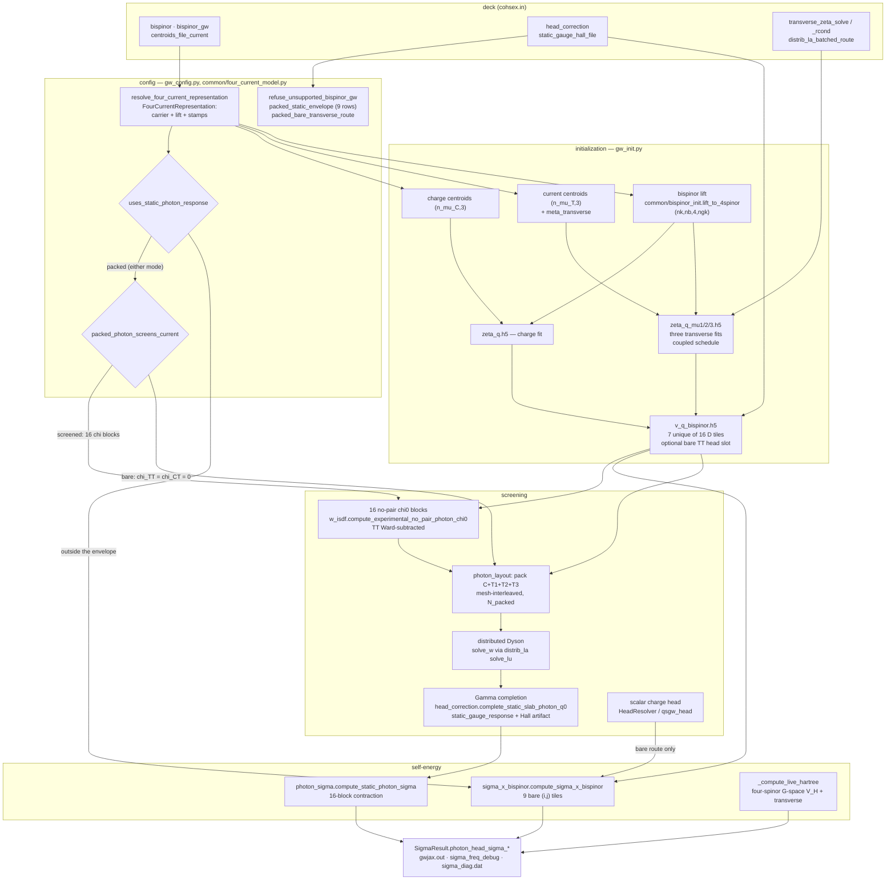

# Four-current (bispinor) wiring

**What this page is for.** The four-current layer touches sixteen source
files across preprocessing, ISDF, screening, Σ and output. This page is the
map: for each stage, the file and function, the object it produces with its
shape and sharding, which route it belongs to, and what refuses. Read it
before touching anything under `bispinor`; it should take about ten minutes.

**What this page is not.** It states no physics. The Γ-cell physics, the
frequency treatment and what is zero by construction are owned by
[Four-current heads and frequency](../theory/four-current-head-corrections.md).
Deck-key semantics are owned by the [input reference](../input_reference.md).
Module one-liners are owned by [Codebase](codebase.md). Where those pages
disagree with this one, they win — this page owns the *wiring* only.

> **Pinned to `integ/bispinor-static-cleanup-2026-09-01`, 2026-09-02 — a
> branch, not `origin/main`.** Four changes since `origin/main@8b6e3cc7`
> reshaped this layer: lane B (`41e2b6b2`) collapsed the two packed modes
> into one and deleted the producerless static-gauge seam, lane C
> (`ce3dedcc`) routed `bare_transverse` through the same packed operator
> inside one envelope, lane L (`44ae4713`) cut the dial set to five keys and
> two mode values, folded the two envelope tables into one nine-row table
> with PHYSICS / IMPLEMENTATION-LIMIT labels, labelled the incumbent route's
> head and deleted 1,446 lines of stranded FULL-seam producers, and lane N
> (`9bf291c6`) gave that operator's CHARGE block a frequency axis on the
> plasmon-pole compute modes (phase 3) while freezing its current blocks at
> `ω = 0`. Line numbers below were re-read at each lane's own tip and may be
> off by the other lanes' insertions; they are for finding code, never for
> quoting it.

## The routes

`bispinor_gw` names three carriers and two Σ *mechanisms*, and the mapping
between them is not one-to-one — that is the single most confusing thing about
this layer, so it comes first.

There is one packed static photon **operator**. Two deck situations reach it:

| route | selected by | current `χ` blocks | `Σ^B` contracted by | marked below |
|---|---|---|---|---|
| **packed, screened** | `bispinor_gw = full_static_cohsex` | all sixteen `χ^{IJ}` built, one packed Dyson solve | `gw.photon_sigma`, TT part of the sixteen-block `Σ_X` | **P** |
| **packed, bare** | `bispinor_gw = bare_transverse` **and** the envelope below | twelve current blocks declared **zero**; packed solve skipped, CC screened by the scalar owner and spliced in, so `W_packed = diag(W_00, D_TT)` and `W_CT = 0` | the same `gw.photon_sigma` | **P** |
| **incumbent, bare** | `bispinor_gw = bare_transverse`, **outside** the envelope | none — the bare `D^{ij}` tiles are contracted directly | `gw.sigma_x_bispinor` | **B** |

Orthogonally to *which* packed operator is built, `compute_mode` decides
**how much of Σ that operator owns** — one axis, two values:

| compute mode | packed Σ blocks | charge Σ | predicate |
|---|---|---|---|
| `cohsex` | all sixteen (`blocks = "all"`) | none beside it: the CC block of the packed operator **is** the charge Σ | `packed_photon_replaces_charge_sigma` |
| `gn_ppm`, `hl_ppm` | the twelve with a current index (`blocks = "current"`), evaluated once at `ω = 0` | the ordinary scalar `Σ_x + Σ_c(ω)` on the same ISDF `W_00`, with `head_resolver`, `static_head_terms`, the `{static, probe}` role W's and the `ppm_pipeline` all unchanged | `uses_dynamic_packed_photon_route` |

`mpa` is refused: `screening_requests_for` returns no independent static role
for it, so the bare family's CC block of `W_packed` would have no owner
(`gw_config.PACKED_PHOTON_COMPUTE_MODES`; the Σ dispatch refuses by name at
`sigma_dispatch.py`'s exhaustiveness branch). The dynamic route's own
run-record line is `Photon Sigma`, beside `Photon route` and `Photon head`.

**ONE envelope table, since 2026-09-02** (`lane/bisp-l-dials-envelope-2026-09-01`).
It used to be written twice — six conditions in
`packed_bare_transverse_route` and seventeen in
`refuse_unsupported_bispinor_gw`, five of them restated with separately
formatted `got`/`want` strings. Both now walk
`gw_config.packed_static_envelope(config, *, screened)` (`:3637`), which
yields `(accepted, got, want, klass, why, derived_key)`:

| # | row | applies to | class |
|---|---|---|---|
| 1 | `compute_mode ∈ {cohsex, gn_ppm, hl_ppm}` (`PACKED_PHOTON_COMPUTE_MODES`) | both | IMPLEMENTATION LIMIT — `cohsex` is the static packed mode, the plasmon-pole pair is the dynamic packed route (charge block dynamic, current blocks frozen at `ω = 0`, lane N); `mpa` has no independent static-role W and refuses by name |
| 2 | `qp_solver = one_shot_dft` | both | IMPLEMENTATION LIMIT |
| 3 | `screening_diagrams = w_rpa` | both | IMPLEMENTATION LIMIT |
| 4 | `head_correction ∈ {full, off}` | both | PHYSICS/POLICY (row 20) |
| 5 | `restart = false` | both | IMPLEMENTATION LIMIT — normally unreachable on a slab deck, which `GATE bispinor_slab_cohsex_restart_changes_the_head_mechanism` (`:3895`) refuses at parse time |
| 6 | `low_mem_bands = true` | screened | IMPLEMENTATION LIMIT, **derived** |
| 7 | `w_dyson_solver = distributed` | screened | IMPLEMENTATION LIMIT, **derived** |
| 8 | no scalar q→0 head override named (`scalar_head_overrides_named`, `:3621`) | screened | IMPLEMENTATION LIMIT — ONE conjunct for the eight `use_bgw_vcoul` / `wcoul0_*` / `*head*` / `mc_average_placement*` keys, naming only the ones the deck set |

Rows 6 and 7 are **derived, not declared**: `LorraxConfig.from_input_file`
sets an unnamed one for `full_static_cohsex` with a `[config provenance]`
line, promoting only when every other row already passes, so a deck outside
the envelope for another reason still sees *that* reason. An explicitly named
conflicting value is refused (rule 13). Material class is also outside the
table: the driver infers it from the loaded WFN occupations, and
`validate_material_inputs` refuses every fractional-occupation non-MPA run
before screening. `sys_dim = 2` is deliberately **not** in the table: the bare route treats it as a routing condition
(`packed_bare_transverse_route`, `:3720`) while the screened mode refuses it
only under `head_correction = full` (`GATE
static_bispinor_photon_head_slab_only`, `:3979`), and one row cannot say
both.

The route predicate returns **`(taken, reason)`**, not a bool: the driver
prints the first unmet condition into the run record as the `Photon route`
line, because the two routes differ in the `q → 0` head mechanism and
switching physics silently is the hazard the reason exists to prevent.

`bispinor_tt_head_correction` **is no longer a deck key** (removed
2026-09-01, refused by name in `read_lorrax_input`). The double-count
refusal survives as ONE gate covering *both* packed modes
(`GATE packed_bare_transverse_tt_head_double_count`, `gw_config.py:3943`,
keyed on `uses_static_photon_response`), reachable only from a hand-built
config: the Γ-cell completion already inserts `⟨D_TT⟩` and honouring an
overlay too would double count it.

The bare route additionally requires `w_dyson_solver = distributed` as a ROUTING condition (not a table row: for the screened mode the key is derived at parse time; for the bare family a deck at the default `auto` stays on the incumbent route, because the packed Dyson solve has no local plan and `distrib_la` refuses `distributed` on a 1×1 mesh). `bispinor_tt_head_correction` is no longer a deck key (lane L); the packed completion is the only producer of a transverse q→0 head.

The three predicates, all in `src/gw/gw_config.py`:

| predicate | line | answers |
|---|---|---|
| `packed_bare_transverse_route(config) -> (taken, reason)` | `:3584` | does a bare-transverse deck take the packed operator, and if not, why not |
| `packed_photon_screens_current(config) -> bool` | `:3648` | **the one selector between the two packed modes**: `True` only for `full_static_cohsex` |
| `uses_static_photon_response(config) -> bool` | `:3662` | is the packed operator used at all — `full_static_cohsex` always, plus the bare route inside its envelope |
| `packed_photon_replaces_charge_sigma(config) -> bool` | `:3676` | does the packed operator own the CHARGE Σ too (`cohsex`), or only the current blocks — the question every driver seam that skips the scalar charge machinery must ask |
| `uses_dynamic_packed_photon_route(config) -> bool` | `:3697` | the packed operator on a frequency-dependent Σ |

`uses_coupled_photon_head` (`:3797`) adds `head.correction is FULL` on top and
decides **only** whether `gw_init` keeps the four literal-Γ channel vectors.

**`BispinorGWMode` has TWO members** (`:289`), `bare_transverse` and
`full_static_cohsex`, and they resolve to the SAME carrier — the axis picks
which Lorentz blocks are screened, never which four-spinor represents them.
Three retired spellings refuse by name from ONE table,
`_RETIRED_BISPINOR_GW_MODES` (`:324`, read by `coerce_bispinor_gw_mode`
`:353`): `charge_hall_cubature` → `full_static_cohsex`, and the two
carrier-comparison modes `pauli_reference_bare_transverse` and
`isometric_kinetic_balance_bare_transverse` → `bare_transverse`. Refusals,
not aliases: the coercer runs from a dozen resolution sites, and a mode value
is the one deck word that decides which physics runs.

**A row marked P below applies to both packed modes** unless it says
otherwise; **B** means the incumbent route only. Rows marked "both" are
common to every bispinor deck.

**What the packed bare route is worth, measured** (MoS2 3×3, 270 states,
`reports/bisp_c_bare_as_packed_2026-09-01`, claim 581): with the head off it is
**byte-identical** to the incumbent route — `max|dE_qp| = 0.000 µeV`, every
`sigma_diag.dat` data row identical — despite a completely different
contraction order and operator packing. Declaring the twelve current `χ` blocks
zero costs **0.012 µeV** against the screened packed mode. With the head **on**
the packed and incumbent routes differ by **5.4 meV MAE / 11.9 meV max**, which
is a disagreement between two Γ-cell quadratures and is
[**open**](../theory/four-current-head-corrections.md) (theory §3.6) — not a
property of the body.

## The map

## Stage 1 — deck to config

Parsing and defaults are the input reference's; the wiring facts are which
object each key ends up on and who reads it.

| key | default (`gw_config.py`) | lands on | route |
|---|---|---|---|
| `bispinor` | `False` (`:1676`, parse `:5720`) | `config.bispinor` (`:4829`) — the master switch | both |
| `bispinor_gw` | `bare_transverse` (parse via `coerce_bispinor_gw_mode` `:353`; enum `:289`, **two** members; three retired spellings in `_RETIRED_BISPINOR_GW_MODES` `:324`) | `config.bispinor_gw` | both |
| `centroids_file_current` | `""` (`:1500`, parse `:5214-5219`) | `config.paths.centroids_file_current` (`:3252`) | both |
| `head_correction` | `full` (`:2012`, coerced `:541`, read `:5230`, built into `HeadConfig` `:5254`) | `config.head.correction` (`:3997`) | both |
| ~~`bispinor_tt_head_correction`~~ | **REMOVED as a deck key 2026-09-01**; the field is wired to `False` (`gw_config.py:5419`) for the incumbent V-tile builder lane N is retiring | `config.head.bispinor_tt_head_correction` | **B only**, and now only from a hand-built config |
| `static_gauge_hall_file` | `""` — EMPTY (`:1503`) | `config.paths.static_gauge_hall_file` | P, **screened mode only** (refused on the packed bare route) — **optional**: an UNNAMED file means `σ_H = 0`, announced; a NAMED but absent one refuses (`GATE static_gauge_hall_file_missing`, `w_isdf.py:1912`); a present but mismatched one refuses in the loader |
| `transverse_zeta_solve` | `ridge` (`:1894`, validate `:5496-5513`) | `config.backend.transverse_zeta_solve` (`:4552`) | both |
| `transverse_zeta_rcond` | `1e-10` (`:1902`, validate `:5514-5518`) | `config.backend.transverse_zeta_rcond` (`:4553`) | both |
| `distrib_la_batched_route` | `auto` (`:1769`, resolve `:1237-1266`, parse `:5460`) | `config.backend.distrib_la_batched_route` (`:4543`) | both |

There is no `transverse_zeta_*` key beyond those two, and no `LORRAX_*`
variable reads any key in this table.

**The one resolver.** `common/four_current_model.resolve_four_current_representation(bispinor, model)`
returns a frozen `FourCurrentRepresentation` with seven fields: `charge_bispinor`,
`charge_lift`, `current_bispinor`, `current_lift`, `scalar_head_bispinor`,
`charge_representation`, `spatial_current_representation`. **It is not stored
on the config** — a dozen sites call it locally (`gw_config.py:371`,
`gw_init.py:804,1464,1991,2817,3123`, `sigma_dispatch.py:310`,
`sc_iteration.py:1588,1736`, `head_correction.py:667,1715`,
`qsgw_head.py:4046`, `kin_ion_io.py:1168`, `file_io/kin_ion.py:393`,
`psp/get_dipole_mtxels.py:1103`), so grep for
`resolve_four_current_representation`, not for a config attribute.

**TWO branches since 2026-09-01**: non-bispinor (everything False) and
bispinor (both `raw`, `scalar_head_bispinor=True`) — the two shipped
`bispinor_gw` values ride the same carrier, so `model` is accepted and
ignored. The two carrier-comparison branches went with their deck spellings.
It stays a resolver rather than collapsing into `bool(bispinor)` because the
`charge_representation` / `spatial_current_representation` provenance stamps
the `dipole.h5` / `kin_ion.h5` / ζ authenticators compare against need ONE
producer. The surviving lift selector is `RAW_KINETIC_BALANCE_LIFT = "raw"`;
`ISOMETRIC_KINETIC_BALANCE_LIFT = "isometric"`
(`src/common/bispinor_init.py`) remains library code for the jet tests.

**`static_bispinor_photon_envelope` is a gate id, not a function.** It is
the raise at `gw_config.py:3997`, over the nine rows of
`packed_static_envelope` (the table in Stage 1). **Nine**, down from
seventeen (`lane/bisp-l-dials-envelope-2026-09-01`), and each unmet row
prints `PHYSICS` or `IMPLEMENTATION LIMIT` with its own reason. `full` is the
default and runs the Γ completion, `off` is a DEBUG skip, and
`no_local_fields` is refused on EVERY bispinor deck
(`GATE bispinor_head_correction_no_local_fields_unavailable`, `:3867`) —
the coupled solve has no scalar diagnostic head, and on the bare route the
value used to move the deck off the packed path, which is a head dial
choosing a route. A separate gate,
`GATE static_bispinor_photon_head_slab_only` (`:3979`), refuses
`sys_dim != 2` **while the completion is on**; the DEBUG headless body keeps
the bulk reach the old envelope gave it.

## Stage 2 — initialization (`gw_init.py`)

| object | producer | shape / dtype | sharding | route |
|---|---|---|---|---|
| charge centroid indices | `gw_jax.py:380-383` → `file_io/centroids.load_centroid_basis` (`:122-174`) | `(n_mu_C, 3)` i64 | host | both |
| current centroid indices | `gw_init.py:1434-1446` (refusal `:1430-1433` if the key is unset) | `(n_mu_T, 3)` i32 | host until needed | both |
| `meta_transverse` | `gw_init.py:1447-1452` | `Meta` with `n_rmu = n_mu_T`, `nspinor = 4`, `npol = 4`, `n_rmu_padded = padded_mu_extent(...)` | — | both |
| four-spinor ψ | `common/bispinor_init.lift_to_4spinor` (`:234`) | `(n_k, nb, 4, ngkmax)` c128, `[ψ_L; ψ_S]` on the spinor axis | caller wraps; no sharding inside | both |
| face ψ carriers | `common/wfn_layout.py:12-13`; transverse copies `gw_init.py:2419-2426` | `(nk, n_X, s, mu_Y)` / `(nk, s, mu_X, n_Y)` | `P(None,'x',None,'y')` / `P(None,None,'x','y')` | both |
| charge ζ | `gw_init.py:2216-2246` → `isdf_fitting.fit_zeta_to_h5` | `tmp/zeta_q.h5`, `(n_q_disk, n_mu_C, ngkmax)` c128 | accumulator `(n_q_disk, n_mu_padded, ngkmax)` at `P(None,('x','y'),None)` (`isdf_fitting.py:1404-1409`) | both |
| three transverse ζ | `gw_init.py:2455-2506` (`_fit_transverse_channel`, `vertex_mu_L = 1,2,3`) | `tmp/zeta_q_mu{1,2,3}.h5`, `(n_q_disk, n_mu_T, ngkmax)` c128 | same | both |
| `C_q` (CCT Gram) | `isdf_fitting.py:743-751` | `(nq, n_mu_padded, n_mu_padded)` | `P(None,'x','y')` — layout contract `isdf/core.py:4960-4966` | both |
| bare `D^{IJ}` tiles | `v_q_bispinor.compute_V_q_bispinor_g_flat_to_h5` (`:261-581`) | `v_q_bispinor.h5`, 7 datasets `(n_q_total, n_mu_L, n_mu_R)` c128 | device buffer `P(None,'x','y')` (`v_q_g_flat.py:492-494`) | both |
| tile reader | `v_q_bispinor.BispinorVqReader.get_tile` (`:682-716`) | `(n_q, n_L_padded, n_R_padded)` c128 | `P(None,'x','y')`; Hermitian companions read at `P(None,'y','x')` then conj-swapped (`:704-709`) | both |
| `photon_g0_vectors` | `v_q_bispinor.py:575-581` | 4-tuple, each `(n_q_full, n_mu_padded)` c128 | `P(None,'x')` | released to `None` unless `uses_coupled_photon_head` (`gw_init.py:2879-2881`) — **P** |

**Sixteen tiles, seven on disk.** Six `(0,i)`/`(i,0)` tiles are exactly zero
by Coulomb gauge (`ZERO_TILES`, `v_q_bispinor.py:67-70`); three `(j,i)` with
`i < j` are Hermitian companions reconstructed on read (`HERMITIAN_PAIRS`,
`:72-78`); the remaining seven — CC plus six TT — are computed and written
(`UNIQUE_TILES`, `:60-65`). Format stamp `bispinor_lorentz_v2` (`:80`),
artifact path `gw_init.py:2793`.

**The coupled ζ schedule.** The Y-side face transform and the full-spin X
broadcast are channel-independent, so μ_L = 1,2,3 share one
built-once-per-r-chunk `[3, q, μ, r]` `Z_q` stack instead of repeating it
three times (`isdf/core.py:2620-2626`). Entry `gw_init.py:2527` (coordinator
`:1752-1928`, route chooser `:1931-1955`, capacity block `:2082-2189`);
kernel `isdf/core._z_q_face_coupled_mu123` (`:2795-2833`). The coupled
out-spec is `P(None,None,'x','y')` against the scalar `P(None,'x','y')`
(`isdf/core.py:2420-2421` vs `:2337-2340`). `distrib_la_batched_route` reaches
this fit through `gw_init.py:2083-2084` → `:2472`, so the same key that
governs generic batched linalg governs the transverse ζ schedule.
Full design: [Face-ψ ζ fitting](zeta_fit_face_psi_cct.md).

**The bare TT head slot** (route B). ONE gate refuses it on either packed
route now that the deck key is gone:
`GATE packed_bare_transverse_tt_head_double_count` (`gw_config.py:3943`,
keyed on `uses_static_photon_response`), reachable only from a hand-built
config. Config plumbing `gw_init.py` →
`v_q_bispinor.py:423` → the per-tile builder
(`_make_per_q_v_builder_for_tile`, `:141-253`). The tensor
`T_ab = ⟨v(q) P^T_ab(q̂)⟩_mBZ` is `(3,3)` f64 from `_tt_head_tensor`
(`:100-138`), computed **once per tile, not per q** (`:107-109`), and refused
outside `sys_dim ∈ {2,3}` (`:118-125`). The injected value is `T[i,j]/Ω_cell`
(`:224` — the `/Ω` is applied here, not in the shared `vcoul` estimator),
substituted into the unique `q = Γ, G = 0` slot (`:240`, `:250`), after which
the single spatial-metric sign is applied once on the way out (`:251`,
`COULOMB_GAUGE_TT_SIGN = -1.0` at
`services/vcoul/src/vcoul/minibz.py:119`). No vertex and no Σ contraction
compensates that sign.

## Stage 3 — screening

### 3a. The packed body (route P — both packed modes)

`w_isdf.compute_static_photon_response` (`:2096`, signature `:2096-2112`) is
**the screening owner of both packed modes**. Lane B removed its
`gauge_head_response=` argument and made `config` required (`cff884e7`), so a
caller can no longer inject a fabricated head record; lane C added the
**required** keyword `screen_current` and the `W_charge` parameter
(`ce3dedcc`).

`screen_current` is resolved once, by
`gw_config.packed_photon_screens_current`, and is never defaulted here; a
value inconsistent with `bispinor_gw` is refused (`:2195-2226`; the
mismatch-with-`packed_photon_screens_current` arm alone is `:2196-2202`,
and `screen_current = False` without a `W_charge` is `:2214-2218`). It
selects:

* **`True`** (`full_static_cohsex`) — the sixteen no-pair `χ` blocks and one
  distributed Dyson solve, below.
* **`False`** (the bare-transverse family on the packed route) — the twelve
  current blocks are zero **by declaration**, so neither they nor the packed
  solve are built at all — the branch is `:2363-2405`, against the screened
  branch at `:2348-2362`. The CC block is screened by
  the incumbent scalar owner (`gw.screening.compute_screening_model` →
  `solve_w` at `n_C`, called by the driver at `gw_jax.py:674`) and
  arrives as `W_charge`; this function assembles
  `W_packed = diag(W_00, D_TT)` with `W_CT = 0` through the sole packer.

Both modes then run **one** Γ-cell completion (§3b). The per-rank resident
byte figure for the packed body is measured and printed at the site
(`:2325-2347`, the print itself `:2342-2347`): `16·n_k·N_packed²/P` bytes each for `V_packed` and
`W_packed`. That carrier is **new to the bare route** — the incumbent route
held one TT tile at a time — and is the same object the screened mode
already held.

| object | producer | shape | sharding |
|---|---|---|---|
| one no-pair block `χ^{IJ}_0` | `w_isdf.compute_no_pair_dirac_current_block` (`:1556`) | `(nq, μ_L, μ_R)` c128 | `P(None,'x','y')` |
| the sixteen blocks (`screen_current = True` only) | `compute_experimental_no_pair_photon_chi0` (`:2016`); families `(charge, transverse, transverse, transverse)` (`:2049-2050`) — T1/T2/T3 share one bundle, no copies | — | — |
| TT Ward subtraction | `_subtract_static_tt_contact` (`:2004`), applied to the nine blocks with both indices nonzero (`:2060`) | `Π(q) − Π(0)` | in place, buffer donated |
| packed `V`, `χ_0`, `W` | `photon_layout.pack_photon_operator` (`:219`), `w_isdf.solve_w` (`:1431`) | `(nq, N_packed, N_packed)` c128 | `P(None,'x','y')` |

`N_packed` is `PhotonBasisLayout.packed_extent` (`photon_layout.py:107-109`),
`p_C + 3·p_T` over the mesh-padded centroid extents built by
`from_centroid_extents` (`:88-101`); one transverse centroid family must serve
T1/T2/T3, and `__post_init__` (`:69`) refuses otherwise. The packing is
**mesh-interleaved**, not a contiguous direct sum: packed row shard `x` holds
that shard's own local `C,T1,T2,T3` row chunks, and the column shard applies
the same permutation (`photon_layout.py:24-31`, offsets `local_offset`
`:119-123`). A packed operator is therefore `P O Pᵀ`, Dyson algebra is
unchanged, and both `pack_photon_operator` and `photon_block_view` (`:279`)
are local `shard_map` slices with no redistribution. Ordering stamp
`PHOTON_BASIS_ORDERING = mesh_interleaved_direct_sum_v1` (`:55`).

The sixteen-block enumeration lives in `pack_photon_operator`'s double loop,
which calls the block builder once per `(A,B)` and `block_until_ready()`s each
(`:247`) so only one block is resident.

**The Dyson solve** is `solve_w` (`w_isdf.py:1431`) with
`dyson_solver="distributed"` on this path (`:2356`, inside the
`screen_current = True` branch), dispatching to
`_get_w_solve_fn_distributed` (`:1164`), which plans through the `distrib_la`
service (`plan("solve_lu", mesh_xy, backend="distributed", …)` at `:1259-1260`,
executed at `:1328`). Inputs, the assembled `A`, the LU factors and `W` all
stay `P(None,'x','y')`. The source states the invariant at `:1191-1195`: **no
rank ever materialises a full `(μ, μ)` tile** — the largest per-rank transient
is the `μ·μ/min(Px,Py)` gathered GEMM operand.

`StaticPhotonResponse` (`w_isdf.py:2084`) carries `layout`, `V_packed`,
`W_packed` (both as above), `head_completion`, and three provenance stamps
whose values **differ by route** — read them to tell which route produced an
artifact:

| stamp | screened (`full_static_cohsex`) | packed bare |
|---|---|---|
| `current_contact` | `ward_subtracted_no_pair` (`:1998`) | `none: current channels unscreened` (`STATIC_PHOTON_BARE_CURRENT_CONTACT`, `:2080`, set `:2484`) |
| `current_model` | `positive_energy_kinetic_balance_dirac_current_v1` (`common/bispinor_init.py:32`) | `bare_breit_no_current_response_v1` (`STATIC_PHOTON_BARE_CURRENT_MODEL`, `:2079`, set `:2486`) |
| `approximation` | `gamma_completed_no_pair_static_photon_v1` / `DEBUG_headless_no_pair_static_photon_v1` (`:2477-2480`) | `gamma_completed_bare_transverse_photon_v1` / `DEBUG_headless_bare_transverse_photon_v1` (`:2488`, `:2490`) |

So there are **four** `approximation` strings, not two: one per route × head
state. The `no_pair` pair is lane B's
(`lane/bisp-b-one-packed-mode-2026-09-01@cff884e7`, replacing two older
strings no sandbox parser read); the `bare_transverse` pair is lane C's
(`ce3dedcc`).

Under the DEBUG setting the module prints a boxed
`WARNING -- DEBUG: Gamma-cell head disabled by head_correction=off`
(`:2305`); the `WARNING` token is what the production sink retains into the
run record's warning block.

### 3b. The Γ completion (route P — both packed modes, on by default)

`head_correction.complete_static_slab_photon_q0` (`:1298-1307`, called `w_isdf.py:2453`) takes
`V_packed`, `W_packed`, a **sealed** response record, the two
`(4, N_packed)` `g_0` vectors (`g0_X` at `P(None,'x')`, `g0_Y` at
`P(None,'y')`) and a cubature receipt, and returns updated `V`, `W` plus a
`StaticSlabPhotonHeadCompletion` (`:1130`, fields `:1133-1151`, carrying
`sigma_H` `:1149` and `hall_source` `:1150` alongside the certificates). The
old `isinstance` fork over two response types is gone: the single path is
`require_static_photon_head_response(response, mesh_xy)` at `:1326`. It runs whenever
`head_correction = full`, which is the default — it is no longer opt-in.

| input | producer | shape | sharding |
|---|---|---|---|
| cubature receipt | `vcoul.slab_minibz_photon_cubature` (`services/vcoul/src/vcoul/minibz.py:821`) — exact Wigner–Seitz polygon, fixed 16/24/32 Duffy–Gauss ladder (`:124`) | host chunks: `q_cart (n,3)`, `D_raw (n,4,4)`, `sample_weight (n,)` f64 | host, write-locked |
| `StaticPhotonHeadResponse` (`:64`, sealed — only its producer can build one) | `static_gauge_response.build_static_photon_head_response` (`:169-293`, called `w_isdf.py:2427`); `require_static_photon_head_response` (`:103-155`) | `S_direct (2,2,4,4)`, `sigma_H (3,)` real, `hall_source` str, `Y_x (2,4,N_packed)`, `Z_y (2,N_packed,4)` | `P()`, `P()`, —, `P(None,None,'x')`, `P(None,'y',None)` |
| Hall artifact — **optional** | `file_io/static_gauge_head.load_static_gauge_hall_artifact` (`:180-189`), called from `w_isdf.py:2279-2287` behind the existence check at `:2273`; sole writer `write_static_gauge_hall_artifact` (`:130-135`) via `psp/get_dipole_mtxels.py` | `static_gauge_hall.h5`, schema 1 (`STATIC_GAUGE_HALL_SCHEMA_VERSION`, `:35`), `sigma_H_cart (3,)` f64 | replicated |

If no `static_gauge_hall_file` is present the builder sets `sigma_H = 0` and
`hall_source = HALL_SOURCE_NONE` (`static_gauge_response.py:51,214`; the shape/sharding contract is re-asserted at `:114-121`) and says
so; a present but mismatched artifact still **refuses** in the loader, so a
stale file cannot degrade a run silently. For a Chern-trivial insulator that
default is the exact answer — see
[the theory page](../theory/four-current-head-corrections.md) §4.4.

The updates are **one bare rank-4 outer product into `V`** (`:1480-1482`) and
**nine screened rank-4 outer products into `W`** (`:1491-1503`), all through
`photon_layout.add_photon_q0_low_rank` (`:556`), which takes left rows at
`P(None,'x')` and right rows at `P(None,'y')`, donates the packed buffer, and
does a purely local outer product (`:576-579`). Gates on this path:
`GATE static_gauge_head_fold_ward` (`:1365`) and
`GATE static_gauge_head_fold_hermiticity` (`:1370`), against
`_STATIC_GAUGE_WARD_RESIDUAL_MAX = 1e-8` and
`_STATIC_GAUGE_HERMITICITY_RESIDUAL_MAX = 1e-10` (`:158-159`), plus the
`static_photon_dyson_*` / `static_photon_polygon_*` numerical certificates
(`:1249-1295`, helpers `:1159-1246`, budget `1e-9` at `:1154`).

**What the mode declares it does not have.** The **module docstring of
`gw.static_gauge_response`** is the complete list. It replaced the
`CHARGE_HALL_CUBATURE_AVAILABILITY` availability grammar and its
`StaticGaugeTermAvailability` / `require_full_static_gauge_availability`
machinery, which are deleted
(`lane/bisp-b-one-packed-mode-2026-09-01@cff884e7`). Present: the charge CC
`q²` head `S^{00}`, the charge wings `Y^0`/`Z^0`, and the Hall CT/TC `q¹`
term. Omitted by model: the current `q²` response (TT and CT/TC), the current
wings, the uniform static current response (zero by gauge invariance for an
insulator), the diamagnetic/contact terms and the complement-space closure —
and they are never stored as accidental zeros, because `S_direct` has charge
support only. What that list means physically is
[the theory page](../theory/four-current-head-corrections.md) §4.3.

**The dead seam is gone.** On `origin/main@8b6e3cc7` this route carried a
producerless full-static-gauge seam — `StaticGaugeHeadResponse`,
`require_canonical_operator_fingerprint`, `require_static_gauge_head_response`
and its five `GATE static_gauge_head_*`, `LoadedStaticGaugeHeadResponse`,
`write`/`load_static_gauge_head_artifact`, the v2 head schema, the
`gauge_head_response=` argument, `GATE static_gauge_head_end_to_end_uncertified`
and the `GATE full_static_bispinor_gauge_head_unavailable` that made it
unreachable. All of it is **deleted**
(`lane/bisp-b-one-packed-mode-2026-09-01@cff884e7`); `file_io/static_gauge_head.py`
is now the Hall artifact's format owner and nothing else. If you are reading
`origin/main`, expect to find those symbols and to find them unreachable.

### 3c. The scalar charge head (route B — the incumbent route only)

This is the head the packed routes replace, and the other side of the open
disagreement in [theory §3.6](../theory/four-current-head-corrections.md).
Unchanged from the scalar code and owned elsewhere: `HeadResolver`
(`head_correction.py:1589`) built at `gw_jax.py:521`; `head_correction = full`
installs `qsgw_head.build_dft_head_response` (`gw_jax.py:624,637`), finalized
by `finalize_iteration_head_samples` (`:763-768`), applied through
`_compute_static_head` (`gw_jax.py:187,819`) → `cohsex_sigma.py:631-637,720-728`.
It is **skipped entirely** under either packed mode (`gw_jax.py:788,809`), and the
photon-Σ envelope refuses a scalar head overlay if one arrives there anyway
(`sigma_dispatch.py:835` ff.).

## Stage 4 — self-energy

The fork is `sigma_dispatch.py:845`, and it has **three** packed arms plus
an exhaustiveness refusal:

| arm | line | what it does |
|---|---|---|
| `packed_photon_replaces_charge_sigma` (`compute_mode = cohsex`) | `:845-889` | the sixteen-block contraction owns `Σ_X`, `Σ_SX`, `Σ_COH` outright. Its three refusals fire before any allocation: outside `compute_mode = cohsex`, with no packed response ("Refusing instead of falling back to charge-only screened COHSEX"), and with scalar `static_head_terms` present (double count) |
| `uses_dynamic_packed_photon_route` (the plasmon-pole pair) | `:890-990` | the scalar `compute_sigma_x` runs with the incumbent `Σ^B` arms **explicitly off** (`wfns_transverse=None`, `bispinor_v_q_path=None`) and keeps `static_head_terms` (the CC bare-X head); the packed consumer is called with `blocks = "current"` (`:955`) and its `SX + COH` is booked into `sig_x` (`:973`), which is arithmetically the same `Σ_xc` as adding an `ω`-independent term to `Σ_c` and is the seam the incumbent route already used for `Σ^B`. The current sector's bare-exchange and static-correlation magnitudes are printed at the seam |
| `uses_static_photon_response` with neither of the above | `:991-1008` | `NotImplementedError` naming `PACKED_PHOTON_COMPUTE_MODES`; today that is `mpa` reached through a hand-built config |

`finalize_dynamic_sigma` carries the packed per-sector Γ diagnostics through
to `sigma_freq_debug.dat` (`:341-`, passed at `:1206-1207`); on the dynamic
route the CC sector of those columns is exactly zero, because the charge head
there is the dynamic model's, not the packed completion's.

| object | producer | shape | sharding | route |
|---|---|---|---|---|
| sixteen-block `Σ_X`, `Σ_SX`, `Σ_COH` (twelve blocks under `blocks = "current"`) | `photon_sigma.compute_static_photon_sigma` (`:296`), called at `sigma_dispatch.py:871` (static) and `:946` (dynamic) | each `(nk, nb_sigma, nb_sigma)` | **replicated** `P(None,None,None)` at the output boundary | P |
| per-block operands | `photon_layout.photon_block_view` (`:279`), fetched at `photon_sigma.py:364-365` | `(nk_tot, n_left, n_right)` | `P(None,'x','y')` — a `dynamic_slice`, never a gather | P |
| Green function `G` | `greens_function_kernel.build_G`, face layout | `(nk, ns, μ_L, ns, μ_R)` | `P(None,None,'x',None,'y')` (`wavefunction_bundle.py:236`) | both |
| head-attribution diagnostics | `photon_sigma.py:373-377` (accumulated `:413-434`) via `photon_layout.photon_q0_low_rank_block` (`:676`) | one `(1, p_A, p_B)` block | `P(None,'x','y')` | P |
| `Σ^B`, bare transverse — **incumbent route only** | `sigma_x_bispinor.compute_sigma_x_bispinor` (`:91`), nine `(i,j)` tiles at `:200-201`. Retained for `mpa`, `x_only`, self-consistent, `restart = true`, bulk, the resolvent diagram sets, `no_local_fields`, and any deck at `w_dyson_solver ≠ distributed` (every 1-GPU deck) — the plasmon-pole pair now reaches `Σ^B` through the packed operator instead | `(nk, nb_sigma, nb_sigma)` | replicated after a gather-then-window (`:234-248`) | B |
| transverse Hartree | `sigma_dispatch._compute_live_hartree` (`:301-334`) → `kin_ion_io.compute_hartree_matrix` (`:764`) | `charge`, `transverse`, each `(nk_full, nb, nb)` Ry | `P(None,'x','y')` with `return_sharded=True` | **both** |

**The sixteen-block contraction** is a plain nested Python loop (`A` at
`photon_sigma.py:385`, `B` at `:389`), not a `vmap`. The `blocks` selection
is one `continue` inside it (`:390`) and appears nowhere else, so the static
and dynamic routes share every kernel, every certificate and the sector
closure gate. Per block the γ̃ vertices
are folded into the two G-build operands only (`:355`, `:359`), and the same
jitted kernel is called three times with a dynamic `term` selector for X, SX
and COH (`:383`, `:393`, `:403`; COH uses `W − V` with prefactor `−0.5`). Each
accumulator is `block_until_ready()`d before advancing (`:392`, `:402`,
`:439`) — the source names this "the lifetime boundary that prevents two W/G
body tiles" from coexisting (`:436-438`).
`GATE photon_head_sigma_sector_closure` (`:478-483`) then checks that
CC + (CT+TC) + TT closes on the direct sixteen-block total. The diagnostics
record `StaticPhotonHeadSigmaDiagnostics` (`:60-82`) now has three fields;
its operator fingerprint went with the deleted seam.

**`Σ^B` enters twice, differently** — on the incumbent route. In
`compute_cohsex_sigma` it is added to **both** `sig_x` and `sig_sx`
(`cohsex_sigma.py:660-668`); in `compute_sigma_x` — the entry every dynamic
mode and `x_only` takes — it is added to `sig_x` only (`:735-742`). On
either packed route neither fires: `Σ^B` is the TT part of the packed `Σ_X`
instead, and `sigma_x_bispinor` is not called — on the dynamic route the
`compute_sigma_x` call passes `wfns_transverse=None` explicitly so the arm
cannot fire by accident. `photon_sigma` and `sigma_dispatch` needed **no
change** for the packed *bare* route — the sixteen-block consumer streams
whatever `V`/`W` it is handed — and needed only a block selector and one
branch for the *dynamic* one.

**No transverse operand reaches a dynamic Σ_c, and that is the design.**
`compute_ppm_sigma_pipeline` (`ppm_pipeline.py:473-490`) and the MPA body
(`mpa/sigma.py:283-303`) have no `wfns_transverse`, `bispinor_v_q_path` or
`photon_response` parameter, and they gained none in phase 3. The dynamic
packed route splits Σ instead: the charge half is those untouched kernels on
`W_00(ω)`, the current half is the packed consumer at `ω = 0`, and the two
meet only in the `sig_x` addition at `sigma_dispatch.py:973`. So the
four-current layer still reaches a dynamic Σ through `sig_x` and the
transverse Hartree and nowhere else — what changed is which owner computes
the `sig_x` transverse part, not how many owners there are.

**The transverse Hartree is on both routes.** Its gate is
`include_transverse = bool(config.bispinor)` (`sigma_dispatch.py:310`), not
`bispinor_gw`, so every bispinor mode and every compute mode gets it unless
`omit_v_h` (density self-consistency, which rebuilds both fields itself). It
is added to `sig_h` at `:937`, under the guard at `:930`. Physics owner:
[Direct Hartree field](../theory/hartree.md).

## Stage 5 — outputs

`SigmaResult` (`sigma_dispatch.py:61`) carries **two** such fields, `None` on
every non-packed route (initialized `:833-834`, harvested `:876-879`, set at
`:952-953` for `x_only` and `:966-967` for `cohsex`):

| field | line | shape / value |
|---|---|---|
| `photon_head_sigma_diag_tskn_ry` | `:124` | `(3, 3, nk, nb)` — axes `(term = X/SX/COH, sector = CC / CT+TC / TT, k, band)`, DFT basis |
| `photon_head_sigma_basis` | `:125` | `"dft"` when populated; also in `BASIS_FREE_FIELDS` (`:257`) |

A third field, `photon_head_sigma_operator_fingerprint`, existed on
`origin/main@8b6e3cc7` and is **deleted**
(`lane/bisp-b-one-packed-mode-2026-09-01@cff884e7`) along with the
fingerprint field of `StaticPhotonHeadSigmaDiagnostics` — it belonged to the
removed full-static-gauge seam.

Mirrored onto the output record at `gw_output.py:149-150` and forwarded by the
driver at `gw_jax.py:1019-1021` (schema zeros `:1023`, final record
`:1244-1246`). `sigma_freq_debug` gains `head_CC`, `head_CTTC`, `head_TT`,
`head_total` (`gw_output.py:814-819`) and the per-term `{term}_head_{sector}`
columns (`:820-830`), gated on `photon_head_sigma_basis is not None` at
`:726` and refusing a basis other than `dft` at `:784-787`;
`sigma_diag.dat`'s Hartree column is relabelled `Hdir` (`:1653-1654`) and
gains an `H_T` column whenever the transverse Hartree ran (`:767-768`).

**Reading `gwjax.out`.** These lines tell you which route ran:

| line | file:line | means |
|---|---|---|
| `Photon head    : …` | `gw_jax.py:339` (packed) and `:346` via `gw_config.incumbent_bispinor_head_record` `:3813` (incumbent) | **which Γ-cell head ran, on every bispinor deck.** Packed: the completion's `hall_source`, `σ_H`, Ward / Hermiticity / Dyson-bound residuals and cubature orders, or the `DEBUG … NOT a production calculation` line under `head_correction = off`. Incumbent: the same DEBUG line under `off`, and under `full` a statement that the charge head is the scalar band-diagonal one and that there is **no** transverse q=Γ head on that route |
| `Photon route   : …` | `gw_jax.py:328` | **which of the two bare routes ran.** Either "packed static photon operator (chi_TT = chi_CT = 0; scalar Dyson on CC, W_packed = diag(W_00, D_TT); the Gamma-cell completion carries both the charge head and the bare `<D_TT>`)" or "incumbent charge-screened W + Sigma^B (gw.sigma_x_bispinor) with the scalar band-diagonal q->0 head" — each followed by the predicate's **reason**, which for a refusal names the first unmet envelope condition. Printed for every non-`full_static_cohsex` deck |
| `Bispinor GW policy: bispinor_gw=…` | `gw_jax.py:315` | the carrier banner. Under `full_static_cohsex` the parenthetical names the **head state**, not "experimental", and reads `DEBUG: Gamma-cell head disabled by head_correction=off` when the completion is off |
| `Σ^B tile (μ_L=i, ν_L=j): tr Σ = …` ×9 | `sigma_x_bispinor.py:228` | the **incumbent** bare route ran. Their absence beside a `Photon route: packed …` line is the packed bare route |
| `WARNING -- DEBUG: Gamma-cell head disabled by head_correction=off` | `w_isdf.py:2305-2306` | the packed body ran **headless**; the `WARNING` token is what the production sink keeps in the run record's warning block |
| `static photon response: approximation=…` | `gw_jax.py:719` | one of the **four** stamps above — the `no_pair` pair means the screened mode ran, the `bare_transverse` pair means the packed bare route did — plus `N_packed` |
| `[photon response] packed body N_packed=… : … GB/rank resident for EACH of V and W` | `w_isdf.py:2342-2347` | the measured per-rank cost of the packed carrier, printed on both packed routes |
| `Photon head    : Gamma-cell completion applied …` with `hall_source=`, `sigma_H=`, `ward=`, `hermiticity=`, `dyson_forward_bound=`, `cubature_orders=` | `gw_jax.py:730` | **the production run record's head line** (`41e2b6b2`). It reads `DEBUG: … NOT a production calculation` when the head was skipped, and `hall_source` says whether the Hall artifact was used or `σ_H = 0` |
| `packed photon COHSEX block (A,B) complete` ×16 | `photon_sigma.py:441` | the packed Σ ran — and there will be no `Σ^B tile` lines |
| `rho + signed J/c sweep` | `kin_ion_io.py:694-697` | the transverse Hartree ran |
| the `V_H` matrix label carrying `+ <m\|sum_i alpha_i A_i\|n>` | `kin_ion_io.py:996-1001` | same, at the matrix sweep |

## Refusals, compressed

Every entry is a hard refusal, not a demotion. The `bispinor` refusals live in
`gw_config.refuse_unsupported_bispinor_gw` (`:3666-3863`), called at parse
and again at driver entry (`gw_init.py:3118`).

| rule id | file:line | fires when |
|---|---|---|
| `packed_bare_transverse_tt_head_double_count` | `gw_config.py:3943` | `head.bispinor_tt_head_correction = true` on a deck that takes EITHER packed route. The deck key is gone (2026-09-01), so this is the hand-built-config guard. The Γ completion already inserts `⟨D_TT⟩`; honouring the overlay too would double count it |
| `static_gauge_hall_file_missing` | `w_isdf.py:1912` | the deck NAMES a Hall artifact that does not exist. `static_gauge_hall_file` is empty by default: unnamed means `σ_H = 0`, announced, and a mistyped path must not give the same silent answer |
| `packed_bare_transverse_hall_unavailable` | `w_isdf.py:1932` | a named, present `static_gauge_hall_file` on the packed **bare** route. With the current channels unscreened `W_CT = 0` at every finite `q`, so a Γ-only CT/TC block is not the limit of anything the model computes |
| (no id) `screen_current` inconsistency | `w_isdf.py:2195-2226` | the `screen_current` argument disagrees with `packed_photon_screens_current(config)` for the resolved `bispinor_gw`, or `W_charge` is missing on the bare branch |
| `bispinor_gw_charge_hall_cubature_retired`, `bispinor_gw_pauli_reference_retired`, `bispinor_gw_isometric_kinetic_balance_retired` | `gw_config.py:324` (`_RETIRED_BISPINOR_GW_MODES`, read by `coerce_bispinor_gw_mode` `:353`) | the deck names a retired mode value. **Refusals, not aliases**: the coercer runs from a dozen resolution sites, so an alias would print from each, and a mode value is the one deck word that decides which physics runs. Each names its replacement |
| `bispinor_head_correction_no_local_fields_unavailable` | `:3867` | `head_correction = no_local_fields` with `bispinor = true`, on EVERY bispinor deck. A scalar diagnostic the coupled solve does not produce, and on the bare route it silently moved the deck off the packed path |
| `bispinor_slab_cohsex_restart_changes_the_head_mechanism` | `:3895` | an EXPLICIT `restart = true` with `bispinor`, `compute_mode = cohsex`, `sys_dim = 2`. An UNNAMED `restart` is set to false for this deck class at parse time instead. There is no photon restart storage, so the key alone used to swap the packed completion for the incumbent scalar head (+5.72 meV, plus the whole transverse head) |
| (deck key, not a gate) `bispinor_tt_head_correction` | `read_lorrax_input` | the key is REMOVED and refused at any value, naming the Γ-cell completion that carries the head |
| `bispinor_self_consistency_requires_live_four_current` | `:3915` | bispinor QSGW with an explicit `density_self_consistent = false` |
| `bispinor_gw_requires_bispinor` | `:3968` | `bispinor_gw = full_static_cohsex` with `bispinor = false` |
| `static_bispinor_photon_head_slab_only` | `:3979` | the packed mode with the completion on (`head_correction = full`) and `sys_dim ≠ 2`. The coupled 4×4 solve on the in-plane cubature cannot take a bulk analytic-sphere correction after the nonlinear solve, and no bulk integrator has been derived. The DEBUG headless body keeps the bulk reach |
| `static_bispinor_photon_envelope` | `:3997`, over `packed_static_envelope` `:3637` | any of the NINE rows (Stage 1). Each unmet row prints `PHYSICS` or `IMPLEMENTATION LIMIT` and its own reason |
| `bispinor_tt_head_unsupported` | in `refuse_unsupported_bispinor_tt_head_correction`, `:4010` | a hand-built TT head without `bispinor`, or `sys_dim ∉ {2,3}` |
| (no id) SC × dynamic | `gw_jax.py:272` | self-consistent solver with a dynamic mode — bispinor QSGW is static-only |
| (no id) missing current centroids | `gw_jax.py:560-572`, `gw_init.py:1430-1433` | `bispinor = true` without `centroids_file_current` |
| (no id) packed route needs a distributed Dyson solve | `gw_config.py:3630` (the last conjunct of `packed_bare_transverse_route`) | `w_dyson_solver ≠ distributed`, i.e. also the shipping default `auto` on a small system. This is a **route** conjunct, not a refusal: the deck falls back to the incumbent path and the run record names the key. It exists because the screening owner refuses anything else (`w_isdf.py:2173`) and `distrib_la` additionally refuses `distributed` on a 1×1 mesh, so without it the predicate claimed decks that then died inside the packed operator — reachable only once the plasmon-pole pair joined the served modes |
| (no id) photon Σ envelope | `sigma_dispatch.py:845` ff. | the static arm: outside `cohsex`; without a packed response; with scalar `static_head_terms`. The dynamic arm (`:890`) refuses a mode that builds static screened channels, and `:991` refuses a packed deck on a mode with no branch (`mpa`) |
| (no id) packed response needs a config / distributed Dyson | `w_isdf.py:2178-2186` | the packed path called without the run config, or with a non-distributed Dyson solver |
| `GATE static_gauge_head_fold_{ward,hermiticity}` | `head_correction.py:1365,1370` | Γ-fold residuals over `1e-8` / `1e-10` (`:158-159`) |
| `GATE static_photon_{dyson,polygon}_*` | `head_correction.py:1249-1295` (helpers `:1159-1246`) | coupled-solve and polygon certificates, budget `1e-9` |
| `GATE photon_head_sigma_sector_closure` | `photon_sigma.py:478-483` | CC + CT/TC + TT does not close on the direct sixteen-block total |
| `GATE static_gauge_hall_{schema,partial,artifact_absent}` and the authentication gates | `file_io/static_gauge_head.py:69,77,83,200,203`; identity checks `:235-256` | Hall artifact partial, wrong schema, or not authenticating against this WFN, band manifold or `nk_tot`. **An absent file is not one of these** on the packed path: it means `σ_H = 0`, announced |
| `GATE static_gauge_raw_hall_degenerate` | `qsgw_head.py:3343` | degenerate differently-occupied states |
| (no id) insulating-only Hall | `qsgw_head.py:3460` | any fractional occupation |

**Three refusals that are gone.** `full_static_bispinor_gauge_head_unavailable`,
`GATE static_gauge_head_end_to_end_uncertified` and
`GATE static_gauge_availability` guarded the deleted full-static-gauge seam and
were removed with it (`lane/bisp-b-one-packed-mode-2026-09-01@cff884e7`). A
mode that cannot be requested needs no refusal.

## Memory invariants

The standing rule is that there must always exist a path that materialises no
`N_μ²`-class object on any one rank ([design decisions](decisions.md), the
two-plans-per-solve-family entry; the plan table is
[`docs/dev/large_nmu_operation.md`](../dev/large_nmu_operation.md)). Where it
is enforced on this layer, and how:

* **Packed Dyson.** Enforced by construction: `w_isdf.py:1191-1195`
  states that inputs, `A`, the LU factors and `W` all stay `P(None,'x','y')`
  and no rank materialises a full `(μ,μ)` tile.
* **Packed Σ.** Enforced by an **assertion**:
  `photon_sigma._require_packed_operator` (`:126-134`, message `:132-134`) raises unless both
  packed operators are still `P(None,'x','y')` — "A photon body may not be
  gathered or placed on fewer than all ranks." Block views are
  `dynamic_slice`s, not gathers (`photon_layout.py:259-274`).
* **`V_q` construction.** Structural, documented rather than asserted: one
  tile at a time, streamed to HDF5 and freed, so peak equals one scalar `V_q`
  tile (`v_q_bispinor.py:29-31`); Hermitian companions never stored (`:32-35`);
  TT Lorentz mixing done at write time so the reader's per-tile contract stays
  clean (`:389-391`).
* **`Σ^B`.** Structural, delegated to the reader — nine bare tiles consumed
  sequentially, each `P(None,'x','y')` (`v_q_bispinor.py:682-694`). There is
  **no assertion** in `sigma_x_bispinor.py`; what it carries instead is a
  measured per-rank ψ-inventory disclosure (`:164-178`) recording that the
  transverse bundle doubles the primary bundle's inventory.
* **ζ fits.** The layout contract is stated once, at `isdf/core.py:4960-4966`
  ("nothing here ever replicates an O(μ²) object"), with the per-tier byte
  accounting at `isdf/core.py:3569-3573` and the runtime banner at
  `isdf_fitting.py:920-923`.

Those are comments, banners and one assertion — not a gate. Treat the two
structural cases (`v_q_bispinor`, `sigma_x_bispinor`) as design intent to
uphold when editing, not as something the tree checks for you.

## Owners

| what you want | where |
|---|---|
| the physics of every Γ-cell head, and which frequency each channel carries | [Four-current heads and frequency](../theory/four-current-head-corrections.md) |
| what a deck key does | [Input reference](../input_reference.md) |
| one-line module descriptions | [Codebase](codebase.md) |
| the ζ fit's data movement and the coupled transverse schedule | [Face-ψ ζ fitting](zeta_fit_face_psi_cct.md) |
| the mini-BZ estimators and the photon cubature | [`vcoul`](../services/vcoul.md) |
| the distributed solve behind the Dyson step | [`distrib_la`](../services/distrib_la.md) |
| bispinor tile symmetry contracts, and why 4-component rotation does not exist | [Symmetry register](symmetry_register.md) |
| the transverse current Hartree | [Direct Hartree field](../theory/hartree.md) |
| whether the two Γ-cell head quadratures agree (the CHARGE pair do not, by 5.4 meV MAE on MoS2 3×3; the TRANSVERSE pair agree to 0.4 µeV, which is 0.16 % of a 0.25 meV term — the same Sobol sampling error, scaled to a much smaller quantity) | [Four-current heads and frequency](../theory/four-current-head-corrections.md) §3.6 — **open** for the charge pair |
| what freezing the current blocks at ω = 0 inside a dynamic run costs (1.2 × 10⁻⁸ eV on MoS2 3×3, and it bounds the neglected frequency dependence from above) | [Four-current heads and frequency](../theory/four-current-head-corrections.md) §2.2 |
| the narrative introduction, for a reader rather than an editor | `manual/08_bispinor/` (repo only, not in this site) |
