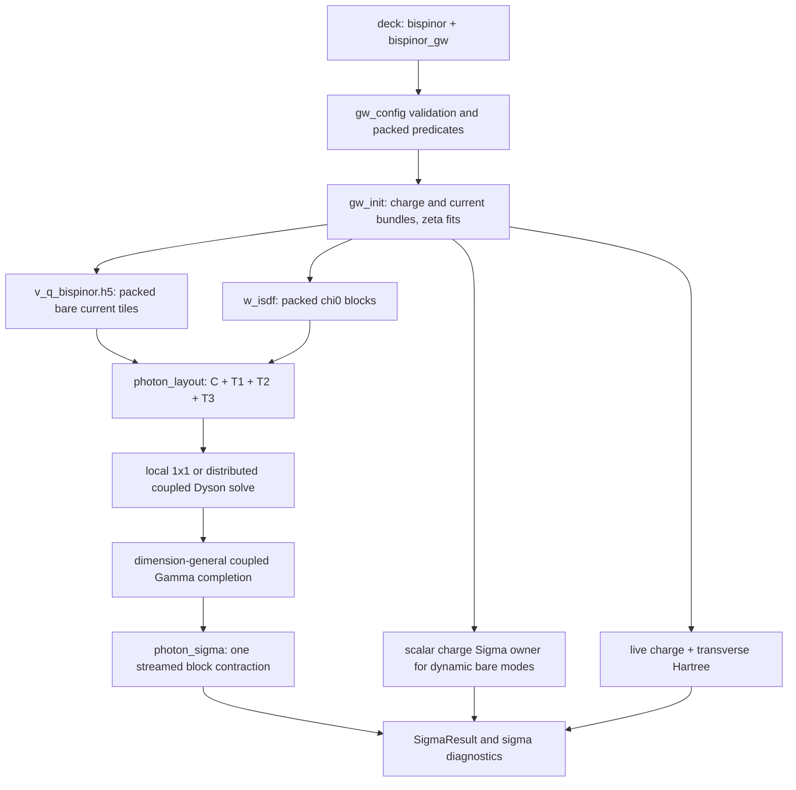

# Four-current (bispinor) wiring

This page maps the single production four-current route from a deck to its
outputs. Physics and Γ-cell formulae are owned by
[Four-current heads and frequency](../theory/four-current-head-corrections.md);
deck semantics are owned by the [input reference](../input_reference.md).

## The route

Every accepted `bispinor = true` deck uses the packed photon operator and
`gw.photon_sigma` contraction. `bispinor_gw` has two values on that one
carrier; it selects which Lorentz blocks are screened, not another Sigma
implementation.

| family and mode | packed response | Sigma ownership |
|---|---|---|
| `full_static_cohsex`, `cohsex` | all sixteen `chi^{AB}` blocks and one coupled Dyson solve | the packed contraction owns X, SX and COH for all sixteen blocks |
| `bare_transverse`, `cohsex` | current response is declared zero; scalar `W_CC` is spliced beside bare `D_TT` | the packed contraction owns all sixteen static blocks |
| `bare_transverse`, `x_only` | `W = V`; no screening | scalar charge X plus the packed twelve current-index X blocks |
| `bare_transverse`, `gn_ppm`, `hl_ppm` or `mpa` | CC is absent from the packed layout; `W_CURRENT = V_CURRENT` | scalar dynamic charge Sigma plus the packed current blocks at zero frequency |

The absent-CC layout lets dynamic MPA keep its disk-backed charge fit and its
ordered residues unchanged. On a measured-broken-TR GN run, the authenticated
Hall samples additionally produce the dynamic Faraday CT/TC Γ contribution.
HL refuses that magnetic case because its scalar probe is real-axis while the
Hall artifact is authenticated at an imaginary probe.

The route predicates in `gw.gw_config` have distinct questions:

| owner | question |
|---|---|
| `packed_static_envelope(config, screened=...)` | which public deck classes are admissible |
| `packed_bare_transverse_route(config)` | whether a bare deck satisfies that envelope, with a printable reason |
| `uses_static_photon_response(config)` | whether the one packed response must exist; true for every accepted bispinor deck |
| `packed_photon_screens_current(config)` | whether all current blocks are screened (`full_static_cohsex` only) |
| `packed_photon_replaces_charge_sigma(config)` | whether packed static COHSEX owns the charge Sigma too |
| `uses_dynamic_packed_photon_route(config)` | whether charge Sigma remains with a frequency-dependent scalar owner |
| `uses_coupled_photon_head(config)` | whether the Γ completion is enabled by `head_correction = full` |

`tests/test_bispinor_route_exhaustive.py` crosses the complete public deck
grid through parsing, bispinor validation, the screening-diagram door and the
restart-storage door. Every accepted cell must make
`uses_static_photon_response(config)` true; every rejected cell must name a
`GATE`. This is the executable exhaustiveness boundary.

## Data flow

### Initialization and storage

`gw_init.prepare_isdf_and_wavefunctions` builds the charge bundle and the
independent transverse bundle named `wfns_transverse`. The latter is a live
packed-route operand: it supplies the current vertices for response, Sigma and
the transverse Hartree. `bispinor_v_q_path` likewise remains the authenticated
path to the packed bare-current tiles read by
`compute_static_photon_response`; it is not a dispatch selector.

Charge and current centroid extents may differ. `photon_layout` packs
`C,T1,T2,T3` with logical extents recorded separately from mesh padding.
Every response or Coulomb body remains sharded `P(None,'x','y')`; no complete
centroid-square object is materialized on fewer than all processors.

Bare restart authenticates the tensor store and `v_q_bispinor.h5` with one
source-composition binding, the four literal-Γ vectors and any required scalar
`W(0)`. Paired pre-schema files recover that binding in memory only after the
restart WFN fingerprint, both centroid tables, Coulomb policy, four exact zeta
provenance records, and V-tile format/grid/extents agree. Their literal-Γ
vectors are the four small `zeta_q_G[:, :, 0]` hyperslabs read through
`ZetaLoader`; no full zeta sphere is gathered and the historical artifacts are
not modified. Screened packed restart refuses before opening large arrays because
canonical packed V+W storage is not yet implemented.

### Screening and Γ completion

`w_isdf.compute_static_photon_response` is the response owner. Screened
static COHSEX constructs all sixteen no-pair current blocks and solves the
packed Dyson equation. Bare static COHSEX splices the independently screened
charge block beside bare current blocks. Bare dynamic and x-only modes do not
perform a packed solve.

`head_correction.complete_static_photon_q0` is the only transverse Γ-cell
owner for both slabs and bulk. The slab provider integrates the reciprocal
mini-cell polygon; the bulk provider integrates its Wigner-Seitz polyhedron.
The completion returns low-rank charge, transverse, and optional Hall mixed
blocks plus Ward, Hermiticity and Dyson-bound certificates. With
`head_correction = off`, the body remains packed but the run record loudly
marks the calculation as debug-only.

There is no production transverse-head overlay. The old deck spelling is a
parse-time tombstone only and always refuses; it has no config field, builder
hook, or service kernel.

For broken TR, `file_io.static_gauge_head` owns Hall-artifact authentication.
Static screened COHSEX consumes the zero-frequency mixed completion. Dynamic
GN uses `fit_dynamic_photon_cttc_q0` and
`photon_sigma.compute_ppm_faraday_head_sigma_omega` to stream the six CT/TC
blocks without allocating a second packed W body. `SymMaps.trs_allowed=true`
takes an exact-zero fast path. `head_correction=off` skips with a DEBUG record.

### Self-energy

`sigma_dispatch.compute_sigma_xc` has three bispinor arms and an
exhaustiveness refusal:

| arm | behavior |
|---|---|
| packed static COHSEX | `compute_static_photon_sigma(blocks="all")` supplies X, SX and COH; scalar head terms are rejected as a double count |
| packed bare x-only | scalar charge X plus packed current X; the current SX/X identity and zero COH are checked |
| packed bare dynamic | scalar charge X and correlation retain their ordinary owners; `compute_static_photon_sigma(blocks="current")` adds the frequency-independent current sector, and GN may add Faraday CT/TC |

Each current block folds gamma vertices into separate Green-build operands with
`wavefunction_bundle.with_lorentz_vertices`, streams one V/W tile through the
common Green/convolution/projector graph, and blocks before advancing. The
block selector is dynamic, so X, SX and COH share one compiled kernel. A sector
closure gate checks `CC + (CT+TC) + TT` against the direct total.

The live Hartree is common to every bispinor family. It is rebuilt from charge
and signed current densities unless the density-self-consistent driver owns
that rebuild. No transverse operand enters the scalar finite-q PPM or MPA
correlation kernel; only the dynamic Faraday Γ carrier supplements GN.

### Outputs and observability

`SigmaResult` carries:

| field | meaning |
|---|---|
| `photon_head_sigma_diag_tskn_ry` | X/SX/COH by CC, CT+TC and TT sector, k and band |
| `photon_head_sigma_basis` | basis label for those diagnostics |
| `sigma_lorentz_skij_ry` | physical Sigma by CC, CT+TC and TT sector |
| `sigma_c_odd_at_dft_diag_ev` | ordered-residue `Sigma_c[B,D]-Sigma_c[B,D=0]` on measured-broken-TR GN |
| `sigma_ct_hall_at_dft_diag_ev` | dynamic Hall-on minus Hall-off CT/TC term when the Faraday carrier is applied |

`sigma_output` writes these to `sigma_freq_debug.dat` and `sigma_diag.dat`
(`sigCC`, `sigTT`, `sigCT`, `sigC_odd`, and `sigCT_hall`). Run records always
contain `Photon route`, `Photon head`, and `Photon Sigma`; the latter reads the
layout's `charge_block_state`, so screened layouts report CC present while the
dynamic current-only layout reports CC absent.

## Named refusals

The deck-class IDs asserted by the exhaustive test are:

- `bispinor_head_correction_no_local_fields_unavailable`
- `bispinor_screened_packed_restart_storage_unimplemented`
- `bispinor_screened_x_only_has_no_screened_operand`
- `bispinor_screening_diagrams_require_packed_operand`
- `packed_bare_cohsex_self_consistency_unimplemented`
- `packed_bare_x_only_self_consistency_unimplemented`
- `packed_screened_mpa_static_role_unimplemented`
- `packed_screened_self_consistency_unimplemented`

Runtime facts add these important boundaries:

- `bispinor_screened_packed_local_requires_1x1`: a local packed solve is
  supported only on a true 1x1 mesh.
- `dynamic_hall_head_hl_imaginary_probe`: broken-TR HL cannot pair its
  real-axis charge probe with an imaginary-axis Hall sample.
- `packed_dynamic_sc_requires_current_operator`: a served bare dynamic SC
  map must receive both the immutable packed response and transverse bundle.
- `bispinor_packed_restart_binding_*`, `bispinor_packed_restart_gamma_*`, and
  `bispinor_packed_restart_w0_missing`: restart authentication failed.
- `bispinor_pre_schema_restart_provenance_{missing,mismatch}`: read-only
  recovery lacks a required historical stamp or one disagrees with the live
  authenticated sources.
- `static_gauge_hall_*`: the Hall artifact is absent, partial, or mismatched.
- `photon_head_sigma_sector_closure`: the block-sector accounting failed.

The removed transverse-head spelling is deliberately not in this capability
matrix: parsing tombstones it before a `LorraxConfig` exists.

## Memory invariants

- Packed V, W and response bodies use `NamedSharding` and
  `P(None,'x','y')` on a square mesh.
- Per-block views are dynamic slices, not host gathers.
- Only the band-space Sigma result is replicated at the output seam.
- Dynamic Faraday retains low-rank CT/TC factor pairs, never a second packed
  frequency-dependent body.
- The transverse wavefunction bundle is measured with
  `wavefunction_bundle.bundle_bytes_per_rank`; it is not hidden in a scalar
  memory estimate.

## Owners

| concern | owner |
|---|---|
| deck class and route predicates | `src/gw/gw_config.py` |
| charge/current bundle and V-tile orchestration | `src/gw/gw_init.py` |
| packed layout | `src/gw/photon_layout.py` |
| finite-q response and Dyson solve | `src/gw/w_isdf.py` |
| coupled Γ completion and Faraday factors | `src/gw/head_correction.py` |
| blockwise current Sigma | `src/gw/photon_sigma.py` |
| mode dispatch and sector bookkeeping | `src/gw/sigma_dispatch.py` |
| output schema | `src/file_io/sigma_output.py` |
| executable route exhaustiveness | `tests/test_bispinor_route_exhaustive.py` |
