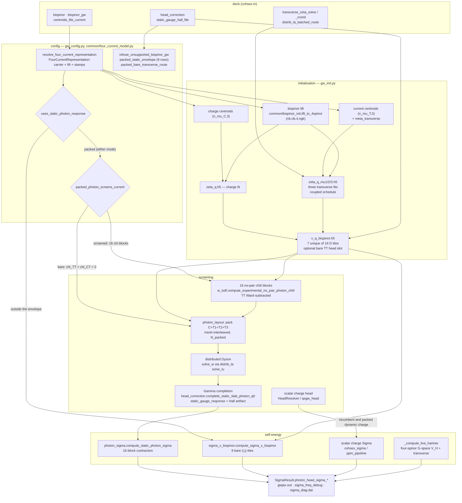

# Four-current (bispinor) wiring

**What this page is for.** The four-current layer touches sixteen source
files across preprocessing, ISDF, screening, Σ and output. This page is the
map: for each stage, the file and function, the object it produces with its
shape and sharding, which route it belongs to, and what refuses. Read it
before touching anything under `bispinor`; it should take about ten minutes.

**What this page is not.** It states no physics. The Γ-cell physics, the
frequency treatment and what is zero by construction are owned by
[Four-current heads and frequency](../theory/four-current-head-corrections.md).
Deck-key semantics are owned by the [input reference](../input_reference.md).
Module one-liners are owned by [Codebase](codebase.md). Where those pages
disagree with this one, they win — this page owns the *wiring* only.

> **Parent-route wiring updated 2026-09-06 on the BISP feature branch.**
> Older line-number locators below refer to `34228021`; named owners and
> the parent-route sections describe the current implementation. The sole phase and
> coverage statement is on the
> [theory page](../theory/four-current-head-corrections.md#four-current-phase-status).
> Use the named function as the durable locator; historical line numbers
> are not a claim about the current source position.

## The routes

`bispinor_gw` has two values on one four-spinor carrier. It selects which
Lorentz blocks are screened and which Sigma owner contracts them; it does not
select a carrier.

There is one packed static photon **operator**. Two deck situations reach it:

| route | selected by | current `χ` blocks | `Σ^B` contracted by | marked below |
|---|---|---|---|---|
| **packed, screened** | `bispinor_gw = full_static_cohsex` | all sixteen `χ^{IJ}` built, one packed Dyson solve | `gw.photon_sigma`, TT part of the sixteen-block `Σ_X` | **P** |
| **packed, bare** | `bispinor_gw = bare_transverse` **and** the envelope below | fifteen current blocks declared **zero**; packed solve skipped, CC screened by the scalar owner and spliced in, so `W_packed = diag(W_00, D_TT)` and `W_CT = 0` | the same `gw.photon_sigma` | **P** |
| **incumbent, bare** | `bispinor_gw = bare_transverse`, **outside** the envelope | none — the bare `D^{ij}` tiles are contracted directly | `gw.sigma_x_bispinor` | **B** |

Orthogonally to *which* packed operator is built, `compute_mode` decides
**how much of Σ that operator owns** — one axis, two values:

| compute mode | packed Σ blocks | charge Σ | predicate |
|---|---|---|---|
| `cohsex` | all sixteen (`blocks = "all"`) | none beside it: the CC block of the packed operator **is** the charge Σ | `packed_photon_replaces_charge_sigma` |
| `gn_ppm`, `hl_ppm` | the twelve with a current index (`blocks = "current"`), evaluated once at `ω = 0` | the ordinary scalar `Σ_x + Σ_c(ω)` on the same ISDF `W_00`, with `head_resolver`, `static_head_terms`, the `{static, probe}` role W's and the `ppm_pipeline` all unchanged | `uses_dynamic_packed_photon_route` |

`mpa` has no packed arm: `screening_requests_for` returns no independent
static role for it, so the packed bare family's CC block would have no owner.
It therefore remains on the incumbent bare-transverse Sigma route. The packed
dynamic route's run-record line is `Photon Sigma`, beside `Photon route` and
`Photon head`.

**One envelope owner: `gw_config.packed_static_envelope`.**
It used to be written twice — six conditions in
`packed_bare_transverse_route` and seventeen in
`refuse_unsupported_bispinor_gw`, five of them restated with separately
formatted `got`/`want` strings. Both now walk
`gw_config.packed_static_envelope(config, *, screened)` (`:3655`), which
yields `(accepted, got, want, klass, why, derived_key)`. The table also
shows configuration coercion and the downstream restart-file contract;
those are not extra duplicate envelope predicates:

| # | row | applies to | class |
|---|---|---|---|
| 1 | `compute_mode ∈ {cohsex, gn_ppm, hl_ppm}` (`PACKED_PHOTON_COMPUTE_MODES`) | both | IMPLEMENTATION LIMIT — `cohsex` is the static packed mode and the plasmon-pole pair is the dynamic packed route (charge block dynamic, current blocks frozen at `ω = 0`); `mpa` remains incumbent because it has no independent static-role W |
| 2 | `qp_solver = one_shot_dft` | both | IMPLEMENTATION LIMIT |
| 3 | `screening_diagrams = w_rpa` | both | IMPLEMENTATION LIMIT |
| 4 | `head_correction ∈ {full, off}` | both | PHYSICS/POLICY (row 20) |
| 5 | authenticated parent restart, when requested | both | File readers require canonical parent faces and stored Γ factors; missing old-file factors refuse |
| 6 | parent carrier | both | `low_mem_bands` defaults true; false warns and proceeds on parents |
| 7 | `linalg = distributed` | both packed modes | IMPLEMENTATION LIMIT, **declared** |
| 8 | no scalar q→0 head override named (`scalar_head_overrides_named`, `:3621`) | screened | IMPLEMENTATION LIMIT — ONE conjunct for the eight `use_bgw_vcoul` / `wcoul0_*` / `*head*` / `mc_average_placement*` keys, naming only the ones the deck set |

Row 6 is enforced at configuration parsing: both accepted spellings select
parents, with a visible retirement warning for false. Refusal-by-name remains
pending under the owner ruling. Row 7 is declared: packed routes require
`distributed`. Material class is also outside the
table: the driver infers it from the loaded WFN occupations, and
`validate_material_inputs` refuses every fractional-occupation non-MPA run
before screening. `sys_dim = 2` is deliberately **not** in the table: the bare route treats it as a routing condition
(`packed_bare_transverse_route`, `:3720`) while the screened mode refuses it
only under `head_correction = full` (`GATE
static_bispinor_photon_head_slab_only`, `:4055`), and one row cannot say
both.

The route predicate returns **`(taken, reason)`**, not a bool: the driver
prints the first unmet condition into the run record as the `Photon route`
line, because the two routes differ in the `q → 0` head mechanism and
switching physics silently is the hazard the reason exists to prevent.

`bispinor_tt_head_correction` **is no longer a deck key** (removed
2026-09-01, refused by name in `read_lorrax_input`). The double-count
refusal survives as ONE gate covering *both* packed modes
(`GATE packed_bare_transverse_tt_head_double_count`, `gw_config.py:4019`,
keyed on `uses_static_photon_response`), reachable only from a hand-built
config: the Γ-cell completion already inserts `⟨D_TT⟩` and honouring an
overlay too would double count it.

The bare route additionally requires `linalg = distributed` as a routing
condition. The default `local` retains the incumbent route; an explicit
`distributed` selects the packed route on a supported multi-rank mesh.
Because `distrib_la` refuses a distributed solve on a 1×1 mesh, one-GPU
operation stays on the local incumbent route. The packed completion is the
only deck-reachable producer of a transverse q→0 head.

The three predicates, all in `src/gw/gw_config.py`:

| predicate | line | answers |
|---|---|---|
| `packed_bare_transverse_route(config) -> (taken, reason)` | `:3743` | does a bare-transverse deck take the packed operator, and if not, why not |
| `packed_photon_screens_current(config) -> bool` | `:3810` | **the one selector between the two packed modes**: `True` only for `full_static_cohsex` |
| `uses_static_photon_response(config) -> bool` | `:3824` | is the packed operator used at all — `full_static_cohsex` always, plus the bare route inside its envelope |
| `packed_photon_replaces_charge_sigma(config) -> bool` | `:3838` | does the packed operator own the CHARGE Σ too (`cohsex`), or only the current blocks — the question every driver seam that skips the scalar charge machinery must ask |
| `uses_dynamic_packed_photon_route(config) -> bool` | `:3859` | the packed operator on a frequency-dependent Σ |

`uses_coupled_photon_head` (`:3873`) adds `head.correction is FULL` on top and
decides **only** whether `gw_init` keeps the four literal-Γ channel vectors.

**`BispinorGWMode` has TWO members** (`:289`), `bare_transverse` and
`full_static_cohsex`, and they resolve to the SAME carrier — the axis picks
which Lorentz blocks are screened, never which four-spinor represents them.
Three retired spellings refuse by name from ONE table,
`_RETIRED_BISPINOR_GW_MODES` (`:324`, read by `coerce_bispinor_gw_mode`
`:353`): `charge_hall_cubature` → `full_static_cohsex`, and the two
carrier-comparison modes `pauli_reference_bare_transverse` and
`isometric_kinetic_balance_bare_transverse` → `bare_transverse`. Refusals,
not aliases: the coercer runs from a dozen resolution sites, and a mode value
is the one deck word that decides which physics runs.

**A row marked P below applies to both packed modes** unless it says
otherwise; **B** means the incumbent route only. Rows marked "both" are
common to every bispinor deck.

**What the packed bare route is worth, measured** (MoS2 3×3, 270 states,
`reports/bisp_c_bare_as_packed_2026-09-01`, claim 581): with the head off it is
**byte-identical** to the incumbent route — `max|dE_qp| = 0.000 µeV`, every
`sigma_diag.dat` data row identical — despite a completely different
contraction order and operator packing. Declaring the fifteen current `χ` blocks
zero costs **0.012 µeV** against the screened packed mode. The former head-on
difference of **5.4 meV MAE / 11.9 meV max** compared different Γ-cell
quadratures as well as different insertion rules. Both routes now use the
Wigner–Seitz polygon cubature; the remaining insertion distinction is owned
by [theory §3.6](../theory/four-current-head-corrections.md).

## The map



## Stage 1 — deck to config

Parsing and defaults are the input reference's; the wiring facts are which
object each key ends up on and who reads it.

| key | default (`gw_config.py`) | lands on | route |
|---|---|---|---|
| `bispinor` | `False` (`:1690`, parse `:5947`) | `config.bispinor` (`:5050`) — the master switch | both |
| `bispinor_gw` | `bare_transverse` (parse via `coerce_bispinor_gw_mode` `:353`; enum `:289`, **two** members; three retired spellings in `_RETIRED_BISPINOR_GW_MODES` `:324`; config construction `:5948`) | `config.bispinor_gw` | both |
| `centroids_file_current` | `""` (`:1514`, parse `:5435-5443`) | `config.paths.centroids_file_current` (`:3274`) | both |
| `head_correction` | `full` (`:2011`, coerced `:548`, read `:5451`, built into `HeadConfig` `:5474`) | `config.head.correction` (`:5064`) | both |
| ~~`bispinor_tt_head_correction`~~ | **REMOVED as a deck key 2026-09-01**; the field is wired to `False` (`gw_config.py:5495`) for the incumbent V-tile builder | `config.head.bispinor_tt_head_correction` | **B only**, and now only from a hand-built config |
| `static_gauge_hall_file` | `""` — EMPTY (`:1503`) | `config.paths.static_gauge_hall_file` | P; optional. An UNNAMED file means `σ_H = 0`, announced. Every named path is authenticated by the loader; an absent one refuses there. The bare route accepts only an exact-zero artifact and refuses a nonzero Hall vector |
| `linalg` | `local` | the parser-cached backend profile (including `config.backend.transverse_zeta_solve`) | both |
| `transverse_zeta_rcond` | `1e-10` (`:1916`, validate `:5741-5745`) | `config.backend.transverse_zeta_rcond` (`:4774`) | both |

The retired stage/backend keys refuse by name; implementation-specific
overrides, where available, are debug-only CLI or `LORRAX_*` controls.

**The one resolver.** `common/four_current_model.resolve_four_current_representation(bispinor, model)`
returns a frozen `FourCurrentRepresentation` with seven fields: `charge_bispinor`,
`charge_lift`, `current_bispinor`, `current_lift`, `scalar_head_bispinor`,
`charge_representation`, `spatial_current_representation`. **It is not stored
on the config** — its consumers call it locally (`gw_config.py:378`,
`gw_init.py:799,1459,1984,3106`, `sigma_dispatch.py:309`,
`sc_iteration.py:1588,1736`, `head_correction.py:571,1613`,
`qsgw_head.py:3394`, `file_io/kin_ion.py:389`, and
`psp/get_dipole_mtxels.py:1093`), so grep for
`resolve_four_current_representation`, not for a config attribute.

**TWO branches at `34228021`**: non-bispinor (everything False) and
bispinor (both `raw`, `scalar_head_bispinor=True`) — the two shipped
`bispinor_gw` values ride the same carrier, so `model` is accepted and
ignored. The two carrier-comparison branches went with their deck spellings.
It stays a resolver rather than collapsing into `bool(bispinor)` because the
`charge_representation` / `spatial_current_representation` provenance stamps
the `dipole.h5` / `kin_ion.h5` / ζ authenticators compare against need ONE
producer. The surviving lift selector is `RAW_KINETIC_BALANCE_LIFT = "raw"`;
`ISOMETRIC_KINETIC_BALANCE_LIFT = "isometric"`
(`src/common/bispinor_init.py`) remains library code for the jet tests.

**`static_bispinor_photon_envelope` is a gate id, not a function.** It is
the raise at `gw_config.py:3997`, over the eight rows of
`packed_static_envelope` (the table in Stage 1). **Eight**, down from
seventeen (`lane/bisp-l-dials-envelope-2026-09-01`), and each unmet row
prints `PHYSICS` or `IMPLEMENTATION LIMIT` with its own reason. `full` is the
default and runs the Γ completion, `off` is a DEBUG skip, and
`no_local_fields` is refused on EVERY bispinor deck
(`GATE bispinor_head_correction_no_local_fields_unavailable`, `:3943`) —
the coupled solve has no scalar diagnostic head, and on the bare route the
value used to move the deck off the packed path, which is a head dial
choosing a route. A separate gate,
`GATE static_bispinor_photon_head_slab_only` (`:4055`), refuses
`sys_dim != 2` **while the completion is on**; the DEBUG headless body keeps
the bulk reach the old envelope gave it.

## Stage 2 — initialization (`gw_init.py`)

| object | producer | shape / dtype | sharding | route |
|---|---|---|---|---|
| charge centroid indices | `gw_jax.py:392-395` → `file_io/centroids.load_centroid_basis` (`:122-174`) | `(n_mu_C, 3)` i64 | host | both |
| current centroid indices | `gw_init.py:1429-1441` (refusal `:1425-1428` if the key is unset) | `(n_mu_T, 3)` i32 | host until needed | both |
| `meta_transverse` | `gw_init.py:1442-1447` | `Meta` with `n_rmu = n_mu_T`, `nspinor = 4`, `npol = 4`, `n_rmu_padded = padded_mu_extent(...)` | — | both |
| four-spinor ψ | `common/bispinor_init.lift_to_4spinor` (`:234`) | `(n_parent, nb, 4, ngkmax)` c128, `[ψ_L; ψ_S]` on the spinor axis | caller wraps; no sharding inside | both |
| raw-parent ψ carriers | `wavefunction_bundle.ParentGreenCarrier`; `gw_init` prepares separate C/T families | `(n_parent, n_X, 4, mu_Y)` / `(n_parent, 4, mu_X, n_Y)` | `P(None,'x',None,'y')` / `P(None,None,'x','y')` | both; child faces are transient |
| charge ζ | `gw_init.py:2209-2239` → `isdf_fitting.fit_zeta_to_h5` | `tmp/zeta_q.h5`, `(n_q_disk, n_mu_C, ngkmax)` c128 | accumulator `(n_q_disk, n_mu_padded, ngkmax)` at `P(None,('x','y'),None)` (`isdf_fitting.py:1404-1409`) | both |
| three transverse ζ | `gw_init.py:2448-2499` (`_fit_transverse_channel`, `vertex_mu_L = 1,2,3`) | `tmp/zeta_q_mu{1,2,3}.h5`, `(n_q_disk, n_mu_T, ngkmax)` c128 | same | both |
| `C_q` (CCT Gram) | `isdf_fitting.py:743-751` | `(nq, n_mu_padded, n_mu_padded)` | `P(None,'x','y')` — layout contract `isdf/core.py:4960-4966` | both |
| bare `D^{IJ}` tiles | `v_q_bispinor.compute_V_q_bispinor_g_flat_to_h5` (`:261-581`) | `v_q_bispinor.h5`, 7 datasets `(n_q_irr, n_mu_L, n_mu_R)` c128 | device buffer `P(None,'x','y')` (`v_q_g_flat.py:492-494`) | both |
| tile reader | `v_q_bispinor.BispinorVqReader.get_tile` (`:682-716`) | `(n_q, n_L_padded, n_R_padded)` c128 | `P(None,'x','y')`; Hermitian companions read at `P(None,'y','x')` then conj-swapped (`:704-709`) | both |
| `photon_g0_vectors` | `v_q_bispinor` writer/reader | four canonical `(1,n_mu)` datasets; padded/packed at read | `P(None,'x')` | authenticated Γ completion and restart — **P** |

**Sixteen tiles, seven on disk.** Six `(0,i)`/`(i,0)` tiles are exactly zero
by Coulomb gauge (`ZERO_TILES`, `v_q_bispinor.py:67-70`); three `(j,i)` with
`i < j` are Hermitian companions reconstructed on read (`HERMITIAN_PAIRS`,
`:72-78`); the remaining seven — CC plus six TT — are computed and written
(`UNIQUE_TILES`, `:60-65`). Format stamp `bispinor_lorentz_v2` (`:80`),
artifact path `gw_init.py:2786`.

The raw-parent ζ route uses a separate orbit-packed current basis and its
four-spinor `ParentGreenCarrier`. `_fit_transverse_channel` passes that
carrier's plan and both faces into `fit_zeta_to_h5`. C_q and Z_q contract
raw-parent bands, unfold the open-spin projector through the symmetry
service, then apply the fixed output-spin vertices. Coupled mu123 shares
the parent projector build; each saved ζ file remains canonical and q-IBZ.

**The coupled ζ schedule.** `_z_q_face_parent(coupled_mu123=True)`
shares raw-parent open-spin projectors and the transported left tail across
three current channels. It builds one `[3,q,μ,r]` stack per orbit tile with
`P(None,None,'x','y')`; each channel keeps its own vertex, solve and canonical
q-IBZ output. `_z_q_face_coupled_mu123` and the full-k C/Z fallback kernels
are deleted. The existing fit coordinator controls channel scheduling.
The outer `gw_jax.zeta_fit_transverse` timer measures the current-fit wall
interval; overlapping worker intervals must not be summed.
Full design: [Parent ζ fitting](zeta_fit_face_psi_cct.md).

**The bare TT head slot** (route B). ONE gate refuses it on either packed
route now that the deck key is gone:
`GATE packed_bare_transverse_tt_head_double_count` (`gw_config.py:4019`,
keyed on `uses_static_photon_response`), reachable only from a hand-built
config. Config plumbing `gw_init.py` →
`v_q_bispinor.py:423` → the per-tile builder
(`_make_per_q_v_builder_for_tile`, `:141-253`). The tensor
`T_ab = ⟨v(q) P^T_ab(q̂)⟩_mBZ` is `(3,3)` f64 from `_tt_head_tensor`
(`:100-138`), computed **once per tile, not per q** (`:107-109`), and refused
outside `sys_dim ∈ {2,3}` (`:118-125`). The injected value is `T[i,j]/Ω_cell`
(`:224` — the `/Ω` is applied here, not in the shared `vcoul` estimator),
substituted into the unique `q = Γ, G = 0` slot (`:240`, `:250`), after which
the single spatial-metric sign is applied once on the way out (`:251`,
`COULOMB_GAUGE_TT_SIGN = -1.0` at
`services/vcoul/src/vcoul/minibz.py:119`). No vertex and no Σ contraction
compensates that sign.

## Stage 3 — screening

### 3a. The packed body (route P — both packed modes)

`w_isdf.compute_static_photon_response` (`:1863-2279`) is the screening owner
of both packed modes. Its required `screen_current` argument comes from
`gw_config.packed_photon_screens_current`; `config` is required and the head
record is built internally, so a caller cannot inject a competing head owner.

`screen_current` is resolved once, by
`gw_config.packed_photon_screens_current`, and is never defaulted here; a
value inconsistent with `bispinor_gw` is refused (`:1962-1993`), and
`screen_current = False` without a `W_charge` is refused at `:1981-1985`. It
selects:

* **`True`** (`full_static_cohsex`) — the sixteen no-pair `χ` blocks and one
  distributed Dyson solve, below.
* **`False`** (the bare-transverse family on the packed route) — the twelve
  current blocks are zero **by declaration**, so neither they nor the packed
  solve are built at all — the branch is `:2150-2193`, against the screened
  branch at `:2135-2149`. The CC block is screened by
  the incumbent scalar owner (`gw.screening.compute_screening_model` →
  `solve_w` at `n_C`, called by the driver at `gw_jax.py:695`) and
  arrives as `W_charge`; this function assembles
  `W_packed = diag(W_00, D_TT)` with `W_CT = 0` through the sole packer.

Both modes then run **one** Γ-cell completion (§3b). The per-rank resident
byte figure for the packed body is measured and printed at the site
(`:2112-2134`, the print itself `:2129-2134`): `16·n_q_irr·N_packed²/P` bytes each for `V_packed` and
`W_packed`. That carrier is **new to the bare route** — the incumbent route
held one TT tile at a time — and is the same object the screened mode
already held.

| object | producer | shape | sharding |
|---|---|---|---|
| one no-pair block `χ^{IJ}_0` | `w_isdf.compute_no_pair_dirac_current_block` (`:1665`) | `(nq, μ_L, μ_R)` c128 | `P(None,'x','y')` |
| the sixteen blocks (`screen_current = True` only) | `compute_experimental_no_pair_photon_chi0` (`:1788`); T1/T2/T3 share one transverse bundle | — | — |
| TT Ward subtraction | `_subtract_static_tt_contact` (`:1776`), applied inside the sixteen-block builder | `Π(q_irr) − Π(Γ)` before Dyson/star unfold | covariant contact follows typed block transport |
| packed `V`, `χ_0`, `W` | `photon_layout.pack_photon_operator` (`:219`), `w_isdf.solve_w` (`:1431`) | `(nq, N_packed, N_packed)` c128 | `P(None,'x','y')` |

`N_packed` is `PhotonBasisLayout.packed_extent` (`photon_layout.py:107-109`),
`p_C + 3·p_T` over the mesh-padded centroid extents built by
`from_centroid_extents` (`:88-101`); one transverse centroid family must serve
T1/T2/T3, and `__post_init__` (`:69`) refuses otherwise. The packing is
**mesh-interleaved**, not a contiguous direct sum: packed row shard `x` holds
that shard's own local `C,T1,T2,T3` row chunks, and the column shard applies
the same permutation (`photon_layout.py:24-31`, offsets `local_offset`
`:119-123`). A packed operator is therefore `P O Pᵀ`, Dyson algebra is
unchanged, and both `pack_photon_operator` and `photon_block_view` (`:279`)
are local `shard_map` slices with no redistribution. Ordering stamp
`PHOTON_BASIS_ORDERING = mesh_interleaved_direct_sum_v1` (`:55`).

The sixteen-block enumeration lives in `pack_photon_operator`'s double loop,
which calls the block builder once per `(A,B)` and `block_until_ready()`s each
(`:247`) so only one block is resident.

**The Dyson solve** is `solve_w` (`w_isdf.py:1431`) with
`dyson_solver="distributed"` on this path (`:2141-2144`, inside the
`screen_current = True` branch), dispatching to
`_get_w_solve_fn_distributed` (`:1164`), which plans through the `distrib_la`
service (`plan("solve_lu", mesh_xy, backend="distributed", …)` at `:1259-1260`,
executed at `:1328`). Inputs, the assembled `A`, the LU factors and `W` all
stay `P(None,'x','y')`. The source states the invariant at `:1191-1195`: **no
rank ever materialises a full `(μ, μ)` tile** — the largest per-rank transient
is the `μ·μ/min(Px,Py)` gathered GEMM operand.

`StaticPhotonResponse` (`w_isdf.py:1846`) carries `layout`, `V_packed`,
`W_packed` (both as above), `head_completion`, and three provenance stamps
whose values **differ by route** — read them to tell which route produced an
artifact:

| stamp | screened (`full_static_cohsex`) | packed bare |
|---|---|---|
| `current_contact` | `ward_subtracted_no_pair` | `none: current channels unscreened` (`STATIC_PHOTON_BARE_CURRENT_CONTACT`, `:1842`) |
| `current_model` | `positive_energy_kinetic_balance_dirac_current_v1` (`common/bispinor_init.py:32`) | `bare_breit_no_current_response_v1` (`STATIC_PHOTON_BARE_CURRENT_MODEL`, `:1841`) |
| `approximation` | `gamma_completed_no_pair_static_photon_v1` / `DEBUG_headless_no_pair_static_photon_v1` (`:2259-2269`) | `gamma_completed_bare_transverse_photon_v1` / `DEBUG_headless_bare_transverse_photon_v1` (`:2270-2278`) |

There are **four** `approximation` strings: one per route × head state.

Under the DEBUG setting the module prints a boxed
`WARNING -- DEBUG: Gamma-cell head disabled by head_correction=off`
(`:2092-2098`); the `WARNING` token is what the production sink retains into the
run record's warning block.

### 3b. The Γ completion (route P — both packed modes, on by default)

`head_correction.complete_static_slab_photon_q0` (`:1298-1307`, called at
`w_isdf.py:2241`) takes
`V_packed`, `W_packed`, a **sealed** response record, the two
`(4, N_packed)` `g_0` vectors (`g0_X` at `P(None,'x')`, `g0_Y` at
`P(None,'y')`) and a cubature receipt, and returns updated `V`, `W` plus a
`StaticSlabPhotonHeadCompletion` (`:1130`, fields `:1133-1151`, carrying
`sigma_H` `:1149` and `hall_source` `:1150` alongside the certificates). The
old `isinstance` fork over two response types is gone: the single path is
`require_static_photon_head_response(response, mesh_xy)` at `:1326`. It runs whenever
`head_correction = full`, which is the default — it is no longer opt-in.

| input | producer | shape | sharding |
|---|---|---|---|
| cubature receipt | `vcoul.slab_minibz_photon_cubature` (`services/vcoul/src/vcoul/minibz.py:821`) — exact Wigner–Seitz polygon, fixed 16/24/32 Duffy–Gauss ladder (`:124`) | host chunks: `q_cart (n,3)`, `D_raw (n,4,4)`, `sample_weight (n,)` f64 | host, write-locked |
| `StaticPhotonHeadResponse` (`:64`, sealed — only its producer can build one) | `static_gauge_response.build_static_photon_head_response` (`:169-293`, called at `w_isdf.py:2215`); `require_static_photon_head_response` (`:103-155`) | `S_direct (2,2,4,4)`, `sigma_H (3,)` real, `hall_source` str, `Y_x (2,4,N_packed)`, `Z_y (2,N_packed,4)` | `P()`, `P()`, —, `P(None,None,'x')`, `P(None,'y',None)` |
| Hall artifact — **optional** | `file_io/static_gauge_head.load_static_gauge_hall_artifact` (`:180-189`), called at `w_isdf.py:2066-2074` behind the existence check at `:2019`; sole writer `write_static_gauge_hall_artifact` (`:130-135`) via `psp/get_dipole_mtxels.py` | `static_gauge_hall.h5`, schema 1 (`STATIC_GAUGE_HALL_SCHEMA_VERSION`, `:35`), `sigma_H_cart (3,)` f64 | replicated |

If no `static_gauge_hall_file` is present the builder sets `sigma_H = 0` and
`hall_source = HALL_SOURCE_NONE` (`static_gauge_response.py:51,214`; the shape/sharding contract is re-asserted at `:114-121`) and says
so; a present but mismatched artifact still **refuses** in the loader, so a
stale file cannot degrade a run silently. For a Chern-trivial insulator that
default is the exact answer — see
[the theory page](../theory/four-current-head-corrections.md) §4.4.

The updates are **one bare rank-4 outer product into `V`** (`:1480-1482`) and
**nine screened rank-4 outer products into `W`** (`:1491-1503`), all through
`photon_layout.add_photon_q0_low_rank` (`:556`), which takes left rows at
`P(None,'x')` and right rows at `P(None,'y')`, donates the packed buffer, and
does a purely local outer product (`:576-579`). Gates on this path:
`GATE static_gauge_head_fold_ward` (`:1365`) and
`GATE static_gauge_head_fold_hermiticity` (`:1370`), against
`_STATIC_GAUGE_WARD_RESIDUAL_MAX = 1e-8` and
`_STATIC_GAUGE_HERMITICITY_RESIDUAL_MAX = 1e-10` (`:158-159`), plus the
`static_photon_dyson_*` / `static_photon_polygon_*` numerical certificates
(`:1249-1295`, helpers `:1159-1246`, budget `1e-9` at `:1154`).

**What the mode declares it does not have.** The **module docstring of
`gw.static_gauge_response`** is the complete list. It replaced the
`CHARGE_HALL_CUBATURE_AVAILABILITY` availability grammar and its
`StaticGaugeTermAvailability` / `require_full_static_gauge_availability`
machinery, which are deleted. Present: the charge CC
`q²` head `S^{00}`, the charge wings `Y^0`/`Z^0`, and the Hall CT/TC `q¹`
term. Omitted by model: the current `q²` response (TT and CT/TC), the current
wings, the uniform static current response (zero by gauge invariance for an
insulator), the diamagnetic/contact terms and the complement-space closure —
and they are never stored as accidental zeros, because `S_direct` has charge
support only. What that list means physically is
[the theory page](../theory/four-current-head-corrections.md) §4.3.

**The dead seam is absent at `34228021`.** The former implementation carried
a producerless full-static-gauge seam — `StaticGaugeHeadResponse`,
`require_canonical_operator_fingerprint`, `require_static_gauge_head_response`
and its five `GATE static_gauge_head_*`, `LoadedStaticGaugeHeadResponse`,
`write`/`load_static_gauge_head_artifact`, the v2 head schema, the
`gauge_head_response=` argument, `GATE static_gauge_head_end_to_end_uncertified`
and the `GATE full_static_bispinor_gauge_head_unavailable` that made it
unreachable. Those symbols are deleted; `file_io/static_gauge_head.py` is now
the Hall artifact's format owner and nothing else.

### 3c. The scalar charge head (incumbent and packed dynamic charge)

The scalar head remains the owner for every incumbent route and for the CC
sector of packed GN/HL-PPM. `HeadResolver` (`head_correction.py:1589`) is built
at `gw_jax.py:533`; `head_correction = full` builds the direct DFT response at
`:625-665`, finalizes its samples at `:799-813`, and constructs the static
Sigma terms at `:852-872` through `_compute_static_head` (`:189`). Only static
packed COHSEX skips this machinery: its sixteen-block operator replaces the
charge Sigma and its coupled completion owns the charge head. The dynamic
packed route deliberately keeps the scalar dynamic charge head and adds only
the current-index blocks from the packed completion.

## Stage 4 — self-energy

The fork is `sigma_dispatch.py:845`, and it has **three** packed arms plus
an exhaustiveness refusal:

| arm | line | what it does |
|---|---|---|
| `packed_photon_replaces_charge_sigma` (`compute_mode = cohsex`) | `:845-889` | the sixteen-block contraction owns `Σ_X`, `Σ_SX`, `Σ_COH` outright. Its three refusals fire before any allocation: outside `compute_mode = cohsex`, with no packed response ("Refusing instead of falling back to charge-only screened COHSEX"), and with scalar `static_head_terms` present (double count) |
| `uses_dynamic_packed_photon_route` (the plasmon-pole pair) | `:890-990` | the scalar `compute_sigma_x` runs with the incumbent `Σ^B` arms **explicitly off** (`wfns_transverse=None`, `bispinor_v_q_path=None`) and keeps `static_head_terms` (the CC bare-X head); the packed consumer is called with `blocks = "current"` (`:955`) and its `SX + COH` is booked into `sig_x` (`:973`), which is arithmetically the same `Σ_xc` as adding an `ω`-independent term to `Σ_c` and is the seam the incumbent route already used for `Σ^B`. The current sector's bare-exchange and static-correlation magnitudes are printed at the seam |
| `uses_static_photon_response` with neither of the above | `:991-1008` | `NotImplementedError` naming `PACKED_PHOTON_COMPUTE_MODES`; today that is `mpa` reached through a hand-built config |

`finalize_dynamic_sigma` carries the packed per-sector Γ diagnostics through
to `sigma_freq_debug.dat` (`:342-549`, passed at `:1320`); on the dynamic
route the CC sector of those columns is exactly zero, because the charge head
there is the dynamic model's, not the packed completion's.

| object | producer | shape | sharding | route |
|---|---|---|---|---|
| sixteen-block `Σ_X`, `Σ_SX`, `Σ_COH` (fifteen non-CC blocks for `blocks="current"`) | `photon_sigma.compute_static_photon_sigma` | `(nk, nb_sigma, nb_sigma)` after parent-sector sum and typed band unfold | replicated only at the band-output boundary | P |
| full-q interaction class | `photon_sigma._make_photon_class_restore`, using `w_isdf.photon_blocks_full_q` | `(n_block, nk_tot, n_left, n_right)`, n_block = 1, 3 or 9 | `P(None,None,'x','y')`; q-IBZ source stays packed | both |
| Green function | `greens_function_kernel.build_G` | `(nk, ns, μ_L, ns, μ_R)` | `P(None,None,'x',None,'y')` | both |
| head-attribution block | `photon_layout.photon_q0_low_rank_block` | `(1, p_A, p_B)` | `P(None,'x','y')` | P |
| bare transverse exchange | `sigma_x_bispinor.compute_sigma_x_bispinor` calls `photon_sigma.contract_lorentz_blocks` with nine TT keys and X term | parent-band sum, then full-k band operator | all-P projection; replicated output window | B |
| transverse Hartree | `sigma_dispatch._compute_live_hartree` → `kin_ion_io.compute_hartree_matrix` | scalar/current `(nk_full, nb, nb)` Ry | `P(None,'x','y')` | both |

`contract_lorentz_blocks` is the shared X/SX/COH block consumer. It chooses
raw-parent endpoint families, unfolds each endpoint through its typed plan,
and applies the requested vertex afterward inside the static kernel. The
outer projection uses unvertexed parent faces. Endpoint-family classes are
submitted in sequence without a host fence between them; each full-q
interaction stack is an input to its compiled vertex scan. CC, CT+TC, and TT sums are
formed on parents before band unfold: an individual Lorentz block is not
covariant. `GATE photon_head_sigma_sector_closure` checks the diagnostic sum
against the independently accumulated total. The former
`with_lorentz_vertices` bundle-copy helper and its field map are deleted.

The static kernel currently performs its G band contraction at full k after
local endpoint transport; parent-only persistent storage is distinct from
parent-sized band work. Its distributed GEMMs use native communication, as
the scalar route does. HLO-visible symmetry collectives and native GEMM
traffic must be reported separately.

**`Σ^B` enters twice, differently** — on the incumbent route. In
`compute_cohsex_sigma` it is added to **both** `sig_x` and `sig_sx`
(`cohsex_sigma.py:660-668`); in `compute_sigma_x` — the entry every dynamic
mode and `x_only` takes — it is added to `sig_x` only (`:735-742`). On
either packed route neither fires: `Σ^B` is the TT part of the packed `Σ_X`
instead, and `sigma_x_bispinor` is not called — on the dynamic route the
`compute_sigma_x` call passes `wfns_transverse=None` explicitly so the arm
cannot fire by accident. `photon_sigma` and `sigma_dispatch` needed **no
change** for the packed *bare* route — the sixteen-block consumer streams
whatever `V`/`W` it is handed — and needed only a block selector and one
branch for the *dynamic* one.

**No transverse operand reaches a dynamic Σ_c, and that is the design.**
`compute_ppm_sigma_pipeline` (`ppm_pipeline.py:473-490`) and the MPA body
(`mpa/sigma.py:283-303`) have no `wfns_transverse`, `bispinor_v_q_path` or
`photon_response` parameter, and they gained none in the minimal dynamic
packed route splits Σ instead: the charge half is those untouched kernels on
`W_00(ω)`, the current half is the packed consumer at `ω = 0`, and the two
meet only in the `sig_x` addition at `sigma_dispatch.py:973`. So the
four-current layer still reaches a dynamic Σ through `sig_x` and the
transverse Hartree and nowhere else — what changed is which owner computes
the `sig_x` transverse part, not how many owners there are.

**The transverse Hartree is on both routes.** Its gate is
`include_transverse = bool(config.bispinor)` (`sigma_dispatch.py:311`), not
`bispinor_gw`, so every bispinor mode and every compute mode gets it unless
`omit_v_h` (density self-consistency, which rebuilds both fields itself). It
is added through `_compute_live_hartree` at `:1045-1067`. Physics owner:
[Direct Hartree field](../theory/hartree.md).

## Stage 5 — outputs

`SigmaResult` (`sigma_dispatch.py:62`) carries **two** such fields, `None` on
every non-packed route (initialized at `:843-844` and populated from the
packed contractions at `:887-890` or `:988-990`):

| field | line | shape / value |
|---|---|---|
| `photon_head_sigma_diag_tskn_ry` | `:124` | `(3, 3, nk, nb)` — axes `(term = X/SX/COH, sector = CC / CT+TC / TT, k, band)`, DFT basis |
| `photon_head_sigma_basis` | `:125` | `"dft"` when populated; also in `BASIS_FREE_FIELDS` (`:257`) |
| `sigma_lorentz_skij_ry` | `sigma_dispatch.py` | `(3, nk, nb, nb)` — physical `Sigma_xc` sectors `(CC, CT+TC, TT)`. Packed routes accumulate the computed blocks in `photon_sigma.py`; incumbent routes retain the computed `Sigma^B` as TT and define CC as the exact total-minus-current residual. It rotates with the total under static self-consistency. |
| `sigma_c_odd_at_dft_diag_ev` | `sigma_dispatch.py` | `(nk, nb)` only on a measured-broken-TR GN deck: `Sigma_c[B,D] - Sigma_c[B,D=0]` evaluated at each DFT state. `None` on measured-TRS decks. |

A former `photon_head_sigma_operator_fingerprint` field is absent at
`34228021`; it belonged to the removed full-static-gauge seam.

Mirrored onto the output record at `gw_output.py:149-150` and forwarded by the
driver at `gw_jax.py:1067-1069` (schema zeros `:1070-1072`, final record
`:1292-1294`). `sigma_freq_debug` gains `head_CC`, `head_CTTC`, `head_TT`,
`head_total` (`gw_output.py:814-819`) and the per-term `{term}_head_{sector}`
columns (`:820-830`), gated on `photon_head_sigma_basis is not None` at
`:726` and refusing a basis other than `dft` at `:784-787`;
`sigma_diag.dat`'s Hartree column is relabelled `Hdir` on a bispinor run.
Those runs add `sigCC`, `sigTT`, and `sigCT` (`sigCT = CT+TC`) without
changing `sigTOT`/`sigXC`; their sum is gated against that old total before
write. The independently computed current sectors are rounded to the legacy
six-decimal precision and displayed CC is their residual from the unchanged
displayed total, so the identity also closes within 1e-9 eV in public text. A
measured-broken-TR GN deck additionally adds `sigC_odd`; a
measured-TRS deck omits it. Scalar files take the `None` branch and retain
their historical columns byte-for-byte.

**Reading `gwjax.out`.** These lines tell you which route ran:

| line | file:line | means |
|---|---|---|
| `Photon head    : …` | `gw_jax.py:355` (incumbent) and `:789` (packed), via `gw_config.incumbent_bispinor_head_record:3889` | **which Γ-cell head ran, on every bispinor deck.** Packed: the completion's `hall_source`, `σ_H`, Ward / Hermiticity / Dyson-bound residuals and cubature orders, or the `DEBUG … NOT a production calculation` line under `head_correction = off`. Incumbent: the same DEBUG line under `off`, and under `full` a statement that the charge head is the scalar band-diagonal one and that there is **no** transverse q=Γ head on that route |
| `Photon route   : …` | `gw_jax.py:325-355` | **which route ran, on every bispinor deck.** It names packed screened static, packed bare/dynamic, or incumbent charge-screened + `Sigma^B`; an incumbent selection includes the first predicate condition that decided it. |
| `Photon Sigma   : …` | `gw_jax.py:773-786` | Whether the packed Sigma is all sixteen static blocks or a dynamic CC block plus twelve static current blocks. |
| `Sigma blocks   : …` | `gw_jax.py:1461-1468` | Max and mean `|diag|` in eV over the Sigma window for CC, CT+TC and TT. These reduce the same per-state fields written to `sigma_diag.dat`. |
| `Head Sigma     : …` | `gw_jax.py:1470-1475` | Opt-in under `sigma_freq_debug_output`: max and mean `|diag|` of the Gamma-cell contribution, split CC, CT+TC and TT. Dynamic CC combines the scalar bare-X and dynamic-correlation head owners; current sectors come from the packed completion. |
| `GN odd Sigma   : …` | `gw_jax.py:1478-1498` | Measured-broken-TR only: max/mean `|sigC_odd|`, its max/mean shares of `|Sigma_xc|`, the `W(iomega_p)` Hermiticity residual, and `max|D|/max|B|`. Its absence on a TRS deck is part of the schema. |
| `Slab WS cert   : …` / `Photon WS cert : …` | `gw_jax.py:803-809,1500-1506` | Exact Wigner-Seitz cubature order ladder, physical node counts and final mixed-tolerance error ratio. The photon line also reports the coupled solve's maximum Dyson backward residual. |
| `Global TRS     : …` | `common/scientific_output.py:352-386` | The measured global verdict and provenance used by the screening/ordered-residue route. Route selection reads this verdict; it is not inferred again from a deck flag. |
| `Bispinor GW policy: bispinor_gw=…` | `gw_jax.py:314` | the carrier banner. Under `full_static_cohsex` the parenthetical names the **head state**, not "experimental", and reads `DEBUG: Gamma-cell head disabled by head_correction=off` when the completion is off |
| `Σ^B tile (μ_L=i, ν_L=j): tr Σ = …` ×9 | `sigma_x_bispinor.py:217` | the **incumbent** bare route ran. Their absence beside a `Photon route: packed …` line is the packed bare route |
| `WARNING -- DEBUG: Gamma-cell head disabled by head_correction=off` | `w_isdf.py:2092-2096` | the packed body ran **headless**; the `WARNING` token is what the production sink keeps in the run record's warning block |
| `static photon response: approximation=…` | `gw_jax.py:756` | one of the **four** stamps above — the `no_pair` pair means the screened mode ran, the `bare_transverse` pair means the packed bare route did — plus `N_packed` |
| `[photon response] packed body N_packed=… : … GB/rank resident for EACH of V and W` | `w_isdf.py:2130-2135` | the measured per-rank cost of the packed carrier, printed on both packed routes |
| `Photon head    : Gamma-cell completion applied …` with `hall_source=`, `sigma_H=`, `ward=`, `hermiticity=`, `dyson_forward_bound=`, `cubature_orders=` | `gw_jax.py:789-809` | **the production run record's head line** (`41e2b6b2`). It reads `DEBUG: … NOT a production calculation` when the head was skipped, and `hall_source` says whether the Hall artifact was used or `σ_H = 0` |
| `packed photon COHSEX block (A,B) complete` ×16 | `photon_sigma.py:508` | the packed Σ ran — and there will be no `Σ^B tile` lines |
| `rho + signed J/c sweep` | `kin_ion_io.py:689` | the transverse Hartree ran |
| the `V_H` matrix label carrying `+ <m\|sum_i alpha_i A_i\|n>` | `kin_ion_io.py:991-993` | same, at the matrix sweep |

## Refusals, compressed

Every entry is a hard refusal, not a demotion. The `bispinor` refusals live in
`gw_config.refuse_unsupported_bispinor_gw` (`:3930-4083`), called at parse
and again at driver entry (`gw_init.py:3101`).

| rule id | file:line | fires when |
|---|---|---|
| `packed_bare_transverse_tt_head_double_count` | `gw_config.py:3943` | `head.bispinor_tt_head_correction = true` on a deck that takes EITHER packed route. The deck key is gone (2026-09-01), so this is the hand-built-config guard. The Γ completion already inserts `⟨D_TT⟩`; honouring the overlay too would double count it |
| `static_gauge_hall_file_missing` | `file_io/static_gauge_head.py` | the deck NAMES a Hall artifact that does not exist. This loader is the one absence owner; unnamed still means `σ_H = 0`, announced |
| `packed_bare_transverse_hall_unavailable` | `w_isdf._load_static_photon_hall` | an authenticated Hall artifact has any nonzero component on the packed **bare** route. Exact zero is accepted; otherwise the current-unscreened model's finite-q `W_CT = 0` cannot have a Γ-only CT/TC limit |
| (no id) `screen_current` inconsistency | `w_isdf.py:2195-2226` | the `screen_current` argument disagrees with `packed_photon_screens_current(config)` for the resolved `bispinor_gw`, or `W_charge` is missing on the bare branch |
| `bispinor_gw_charge_hall_cubature_retired`, `bispinor_gw_pauli_reference_retired`, `bispinor_gw_isometric_kinetic_balance_retired` | `gw_config.py:324` (`_RETIRED_BISPINOR_GW_MODES`, read by `coerce_bispinor_gw_mode` `:353`) | the deck names a retired mode value. **Refusals, not aliases**: the coercer runs from a dozen resolution sites, so an alias would print from each, and a mode value is the one deck word that decides which physics runs. Each names its replacement |
| `bispinor_head_correction_no_local_fields_unavailable` | `:3943` | `head_correction = no_local_fields` with any bispinor deck; the coupled solve does not produce that scalar diagnostic, and on the bare family the value would choose a route by changing head policy |
| `bispinor_slab_cohsex_restart_changes_the_head_mechanism` | `:3971` | explicit `restart = true` with bispinor slab COHSEX. The scalar and packed paths now share the cell-average cubature, but the restart schema has no packed response, wings, or rank-4 completion, so restart would still change content and insertion ownership |
| (deck key, not a gate) `bispinor_tt_head_correction` | `read_lorrax_input` | the key is REMOVED and refused at any value, naming the Γ-cell completion that carries the head |
| `bispinor_self_consistency_requires_live_four_current` | `:3997` | bispinor QSGW with explicit `density_self_consistent = false` |
| `bispinor_gw_requires_bispinor` | `:4044` | `bispinor_gw = full_static_cohsex` with `bispinor = false` |
| `static_bispinor_photon_head_slab_only` | `:4055` | the coupled completion is requested outside a slab; no bulk integrator exists |
| `static_bispinor_photon_envelope` | `:4073`, over `packed_static_envelope` `:3655` | any of the nine envelope rows fails |
| `bispinor_tt_head_unsupported` | `:4086-4137` | a hand-built TT head lacks bispinor or has unsupported dimensionality |
| (no id) SC × dynamic | `gw_jax.py:274-285` | self-consistent solver with a dynamic mode |
| (no id) missing current centroids | `gw_jax.py:579-584`, `gw_init.py:1425-1428` | `bispinor = true` without `centroids_file_current` |
| (no id) packed route needs distributed dense linear algebra | `gw_config.packed_static_envelope` | Every packed route requires `linalg = distributed`. The default `local` remains the incumbent fallback for `bare_transverse` and is a refusal for `full_static_cohsex`; `distrib_la` still refuses the distributed route on a 1×1 mesh. |
| (no id) photon Σ envelope | `sigma_dispatch.py:845` ff. | the static arm: outside `cohsex`; without a packed response; with scalar `static_head_terms`. The dynamic arm (`:890`) refuses a mode that builds static screened channels, and `:991` refuses a packed deck on a mode with no branch (`mpa`) |
| (no id) packed response needs a config / distributed Dyson | `w_isdf.py:1945-1953` | the packed path is called without the run config, or with a non-distributed Dyson solver |
| `GATE static_gauge_head_fold_{ward,hermiticity}` | `head_correction.py:1365,1370` | Γ-fold residuals over `1e-8` / `1e-10` (`:158-159`) |
| `GATE static_photon_{dyson,polygon}_*` | `head_correction.py:1249-1295` (helpers `:1159-1246`) | coupled-solve and polygon certificates, budget `1e-9` |
| `GATE photon_head_sigma_sector_closure` | `photon_sigma.py:515-520` | CC + CT/TC + TT does not close on the direct sixteen-block total |
| `GATE static_gauge_hall_{schema,partial,artifact_absent}` and the authentication gates | `file_io/static_gauge_head.py:69,77,83,200,203`; identity checks `:235-256` | Hall artifact partial, wrong schema, or not authenticating against this WFN, band manifold or `nk_tot`. **An absent file is not one of these** on the packed path: it means `σ_H = 0`, announced |
| `GATE static_gauge_raw_hall_degenerate` | `qsgw_head.py:2686` | degenerate differently-occupied states |
| (no id) insulating-only Hall | `qsgw_head.py:2808` | any fractional occupation |

**Three refusals are absent at `34228021`.** `full_static_bispinor_gauge_head_unavailable`,
`GATE static_gauge_head_end_to_end_uncertified` and
`GATE static_gauge_availability` guarded the deleted full-static-gauge seam and
were removed with it. A mode that cannot be requested needs no refusal.

## Memory invariants

The standing rule is that there must always exist a path that materialises no
`N_μ²`-class object on any one rank ([design decisions](decisions.md), the
two-plans-per-solve-family entry; the plan table is
[`docs/dev/large_nmu_operation.md`](../dev/large_nmu_operation.md)). Where it
is enforced on this layer, and how:

* **Packed Dyson.** Enforced by construction: `w_isdf.py:1191-1195`
  states that inputs, `A`, the LU factors and `W` all stay `P(None,'x','y')`
  and no rank materialises a full `(μ,μ)` tile.
* **Packed Σ.** Enforced by an **assertion**:
  `photon_sigma._require_packed_operator` (`:126-134`, message `:132-134`) raises unless both
  packed operators are still `P(None,'x','y')` — "A photon body may not be
  gathered or placed on fewer than all ranks." Block views are
  `dynamic_slice`s, not gathers (`photon_layout.py:259-274`).
* **`V_q` construction.** Structural, documented rather than asserted: one
  tile at a time, streamed to HDF5 and freed, so peak equals one scalar `V_q`
  tile (`v_q_bispinor.py:29-31`); Hermitian companions never stored (`:32-35`);
  TT Lorentz mixing done at write time so the reader's per-tile contract stays
  clean (`:389-391`).
* **`Σ^B`.** Structural, delegated to the reader — nine bare tiles consumed
  sequentially, each `P(None,'x','y')` (`v_q_bispinor.py:682-694`). There is
  **no assertion** in `sigma_x_bispinor.py`; what it carries instead is a
  measured per-rank ψ-inventory disclosure (`:164-178`) recording that the
  transverse bundle doubles the primary bundle's inventory.
* **ζ fits.** The layout contract is stated once, at `isdf/core.py:4960-4966`
  ("nothing here ever replicates an O(μ²) object"), with the per-tier byte
  accounting at `isdf/core.py:3569-3573` and the runtime banner at
  `isdf_fitting.py:920-923`.

Those are comments, banners and one assertion — not a gate. Treat the two
structural cases (`v_q_bispinor`, `sigma_x_bispinor`) as design intent to
uphold when editing, not as something the tree checks for you.

## Owners

| what you want | where |
|---|---|
| the physics of every Γ-cell head, and which frequency each channel carries | [Four-current heads and frequency](../theory/four-current-head-corrections.md) |
| what a deck key does | [Input reference](../input_reference.md) |
| one-line module descriptions | [Codebase](codebase.md) |
| the ζ fit's data movement and the coupled transverse schedule | [Face-ψ ζ fitting](zeta_fit_face_psi_cct.md) |
| the mini-BZ estimators and the photon cubature | [`vcoul`](../services/vcoul.md) |
| the distributed solve behind the Dyson step | [`distrib_la`](../services/distrib_la.md) |
| bispinor tile symmetry contracts, and why 4-component rotation does not exist | [Symmetry register](symmetry_register.md) |
| the transverse current Hartree | [Direct Hartree field](../theory/hartree.md) |
| Γ-cell quadrature ownership and the remaining scalar-versus-packed insertion distinction | [Four-current heads and frequency](../theory/four-current-head-corrections.md) §3.6 — both routes use the Wigner–Seitz polygon cubature; insertion is still route-specific |
| what freezing the current blocks at ω = 0 inside a dynamic run costs (1.2 × 10⁻⁸ eV on MoS2 3×3, and it bounds the neglected frequency dependence from above) | [Four-current heads and frequency](../theory/four-current-head-corrections.md) §2.2 |
| the narrative introduction, for a reader rather than an editor | `manual/08_bispinor/` (repo only, not in this site) |

### Raw-parent photon body (2026-09-05)

Both endpoint families carry raw four-spinor parent faces in their own packed
centroid orders. The current-response kernel takes `(plan_left, plan_right)`
and integer `(A,B)` vertices. Typed face transport precedes the vertex trace;
the completed χ block is selected on the q-IBZ rows. The experimental TT
contact subtracts the Γ row at q-IBZ before Dyson, then follows typed star
transport. It preserves the proxy model while correcting its covariance.

V and W stay packed at q-IBZ. `photon_blocks_full_q(response, keys, term=...)`
yields V, W or W−V one requested Lorentz block at a time. The static Sigma
class producer stacks those yields for its compiled scan; this is not
one-block residency at the consumer. It uses the measured q-grid policy and family plans retained by `StaticPhotonResponse`; Γ remains
row zero. The V reader and literal-G=0 vectors enter packed centroid order at
the file seam, using the existing C/T bases returned by ISDF preparation.

### Self-consistent density and transverse exchange

`sc_iteration._dft_psi_sphere` caches the active global-band window on raw
IBZ G-spheres and IBZ box indices. `rebuild_hartree_dft_basis` selects full-k
U/E at the typed raw-parent rows, uses file k weights, and sends charge
through scalar FFT pullbacks and current through `project_polar_fft_field`.
The unrotated IBZ orbitals contract the common scalar/current potential;
completed Hartree band matrices unfold through the band-operator service.
Each map rotates both charge and transverse parent bundles from their DFT
references with the same U/E, then passes the transverse bundle and its
authenticated V file/bases to `compute_sigma_xc`.

Packed restart stores the four literal Gamma one-leg factors as
`photon_g0_vectors_0` through `_3` in `v_q_bispinor.h5`, each `(1,n_mu)`
in its canonical logical centroid order. The reader pads for the current
mesh and packs at the file boundary. The coupled head is recomputed from
these factors and authenticated parent wavefunctions; restart never changes
the head mechanism. Older packed files missing the factors refuse by name.


The head attribution flag controls diagnostics only: both packed dispatch paths pass it to `compute_static_photon_sigma`, and `contract_lorentz_blocks` reuses each body Green tensor for the optional Γ-only contraction. Physical Γ completion and ordinary `Sigma blocks` output remain independent of this switch.

The Gamma completion transports rank-four factor pairs over the authenticated active group and averages their products through `_photon_q0_factor_orbit`; physical updates and optional head attribution share that owner. The carrier stores the original factor pairs plus family-plan metadata, not a dense group projector. Dynamic tau projection accumulates file-wedge band rows and applies `unfold_file_wedge_band_operator(..., trs_rule="transpose")` after the frequency sum. Its Green contraction unfolds both endpoint faces through the typed symmetry plan before one planned GEMM, with unchanged complex-time weights. See the 2026-09-06 decision for this interface correction.

BSE restart reads select valence/conduction bands from canonical `psi_parent_y`, authenticate their WFN/centroid/parent-row provenance, and pack/unfold/unpack through the same typed parent plan before entering existing BSE contractions. Legacy `psi_full_y` files remain readable. This boundary expands only the requested BSE bands and does not add a GW full-k carrier.

For nonclosed centroid admission, both families share one computational
`SymMaps.trivial_view()` and loader-unfolded full-k parents. The original
loader symmetry still defines file-wedge output and authenticated head
velocities. See [the parent-fit admission contract](zeta_fit_face_psi_cct.md#unreduced-admission-for-nonclosed-centroid-sets).

Green weights contract child faces after the typed endpoint action, with one
full-child Green GEMM for static and dynamic channels. The two transient
complex128 faces occupy `32 * nk * nb * ns * M / P` bytes per rank; the
quadratic Green result remains sharded over both mesh axes. Head wings batch
the same typed children in parent order. Neither path persists those faces.


### Static photon response entry contract (2026-09-06 phase extraction)

Build the packed static photon body and complete its Gamma cell.

THE SCREENING OWNER OF BOTH PACKED STATIC MODES.  ``screen_current``
(resolved once by :func:`gw_config.packed_photon_screens_current`, never
defaulted here) selects which:

``screen_current = True`` -- ``bispinor_gw = full_static_cohsex``: the
sixteen no-pair blocks of ``chi``, one distributed Dyson solve at
omega=0.

``screen_current = False`` -- the ``bare_transverse`` family: the twelve
current blocks of ``chi`` are ZERO by declaration, so the packed Dyson
equation is block diagonal and neither the current blocks nor the packed
solve are built at all.  The CC block is screened by the incumbent
scalar owner (``gw.screening.compute_screening_model`` -> :func:`solve_w`
at ``n_C``) and arrives as ``W_charge``; this function assembles
``W_packed = diag(W_00, D_TT)`` with ``W_CT = 0`` through the sole
packer.  The sixteen-block Sigma consumer then returns the screened
charge COHSEX in CC, the bare Breit exchange ``Sigma^B`` in TT
(``SX(D_TT) = X(D_TT)``, ``COH(D_TT - D_TT) = 0``) and zero in CT/TC --
the incumbent ``gw.sigma_x_bispinor`` result, block for block.

Both modes then run ONE Gamma-cell completion
(:func:`gw.head_correction.complete_static_slab_photon_q0`) from the
bounded response of
:func:`gw.static_gauge_response.build_static_photon_head_response` --
bare ``<D>`` into V, the charge ``S^{00}``/wing head into W, the Hall
CT/TC term from ``config.paths.static_gauge_hall_file`` when that
artifact exists (``sigma_H = 0`` otherwise, announced).  With the
charge-only ``R(q)`` the coupled 4x4 solve returns
``diag(W^{00}_h(q), D_TT(q))``, so the same completion inserts the
charge head AND the bare ``<D_TT> = -<v P^T>`` that the
``bispinor_tt_head_correction`` overlay writes into the TT V tiles on
the incumbent route (that key is refused here, GATE
``packed_bare_transverse_tt_head_double_count``).  The Hall term needs a
screened CT/TC channel to live in, so a nonzero Hall artifact is refused
on the bare route; an authenticated exact-zero artifact is admitted and
gives the same operator as the unnamed zero-Hall default.  The completion
runs under ``head_correction = full`` (the
default); ``off`` skips it behind a DEBUG banner and is not a production
setting (owner ruling 2026-09-01).  The current q^2/contact/complement
terms are omitted by model in either case.

MEMORY.  Both modes keep the packed body resident: ``V_packed`` and
``W_packed`` are each ``(nq, N_packed, N_packed)`` complex128 at
``P(None,'x','y')`` with ``N_packed = n_C + 3 n_T``, i.e.
``16 nq N_packed^2 / P`` bytes per rank each.  The bare route's
incumbent predecessor held one TT tile at a time instead, so this IS a
new resident carrier for that route (it is the same object the screened
mode already holds).  The figure is printed at this site below; the
per-block streaming inside ``gw.photon_sigma`` is unchanged.

``print_fn`` is the driver's rank-zero printer.  In production mode the
driver sinks ordinary component chatter, so the DEBUG banner below
carries a WARNING token (retained in the run record's warning block)
and the driver copies the completion / Hall status into its
``Photon head`` record line from the returned ``head_completion``.


### Coulomb projection entry contract and phase rulings (2026-09-06)

Compute bare Coulomb V_qmunu and its in-memory G=0 view.

Returns (V_qmunu, G0, head_channel, photon_g0_vectors), where V_qmunu
has shape (nq, μ, μ)
(flat-q) and G0 is (n_rmu,) ζ_μ(G=0) at q=0.  ``head_channel`` is a
``gw.head_channel.HeadChannel`` when the deck sets
``mc_average_placement`` to something other than ``off``, and ``None``
otherwise — nothing is computed for it on the default path.  Downstream consumers that need
the 3-D-k form reshape inside ``common.fft_helpers.make_flat_k_fft``.

The legacy ``(1, npol, npol, …)`` leading axes are gone — bispinor
will introduce a structured ``V_q_bispinor`` NamedTuple (CC, CT, TT)
rather than packing all polarisation tiles into a uniform tensor,
because charge and transverse channels use different μ counts.

```text
	# The Cartesian reciprocal ROWS come off the vcoul door's geometry, not
	# from a hand-written product.  ``docs/services/vcoul.md`` says it in as
	# many words — "Do not multiply ``wfn.blat * wfn.bvec`` at a call site" —
	# and the reason is the one ``CoulombGeometry``'s own docstring gives: a
	# product every caller has to remember to take is a footgun, because the
	# day one of them passes ``wfn.bvec`` alone every number downstream is
	# off by the lattice constant with no shape error to say so.
	# ``from_wfn`` is duck-typed on ``blat``/``bvec``/``cell_volume``, all
	# three of which ``WfnLoader`` binds off the mf_header.
	#
	# ONLY ``.bvec`` IS TAKEN.  ``meta.cell_volume`` below stays where it is:
	# Ω sets the 1/Ω factor on every v(q+G), so swapping its source is a
	# physics edit, not a plumbing one.  It happens that the two agree
	# exactly — ``Meta.from_system`` and ``CoulombGeometry.from_wfn`` both
	# read ``float(wfn.cell_volume)`` off this same loader, measured
	# bit-identical — but "they agree" is the licence for a later swap, not
	# a reason to make it in a commit about ``bvec``.
	# V_q memory budget (per rank) — informational only.  The live
	# G-flat V_q path bounds its working set with ``vq_g_chunk_size``
	# (per-q G-chunk) and mesh-sharded ζ slabs; there is no byte-budget
	# chooser to feed any more.  Kept for the log line below.
	# Resolved earlier in :func:`fit_zeta` (line ~589) via the shared
	# ``_resolve_cutoff`` helper — defaults to ``wfn.ecutwfc``, max
	# ``wfn.ecutrho``, validated against the ζ-sphere cutoff.  Hoist
	# the resolved value here rather than re-resolving so the two call
	# sites stay in sync (this is the V_q half of the same number
	# zeta_fit wrote into ``isdf_header/zeta_cutoff_ry``).
	# ── Bispinor branch ────────────────────────────────────────────────
	# When cfg.bispinor is set AND the 4-channel ζ files were produced by
	# fit_zeta (zeta_q.h5 + zeta_q_mu{1,2,3}.h5), dispatch to the
	# 7-tile orchestrator that streams V^{μ_L,ν_L}_q to a dedicated
	# HDF5 file.  The CC tile (μ_L = ν_L = 0) matches the scalar charge
	# V_q — bit-identically for every sandbox bispinor system, which is
	# sys_dim=2: there the G=0 body is regularised by the 2D truncation
	# (f2d→0) and the mini-BZ head-average is a no-op, so the CC builder's
	# omission of ``v_head_fn`` costs nothing.  In 3D with
	# ``mc_average_vcoul_body`` enabled the two DO diverge, in the G=0 slot
	# of every q≠0; that path is reachable, so a 3D bispinor deck must not
	# assume the CC tile and the scalar V_q agree.  See the v_q_bispinor
	# CC builder.  We
	# read the CC tile back as the scalar V_qmunu / G0 the downstream
	# restart_state writer expects.  Σ_X^B / Σ_H^B consumers will read
	# the TT tiles directly via BispinorVqReader.
		# REFUSE, do not demote.  This used to print the sentence below and
		# carry on with a scalar V_q — i.e. silently return NON-BISPINOR
		# physics from a deck that asked for bispinor, with Σ^B absent and
		# no symptom in any output.  decisions.md 2026-08-01 rules that a
		# missing capability is a refusal naming what is missing, never a
		# demotion to a different compute path; this is the same class as
		# the FFI entry and the same class as the restart regression
		# 3d89885 fixed.
		# Reload the transverse centroid indices for the bispinor IBZ
		# cascade.  fit_zeta loaded them earlier but didn't surface them
		# to compute_V_q's signature; reloading is cheap (a text file
		# read) and keeps the bispinor IBZ wiring local to this branch.
		# Orbit-closure of the C/T centroid sets is resolved inside
		# ``_resolve_ibz_q_list`` (called per tile by the V_q
		# orchestrator), which falls back to full-BZ on failure and
		# ANNOUNCES it once per centroid set — the charge and the
		# transverse set are separate facts and get separate lines.
		# It used to fall back SILENTLY; see gw/qgrid_symmetry.py.
		# Charge-channel n_rmu (== meta.n_rmu).  Transverse n_rmu_T comes
		# from the dataset shape on disk — read it from one of the ζ_T
		# files.
		# n_rmu_T from the transverse ζ dataset shape on disk
		# (fit_zeta_to_h5 writes all ζ files in G-flat layout).
		# HEADER-ONLY (``mesh=None``): no SlabIO handle, no phdf5 FFI, no
		# collective — the same one serial-h5py open the raw
		# ``f['zeta_q_G'].shape[1]`` here did, through the reader that owns
		# the layout.  ``n_rmu_disk`` IS axis 1 in G-flat and axis 2 in
		# r-space, which is the dispatch this line used to assume.  The
		# loader's open-time refusals (zeta_is_done, header-vs-dataset μ,
		# header-vs-dataset ngkmax) come along, and they are a strict
		# SUBSET of what the ``ZetaLoader(zeta_T_paths[0], mesh=mesh_xy)``
		# fifteen lines below already applies to this very file.
			# G-flat path: per-q + G-chunked, one orchestrator per
			# four ζ files.  No legacy compute_V_q_tile chooser /
			# μ × ν tiling / in-V_q FFT — see
			# gw.v_q_bispinor.compute_V_q_bispinor_g_flat_to_h5.
						# No explicit-carrier stamp: both shipped
						# bispinor_gw values ride the one raw
						# kinetic-balance carrier.
		# Read only the CC tile back.  Its literal-G=0 vector is the in-memory
		# view returned by the same projection that built V; it is deliberately
		# absent from v_q_bispinor.h5 because zeta_q_G is the sole persisted
		# source of truth.  The four small views stay resident only for a packed
		# coupled head; headless modes release the transverse three immediately.
		# The TT tiles stay on disk; Σ_X^B / Σ_H^B will consume them
		# via BispinorVqReader once those paths land.
		# V_q_raw is on disk at LOGICAL n_rmu (the orchestrator strips
		# the V-tile pad before write).  In-memory ψ flows at PADDED
		# n_rmu so the σ_X kernel can broadcast V across G's μ axis.
		# Pad V_q_raw with zeros to match — pad rows of ψ are zero
		# (Phase 3a invariant), so zero-padding V is exact.
		# ``mc_average_placement`` is refused on the bispinor builder, not
		# silently skipped.  ``v_q_bispinor`` does not pass ``v_head_fn`` at
		# all, so with ``mc_average_vcoul_body`` on in 3D the bispinor CC tile
		# and the scalar V_q ALREADY diverge in the G=0 slot of every q != 0
		# (see the note at the head of this file).  Adding a second, quieter
		# copy of that divergence is exactly what COULOMB_AVG_ARCHITECTURE.md
		# section 4.6(b) says not to do.
			# The BGW q0 mode does not rescale the bispinor V tile.  It needs
			# only the charge-charge head vector at one finite q, which is
			# carried by the ordinary charge ζ file even in a bispinor run.
		# Scalar (non-bispinor) path.  ``compute_all_V_q`` dispatches on
		# the on-disk ζ layout: G-flat (the only thing fit_zeta writes)
		# routes to ``v_q_g_flat.compute_all_V_q_g_flat``; any other
		# layout raises.  ``ZetaLoader`` is the V_q reader of record —
		# it serves the writer's per-q WFN.h5-style G-sphere directly.
					# The q != 0 head channel, for ``mc_average_placement``.
					# Gated on the mode so the default path neither reads ζ a
					# second time nor compiles a single extra kernel.  It sits
					# INSIDE the loader scope because that is the only place
					# ζ is open, and before ``V_q_raw`` is padded so the μ
					# extents agree by construction.
	# Keep G0 = ζ_μ(G=0) in memory for the current compute consumers.
	# It is already the G=0 coefficient of canonical ``zeta_q_G`` (stored
	# parent-q slot 0), so persisting ``g0_mu`` would create a second source
	# of truth.  Full-BZ literal G=0 under IBZ symmetry is a derived unfolded
	# view and likewise must not be persisted as a duplicate dataset.
	# ``common.collectives.gather_to_host`` is the sanctioned L3 gather and
	# is what ``_slab_io_allgather._to_host`` was a private copy of.  This
	# import used to reach straight into the allgather backend, bypassing
	# every one of the seven refusals that guarded that tier -- an eighth,
	# ungated door.  G0 is (nq, mu), mu-class not mu^2-class, so the gather
	# itself is not the doctrine violation; the unguarded private import
	# was.  Same dispatch, public name.
	# Scalar V_qmunu is just (nq, μ, μ).  The (1, npol, npol) leading
	# axes of the legacy 8-D layout were never used in scalar mode and
	# have no place once bispinor switches to a structured tile container
	# (CC + CT(3) + TT(3,3) NamedTuple) since the μ counts differ across
	# polarisation tiles.  See agent/v_q_perf design discussion 2026-05-08.
	# V was assembled from the canonical zeta FILE; every in-memory operator
	# is in the run's packed centroid order.  Convert once, here.
	# V_q_raw is now flat-q (nq, μ, μ); q=0 slab is V_q_raw[0].
	# ── V_q stage gate ────────────────────────────────────────────────
	# Three one-sweep invariants on the tensor every later stage (χ₀, W,
	# Σ_x, Σ_c, the BSE kernel) is built from.  Historically this seam
	# produced a 27 % shift in ``tr V_{q=0}`` between two runs whose V_q
	# is band-window-independent and therefore *must* have been identical
	# — a discrepancy that was only noticed days later, by hand, from log
	# archaeology.  V is a positive-definite Gram matrix in the ISDF
	# basis, so its q=0 trace is positive by construction and its tiles
	# are Hermitian by construction; both are cheap to state.
	# Per-q hermiticity above is a NEIGHBOURING property, not the one the
	# BSE kernel rests on.  That one is q↔−q conjugate reciprocity,
	# V_q = conj(V_{−q}) (equivalently: ifft_q(V_q) is REAL), and it is
	# independent of hermiticity in both directions.  V_q passes the
	# hermiticity gate at 3.0e-16 on every fixture measured while failing
	# the reciprocity at 5.7e-3 (armA_base480, 2026-08-07) -- and a q=0
	# check could not have seen it either way, because -0 == 0 makes the
	# condition collapse to "V[0] is real", which holds at 3.7e-16.
	# V is the BARE Coulomb: static and analytic, no frequency dependence
	# anywhere, so the dynamical/Kramers-Kronig caveat that applies to a
	# real-axis W does not apply here at all.  Reciprocity is simply true.
	# TOLERANCE from the MEASURED floor, not from eps: these tiles span
	# |A| in [2.6, 4.7e6] and the residual is set by cancellation among
	# large intermediates, not by eps*max|A| (= 1.0e-9 here).  The
	# empirical floor is the orbit-closed IBZ arm: MEASURED 1.16e-7
	# (armB_orbit504, 2026-08-07), with the per-element relative residual
	# falling as |A| rises, which is the round-off signature.  The DIRECT
	# arm instead sits at 1.5e-3 per-element relative and FLAT in |A| --
	# systematic, not round-off.  1e-5 is ~90x above the floor and ~400x
	# below that break.
	#
	# WHAT THAT FLOOR IS *NOT*.  This comment used to say that on the
	# orbit-closed IBZ arm "the unfold builds V_{-q} from V_q by symmetry
	# so reciprocity holds BY CONSTRUCTION", and read the 1.16e-7 as an
	# arithmetic floor.  Both halves are false.  The unfold applies a
	# SPATIAL operation; reciprocity is a statement about complex
	# conjugation.  They coincide only if the finite ISDF zeta basis is
	# point-group covariant -- an unstated assumption, and MEASURED FALSE
	# by 1.240e-02 at Gamma on the Na 8x8x8 SOC c464 deck.  So 1.16e-7 is
	# a measurement of zeta covariance on ONE deck, not a floor any deck
	# inherits.
	#
	# AND THIS GATE IS BLIND WHERE THAT DEFECT IS LARGEST.  At a q with
	# q == -q (Gamma, and every TRIM of an even mesh) the condition
	# collapses to "V_q is real", which the analytic assembly satisfies at
	# machine epsilon whatever the covariance does: 3.9e-17 at Gamma and
	# 6.4e-17 at H on the deck whose covariance residual there is 1.2e-02
	# and 2.4e-02.  The discriminating statistic is the little-group
	# covariance of the IBZ PARENTS, measured at the unfold sites in
	# ``v_q_g_flat``/``screening``/``screening_bse`` through
	# ``QgridTrsPolicy.measure_covariance`` and reported by
	# ``sanity.report_parent_covariance``.  Do NOT tighten the rtol here
	# to compensate; this statistic is measuring a projection.
```
