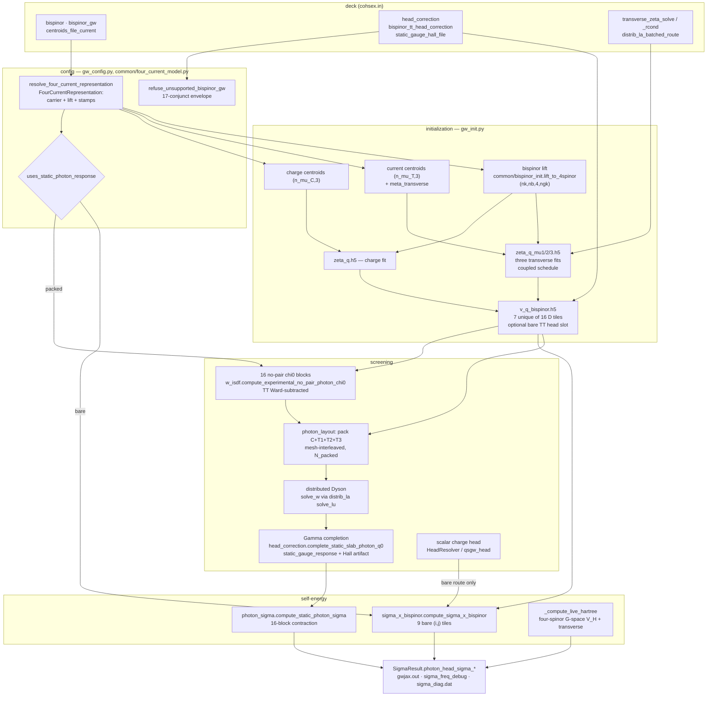

# Four-current (bispinor) wiring

**What this page is for.** The four-current layer touches sixteen source
files across preprocessing, ISDF, screening, Σ and output. This page is the
map: for each stage, the file and function, the object it produces with its
shape and sharding, which route it belongs to, and what refuses. Read it
before touching anything under `bispinor`; it should take about ten minutes.

**What this page is not.** It states no physics. The Γ-cell physics, the
frequency treatment and what is zero by construction are owned by
[Four-current heads and frequency](../theory/four-current-head-corrections.md).
Deck-key semantics are owned by the [input reference](../input_reference.md).
Module one-liners are owned by [Codebase](codebase.md). Where those pages
disagree with this one, they win — this page owns the *wiring* only.

> **Pinned to `lane/bisp-b-one-packed-mode-2026-09-01@41e2b6b2`, 2026-09-01 —
> a branch, not `origin/main`.** Lane B collapsed the two packed modes into
> one and deleted the producerless static-gauge seam, so every `file:line`
> into the eleven files it changed (`gw_config`, `gw_jax`, `gw_output`,
> `head_correction`, `photon_layout`, `photon_sigma`, `sigma_dispatch`,
> `static_gauge_response`, `w_isdf`, `file_io/static_gauge_head`,
> `common/four_current_model`) was re-read at that commit; citations into
> files lane B did not touch are unchanged from `origin/main@8b6e3cc7` and
> are byte-identical there. Line numbers are for finding code, never for
> quoting it. Other lanes of the cleanup are still in flight against these
> files; the theory page's per-section status notes name which.

## The two routes

> **Status note, 2026-09-01 (lane C, `lane/bisp-c-bare-as-packed-2026-09-01`,
> merged on `integ/bispinor-static-cleanup-2026-09-01@3897f89f`).** The
> table and the paragraph below describe lane B's tree and are one step
> stale. Inside the envelope `bispinor = true`, `compute_mode = cohsex`,
> `qp_solver = one_shot_dft`, `screening_diagrams = w_rpa`, `sys_dim = 2`,
> `head_correction ∈ {full, off}`, `restart = false`
> (`gw_config.packed_bare_transverse_route`, which returns `(taken, reason)`),
> the whole bare-transverse family is ALSO served by the packed route: the
> same `compute_static_photon_response` with `screen_current = False`
> (`W_packed = diag(W_00, D_TT)`, no current `χ` blocks, no packed Dyson
> solve; the CC block comes from the incumbent scalar `solve_w`), the same
> Γ completion with the charge-only `R(q)` (which inserts the bare
> `⟨D_TT⟩` head, so `bispinor_tt_head_correction = true` is refused there,
> `GATE packed_bare_transverse_tt_head_double_count`, and a present
> `static_gauge_hall_file` is refused, `GATE packed_bare_transverse_hall_unavailable`),
> and the same sixteen-block `photon_sigma`. `uses_static_photon_response`
> is therefore `FULL_STATIC_COHSEX or packed_bare_transverse_route(config)[0]`,
> and the ONE selector between the two packed modes is
> `gw_config.packed_photon_screens_current`. Route **B** (`Σ^B` through
> `gw.sigma_x_bispinor`, the scalar band-diagonal head, the TT overlay) is
> now taken only OUTSIDE that envelope — bulk, `restart = true`,
> `no_local_fields`, self-consistent, `x_only` and every dynamic mode — and
> the run record says which ran (`Photon route   :` line, `gw_jax.py`).
> Line numbers below are lane B's; `packed_bare_transverse_route` is at
> `gw_config.py:3565`, `packed_photon_screens_current` at `:3622`.

Everything on this page belongs to one of two routes, and the fork is a
single predicate. There is exactly **one** packed mode: the former
`charge_hall_cubature` spelling is retired and refuses, naming
`full_static_cohsex` (`GATE bispinor_gw_charge_hall_cubature_retired`,
`gw_config.py:326-337`, inside `coerce_bispinor_gw_mode` `:321-345`).

| route | selected by | screening of the transverse channels | marked below |
|---|---|---|---|
| **bare** | `bispinor = true` with `bispinor_gw ∈ {bare_transverse (default), pauli_reference_bare_transverse, isometric_kinetic_balance_bare_transverse}` | none — `Σ^B` contracts the *bare* `D^{ij}` tiles | **B** |
| **packed** | `bispinor_gw = full_static_cohsex` | one packed 4×4 Lorentz Dyson solve, `ω = 0`, `compute_mode = cohsex` only, plus the Γ-cell completion by default | **P** |

`gw_config.uses_static_photon_response(config)` (`src/gw/gw_config.py:3555-3559`)
is that fork: `mode is BispinorGWMode.FULL_STATIC_COHSEX`, one value. Its
companion `uses_coupled_photon_head` (`:3562-3573`) adds
`head.correction is FULL`, and decides **only** whether `gw_init` keeps the
four literal-Γ channel vectors — under the DEBUG `head_correction = off` the
packed V/W keep a zero `q = Γ, G = 0` slot. No third value exists: the
envelope refuses `no_local_fields` for this mode. Consulted at
`gw_jax.py:103,596,638,698,731,752`, `sigma_dispatch.py:53,835` and
`gw_init.py:55,2880`.

## The map

## Stage 1 — deck to config

Parsing and defaults are the input reference's; the wiring facts are which
object each key ends up on and who reads it.

| key | default (`gw_config.py`) | lands on | route |
|---|---|---|---|
| `bispinor` | `False` (`:1676`, parse `:5600`) | `config.bispinor` (`:4709`) — the master switch | both |
| `bispinor_gw` | `bare_transverse` (`:1679`, parse `:5601` via `coerce_bispinor_gw_mode` `:321-345`; enum `:293-315`, four members — `CHARGE_HALL_CUBATURE` deleted) | `config.bispinor_gw` (`:4710`) | both |
| `centroids_file_current` | `""` (`:1500`, parse `:5094-5099`) | `config.paths.centroids_file_current` (`:3252`) | both |
| `head_correction` | `full` (`:2012`, coerced `:541`, read `:5110`, built into `HeadConfig` `:5134`) | `config.head.correction` (`:3877`) | both |
| `bispinor_tt_head_correction` | `False` (`:2008`, parse `:5148`) | `config.head.bispinor_tt_head_correction` (`:3889`) | B |
| `static_gauge_hall_file` | `static_gauge_hall.h5` (`:1489`, parse `:5102`) | `config.paths.static_gauge_hall_file` (`:3255`) | P — **optional**: an absent file means `σ_H = 0`, announced; a present but mismatched one refuses in the loader |
| `transverse_zeta_solve` | `ridge` (`:1894`, validate `:5376-5393`) | `config.backend.transverse_zeta_solve` (`:4432`) | both |
| `transverse_zeta_rcond` | `1e-10` (`:1902`, validate `:5394-5398`) | `config.backend.transverse_zeta_rcond` (`:4433`) | both |
| `distrib_la_batched_route` | `auto` (`:1769`, resolve `:1237-1266`, parse `:5340`) | `config.backend.distrib_la_batched_route` (`:4423`) | both |

There is no `transverse_zeta_*` key beyond those two, and no `LORRAX_*`
variable reads any key in this table.

**The one resolver.** `common/four_current_model.resolve_four_current_representation(bispinor, model)`
(`src/common/four_current_model.py:85-137`) returns a frozen
`FourCurrentRepresentation` (`:66-82`) with seven fields: `charge_bispinor`,
`charge_lift`, `current_bispinor`, `current_lift`, `scalar_head_bispinor`,
`charge_representation`, `spatial_current_representation`. **It is not stored
on the config** — a dozen sites call it locally (`gw_config.py:371`,
`gw_init.py:804,1464,1991,2817,3123`, `sigma_dispatch.py:310`,
`sc_iteration.py:1588,1736`, `head_correction.py:667,1715`,
`qsgw_head.py:3938`, `kin_ion_io.py:1168`, `file_io/kin_ion.py:393`,
`psp/get_dipole_mtxels.py:1103`), so grep for
`resolve_four_current_representation`, not for a config attribute.

The four branches: non-bispinor (`:95-104`, everything False);
`pauli_reference_bare_transverse` (`:105-115`, charge stays a two-spinor Pauli
density, current lifted `raw`); `isometric_kinetic_balance_bare_transverse`
(`:116-127`, both `isometric`, `scalar_head_bispinor=False`); and the
fall-through for `bare_transverse` and `full_static_cohsex` (`:128-137`, both
`raw`, `scalar_head_bispinor=True`). The lift selectors are
`RAW_KINETIC_BALANCE_LIFT = "raw"` and
`ISOMETRIC_KINETIC_BALANCE_LIFT = "isometric"`
(`src/common/bispinor_init.py:40-41`).

**`static_bispinor_photon_envelope` is a gate id, not a function.** The
conjunct table is `gw_config.py:3664-3726`, the loop `:3727-3729`, the raise
`:3730-3743`. **Seventeen** conjuncts now, down from eighteen: the
mode-dependent `required_head` is gone (`lane/bisp-b-one-packed-mode-2026-09-01@cff884e7`): the head conjunct
is now `head.correction in (FULL, OFF)` — `full` is the default and runs the
Γ completion, `off` is a DEBUG skip, and `no_local_fields` is refused because
the coupled solve has no scalar diagnostic head. A separate gate,
`GATE static_bispinor_photon_head_slab_only` (`:3649-3663`), refuses
`sys_dim != 2` **while the completion is on**; the DEBUG headless body keeps
the bulk reach the old envelope gave it.

## Stage 2 — initialization (`gw_init.py`)

| object | producer | shape / dtype | sharding | route |
|---|---|---|---|---|
| charge centroid indices | `gw_jax.py:357-360` → `file_io/centroids.load_centroid_basis` (`:122-174`) | `(n_mu_C, 3)` i64 | host | both |
| current centroid indices | `gw_init.py:1434-1446` (refusal `:1430-1433` if the key is unset) | `(n_mu_T, 3)` i32 | host until needed | both |
| `meta_transverse` | `gw_init.py:1447-1452` | `Meta` with `n_rmu = n_mu_T`, `nspinor = 4`, `npol = 4`, `n_rmu_padded = padded_mu_extent(...)` | — | both |
| four-spinor ψ | `common/bispinor_init.lift_to_4spinor` (`:151-206`) | `(n_k, nb, 4, ngkmax)` c128, `[ψ_L; ψ_S]` on the spinor axis | caller wraps; no sharding inside | both |
| face ψ carriers | `common/wfn_layout.py:12-13`; transverse copies `gw_init.py:2419-2426` | `(nk, n_X, s, mu_Y)` / `(nk, s, mu_X, n_Y)` | `P(None,'x',None,'y')` / `P(None,None,'x','y')` | both |
| charge ζ | `gw_init.py:2216-2246` → `isdf_fitting.fit_zeta_to_h5` | `tmp/zeta_q.h5`, `(n_q_disk, n_mu_C, ngkmax)` c128 | accumulator `(n_q_disk, n_mu_padded, ngkmax)` at `P(None,('x','y'),None)` (`isdf_fitting.py:1404-1409`) | both |
| three transverse ζ | `gw_init.py:2455-2506` (`_fit_transverse_channel`, `vertex_mu_L = 1,2,3`) | `tmp/zeta_q_mu{1,2,3}.h5`, `(n_q_disk, n_mu_T, ngkmax)` c128 | same | both |
| `C_q` (CCT Gram) | `isdf_fitting.py:743-751` | `(nq, n_mu_padded, n_mu_padded)` | `P(None,'x','y')` — layout contract `isdf/core.py:4960-4966` | both |
| bare `D^{IJ}` tiles | `v_q_bispinor.compute_V_q_bispinor_g_flat_to_h5` (`:261-581`) | `v_q_bispinor.h5`, 7 datasets `(n_q_total, n_mu_L, n_mu_R)` c128 | device buffer `P(None,'x','y')` (`v_q_g_flat.py:492-494`) | both |
| tile reader | `v_q_bispinor.BispinorVqReader.get_tile` (`:682-716`) | `(n_q, n_L_padded, n_R_padded)` c128 | `P(None,'x','y')`; Hermitian companions read at `P(None,'y','x')` then conj-swapped (`:704-709`) | both |
| `photon_g0_vectors` | `v_q_bispinor.py:575-581` | 4-tuple, each `(n_q_full, n_mu_padded)` c128 | `P(None,'x')` | released to `None` unless `uses_coupled_photon_head` (`gw_init.py:2879-2881`) — **P** |

**Sixteen tiles, seven on disk.** Six `(0,i)`/`(i,0)` tiles are exactly zero
by Coulomb gauge (`ZERO_TILES`, `v_q_bispinor.py:67-70`); three `(j,i)` with
`i < j` are Hermitian companions reconstructed on read (`HERMITIAN_PAIRS`,
`:72-78`); the remaining seven — CC plus six TT — are computed and written
(`UNIQUE_TILES`, `:60-65`). Format stamp `bispinor_lorentz_v2` (`:80`),
artifact path `gw_init.py:2793`.

**The coupled ζ schedule.** The Y-side face transform and the full-spin X
broadcast are channel-independent, so μ_L = 1,2,3 share one
built-once-per-r-chunk `[3, q, μ, r]` `Z_q` stack instead of repeating it
three times (`isdf/core.py:2620-2626`). Entry `gw_init.py:2527` (coordinator
`:1752-1928`, route chooser `:1931-1955`, capacity block `:2082-2189`);
kernel `isdf/core._z_q_face_coupled_mu123` (`:2795-2833`). The coupled
out-spec is `P(None,None,'x','y')` against the scalar `P(None,'x','y')`
(`isdf/core.py:2420-2421` vs `:2337-2340`). `distrib_la_batched_route` reaches
this fit through `gw_init.py:2083-2084` → `:2472`, so the same key that
governs generic batched linalg governs the transverse ζ schedule.
Full design: [Face-ψ ζ fitting](zeta_fit_face_psi_cct.md).

**The bare TT head slot** (route B; refused on the packed route by
`gw_config.py:3660-3662`). Config plumbing `gw_init.py:2856-2857` →
`v_q_bispinor.py:423` → the per-tile builder
(`_make_per_q_v_builder_for_tile`, `:141-253`). The tensor
`T_ab = ⟨v(q) P^T_ab(q̂)⟩_mBZ` is `(3,3)` f64 from `_tt_head_tensor`
(`:100-138`), computed **once per tile, not per q** (`:107-109`), and refused
outside `sys_dim ∈ {2,3}` (`:118-125`). The injected value is `T[i,j]/Ω_cell`
(`:224` — the `/Ω` is applied here, not in the shared `vcoul` estimator),
substituted into the unique `q = Γ, G = 0` slot (`:240`, `:250`), after which
the single spatial-metric sign is applied once on the way out (`:251`,
`COULOMB_GAUGE_TT_SIGN = -1.0` at
`services/vcoul/src/vcoul/minibz.py:119`). No vertex and no Σ contraction
compensates that sign.

## Stage 3 — screening

### 3a. The packed body (route P only)

Fork at `gw_jax.py:638-657` → `w_isdf.compute_static_photon_response`
(`:2079`, signature `:2079-2093`), the only production caller. Lane B
removed its `gauge_head_response=` argument and made `config` required
(`cff884e7`), so a caller can no longer inject a fabricated head record.

| object | producer | shape | sharding |
|---|---|---|---|
| one no-pair block `χ^{IJ}_0` | `w_isdf.compute_no_pair_dirac_current_block` (`:1556`) | `(nq, μ_L, μ_R)` c128 | `P(None,'x','y')` |
| the sixteen blocks | `compute_experimental_no_pair_photon_chi0` (`:2016`); families `(charge, transverse, transverse, transverse)` (`:2049-2050`) — T1/T2/T3 share one bundle, no copies | — | — |
| TT Ward subtraction | `_subtract_static_tt_contact` (`:2004`), applied to the nine blocks with both indices nonzero (`:2060`) | `Π(q) − Π(0)` | in place, buffer donated |
| packed `V`, `χ_0`, `W` | `photon_layout.pack_photon_operator` (`:219`), `w_isdf.solve_w` (`:1431`) | `(nq, N_packed, N_packed)` c128 | `P(None,'x','y')` |

`N_packed` is `PhotonBasisLayout.packed_extent` (`photon_layout.py:107-109`),
`p_C + 3·p_T` over the mesh-padded centroid extents built by
`from_centroid_extents` (`:88-101`); one transverse centroid family must serve
T1/T2/T3, and `__post_init__` (`:69`) refuses otherwise. The packing is
**mesh-interleaved**, not a contiguous direct sum: packed row shard `x` holds
that shard's own local `C,T1,T2,T3` row chunks, and the column shard applies
the same permutation (`photon_layout.py:24-31`, offsets `local_offset`
`:119-123`). A packed operator is therefore `P O Pᵀ`, Dyson algebra is
unchanged, and both `pack_photon_operator` and `photon_block_view` (`:279`)
are local `shard_map` slices with no redistribution. Ordering stamp
`PHOTON_BASIS_ORDERING = mesh_interleaved_direct_sum_v1` (`:55`).

The sixteen-block enumeration lives in `pack_photon_operator`'s double loop,
which calls the block builder once per `(A,B)` and `block_until_ready()`s each
(`:247`) so only one block is resident.

**The Dyson solve** is `solve_w` (`w_isdf.py:1431`) with
`dyson_solver="distributed"` on this path (`:2229`), dispatching to
`_get_w_solve_fn_distributed` (`:1164`), which plans through the `distrib_la`
service (`plan("solve_lu", mesh_xy, backend="distributed", …)` at `:1259-1260`,
executed at `:1328`). Inputs, the assembled `A`, the LU factors and `W` all
stay `P(None,'x','y')`. The source states the invariant at `:1191-1195`: **no
rank ever materialises a full `(μ, μ)` tile** — the largest per-rank transient
is the `μ·μ/min(Px,Py)` gathered GEMM operand.

`StaticPhotonResponse` (`w_isdf.py:2067`) carries `layout`, `V_packed`,
`W_packed` (both as above), `current_contact` (always
`ward_subtracted_no_pair`, `:1998`), `head_completion`, `current_model`
(`positive_energy_kinetic_balance_dirac_current_v1`,
`common/bispinor_init.py:31`) and `approximation` — either
`gamma_completed_no_pair_static_photon_v1` (the completion ran) or
`DEBUG_headless_no_pair_static_photon_v1` (`head_correction = off`)
(`:2306-2309`). Both stamps are new on
`lane/bisp-b-one-packed-mode-2026-09-01@cff884e7`; the two older strings are
gone, and no sandbox parser read them.

Under the DEBUG setting the module prints a boxed
`WARNING -- DEBUG: Gamma-cell head disabled by head_correction=off`
(`:2194`); the `WARNING` token is what the production sink retains into the
run record's warning block.

### 3b. The Γ completion (route P, on by default)

`head_correction.complete_static_slab_photon_q0` (`:1298-1307`) takes
`V_packed`, `W_packed`, a **sealed** response record, the two
`(4, N_packed)` `g_0` vectors (`g0_X` at `P(None,'x')`, `g0_Y` at
`P(None,'y')`) and a cubature receipt, and returns updated `V`, `W` plus a
`StaticSlabPhotonHeadCompletion` (`:1130`, fields `:1133-1151`, carrying
`sigma_H` `:1149` and `hall_source` `:1150` alongside the certificates). The
old `isinstance` fork over two response types is gone: the single path is
`require_static_photon_head_response(response, mesh_xy)` at `:1326`. It runs whenever
`head_correction = full`, which is the default — it is no longer opt-in.

| input | producer | shape | sharding |
|---|---|---|---|
| cubature receipt | `vcoul.slab_minibz_photon_cubature` (`services/vcoul/src/vcoul/minibz.py:821`) — exact Wigner–Seitz polygon, fixed 16/24/32 Duffy–Gauss ladder (`:124`) | host chunks: `q_cart (n,3)`, `D_raw (n,4,4)`, `sample_weight (n,)` f64 | host, write-locked |
| `StaticPhotonHeadResponse` (`:64`, sealed — only its producer can build one) | `static_gauge_response.build_static_photon_head_response` (`:169-293`, called `w_isdf.py:2257-2267`); `require_static_photon_head_response` (`:103-155`) | `S_direct (2,2,4,4)`, `sigma_H (3,)` real, `hall_source` str, `Y_x (2,4,N_packed)`, `Z_y (2,N_packed,4)` | `P()`, `P()`, —, `P(None,None,'x')`, `P(None,'y',None)` |
| Hall artifact — **optional** | `file_io/static_gauge_head.load_static_gauge_hall_artifact` (`:180-189`), called from `w_isdf.py:2168-2176` behind an existence check at `:2162`; sole writer `write_static_gauge_hall_artifact` (`:130-135`) via `psp/get_dipole_mtxels.py` | `static_gauge_hall.h5`, schema 1 (`STATIC_GAUGE_HALL_SCHEMA_VERSION`, `:35`), `sigma_H_cart (3,)` f64 | replicated |

If no `static_gauge_hall_file` is present the builder sets `sigma_H = 0` and
`hall_source = HALL_SOURCE_NONE` (`static_gauge_response.py:51,214`; the shape/sharding contract is re-asserted at `:114-121`) and says
so; a present but mismatched artifact still **refuses** in the loader, so a
stale file cannot degrade a run silently. For a Chern-trivial insulator that
default is the exact answer — see
[the theory page](../theory/four-current-head-corrections.md) §4.4.

The updates are **one bare rank-4 outer product into `V`** (`:1480-1482`) and
**nine screened rank-4 outer products into `W`** (`:1491-1503`), all through
`photon_layout.add_photon_q0_low_rank` (`:556`), which takes left rows at
`P(None,'x')` and right rows at `P(None,'y')`, donates the packed buffer, and
does a purely local outer product (`:576-579`). Gates on this path:
`GATE static_gauge_head_fold_ward` (`:1365`) and
`GATE static_gauge_head_fold_hermiticity` (`:1370`), against
`_STATIC_GAUGE_WARD_RESIDUAL_MAX = 1e-8` and
`_STATIC_GAUGE_HERMITICITY_RESIDUAL_MAX = 1e-10` (`:158-159`), plus the
`static_photon_dyson_*` / `static_photon_polygon_*` numerical certificates
(`:1249-1295`, helpers `:1159-1246`, budget `1e-9` at `:1154`).

**What the mode declares it does not have.** The **module docstring of
`gw.static_gauge_response`** is the complete list. It replaced the
`CHARGE_HALL_CUBATURE_AVAILABILITY` availability grammar and its
`StaticGaugeTermAvailability` / `require_full_static_gauge_availability`
machinery, which are deleted
(`lane/bisp-b-one-packed-mode-2026-09-01@cff884e7`). Present: the charge CC
`q²` head `S^{00}`, the charge wings `Y^0`/`Z^0`, and the Hall CT/TC `q¹`
term. Omitted by model: the current `q²` response (TT and CT/TC), the current
wings, the uniform static current response (zero by gauge invariance for an
insulator), the diamagnetic/contact terms and the complement-space closure —
and they are never stored as accidental zeros, because `S_direct` has charge
support only. What that list means physically is
[the theory page](../theory/four-current-head-corrections.md) §4.3.

**The dead seam is gone.** On `origin/main@8b6e3cc7` this route carried a
producerless full-static-gauge seam — `StaticGaugeHeadResponse`,
`require_canonical_operator_fingerprint`, `require_static_gauge_head_response`
and its five `GATE static_gauge_head_*`, `LoadedStaticGaugeHeadResponse`,
`write`/`load_static_gauge_head_artifact`, the v2 head schema, the
`gauge_head_response=` argument, `GATE static_gauge_head_end_to_end_uncertified`
and the `GATE full_static_bispinor_gauge_head_unavailable` that made it
unreachable. All of it is **deleted**
(`lane/bisp-b-one-packed-mode-2026-09-01@cff884e7`); `file_io/static_gauge_head.py`
is now the Hall artifact's format owner and nothing else. If you are reading
`origin/main`, expect to find those symbols and to find them unreachable.

### 3c. The scalar charge head (route B)

Unchanged from the scalar code and owned elsewhere: `HeadResolver`
(`head_correction.py:1589`) built at `gw_jax.py:498`; `head_correction = full`
installs `qsgw_head.build_dft_head_response` (`gw_jax.py:601-618`), finalized
by `finalize_iteration_head_samples` (`:706-711`), applied through
`_compute_static_head` (`gw_jax.py:186,762`) → `cohsex_sigma.py:631-637,720-728`.
It is **skipped entirely** under the packed mode (`gw_jax.py:751-752`), and the
photon-Σ envelope refuses a scalar head overlay if one arrives there anyway
(`sigma_dispatch.py:835` ff.).

## Stage 4 — self-energy

The fork is `sigma_dispatch.py:835`, and its three refusals fire before any
allocation: outside `compute_mode = cohsex` (`:836-841`), with no packed
response (`:842-846` — "Refusing instead of falling back to charge-only
screened COHSEX"), and with scalar `static_head_terms` present (`:847-853`,
which would double count CC and omit the coupled current wings).

| object | producer | shape | sharding | route |
|---|---|---|---|---|
| sixteen-block `Σ_X`, `Σ_SX`, `Σ_COH` | `photon_sigma.compute_static_photon_sigma` (`:286-303`), called at `sigma_dispatch.py:860-875` | each `(nk, nb_sigma, nb_sigma)` | **replicated** `P(None,None,None)` at the output boundary (`:443-454`) | P |
| per-block operands | `photon_layout.photon_block_view` (`:279`), fetched at `photon_sigma.py:364-365` | `(nk_tot, n_left, n_right)` | `P(None,'x','y')` — a `dynamic_slice`, never a gather | P |
| Green function `G` | `greens_function_kernel.build_G`, face layout | `(nk, ns, μ_L, ns, μ_R)` | `P(None,None,'x',None,'y')` (`wavefunction_bundle.py:236`) | both |
| head-attribution diagnostics | `photon_sigma.py:373-377` (accumulated `:413-434`) via `photon_layout.photon_q0_low_rank_block` (`:676`) | one `(1, p_A, p_B)` block | `P(None,'x','y')` | P |
| `Σ^B`, bare transverse | `sigma_x_bispinor.compute_sigma_x_bispinor` (`:91`), nine `(i,j)` tiles at `:200-201` | `(nk, nb_sigma, nb_sigma)` | replicated after a gather-then-window (`:234-248`) | B |
| transverse Hartree | `sigma_dispatch._compute_live_hartree` (`:301-334`) → `kin_ion_io.compute_hartree_matrix` (`:764`) | `charge`, `transverse`, each `(nk_full, nb, nb)` Ry | `P(None,'x','y')` with `return_sharded=True` | **both** |

**The sixteen-block contraction** is a plain nested Python loop (`A` at
`photon_sigma.py:353`, `B` at `:357`), not a `vmap`. Per block the γ̃ vertices
are folded into the two G-build operands only (`:355`, `:359`), and the same
jitted kernel is called three times with a dynamic `term` selector for X, SX
and COH (`:383`, `:393`, `:403`; COH uses `W − V` with prefactor `−0.5`). Each
accumulator is `block_until_ready()`d before advancing (`:392`, `:402`,
`:439`) — the source names this "the lifetime boundary that prevents two W/G
body tiles" from coexisting (`:436-438`).
`GATE photon_head_sigma_sector_closure` (`:478-483`) then checks that
CC + (CT+TC) + TT closes on the direct sixteen-block total. The diagnostics
record `StaticPhotonHeadSigmaDiagnostics` (`:60-82`) now has three fields;
its operator fingerprint went with the deleted seam.

**`Σ^B` enters twice, differently.** In `compute_cohsex_sigma` it is added to
**both** `sig_x` and `sig_sx` (`cohsex_sigma.py:660-668`); in
`compute_sigma_x` — the entry every dynamic mode and `x_only` takes — it is
added to `sig_x` only (`:735-742`).

**No transverse operand reaches a dynamic Σ_c.** `compute_ppm_sigma_pipeline`
(`ppm_pipeline.py:473-490`, called `sigma_dispatch.py:1175-1186`) and the MPA
body (`mpa/sigma.py:283-303`, called `:1081-1103`) have no
`wfns_transverse`, `bispinor_v_q_path` or `photon_response` parameter. On a
dynamic route the four-current layer reaches Σ through `sig_x` and through the
transverse Hartree, and nowhere else.

**The transverse Hartree is on both routes.** Its gate is
`include_transverse = bool(config.bispinor)` (`sigma_dispatch.py:310`), not
`bispinor_gw`, so every bispinor mode and every compute mode gets it unless
`omit_v_h` (density self-consistency, which rebuilds both fields itself). It
is added to `sig_h` at `:937`, under the guard at `:930`. Physics owner:
[Direct Hartree field](../theory/hartree.md).

## Stage 5 — outputs

`SigmaResult` (`sigma_dispatch.py:61`) carries **two** such fields, `None` on
every non-packed route (initialized `:833-834`, harvested `:876-879`, set at
`:952-953` for `x_only` and `:966-967` for `cohsex`):

| field | line | shape / value |
|---|---|---|
| `photon_head_sigma_diag_tskn_ry` | `:124` | `(3, 3, nk, nb)` — axes `(term = X/SX/COH, sector = CC / CT+TC / TT, k, band)`, DFT basis |
| `photon_head_sigma_basis` | `:125` | `"dft"` when populated; also in `BASIS_FREE_FIELDS` (`:257`) |

A third field, `photon_head_sigma_operator_fingerprint`, existed on
`origin/main@8b6e3cc7` and is **deleted**
(`lane/bisp-b-one-packed-mode-2026-09-01@cff884e7`) along with the
fingerprint field of `StaticPhotonHeadSigmaDiagnostics` — it belonged to the
removed full-static-gauge seam.

Mirrored onto the output record at `gw_output.py:149-150` and forwarded by the
driver at `gw_jax.py:962-964` (schema zeros `:965-967`, final record
`:1187-1189`). `sigma_freq_debug` gains `head_CC`, `head_CTTC`, `head_TT`,
`head_total` (`gw_output.py:814-819`) and the per-term `{term}_head_{sector}`
columns (`:820-830`), gated on `photon_head_sigma_basis is not None` at
`:726` and refusing a basis other than `dft` at `:784-787`;
`sigma_diag.dat`'s Hartree column is relabelled `Hdir` (`:1653-1654`) and
gains an `H_T` column whenever the transverse Hartree ran (`:767-768`).

**Reading `gwjax.out`.** These lines tell you which route ran:

| line | file:line | means |
|---|---|---|
| `Bispinor GW policy: bispinor_gw=…` | `gw_jax.py:313-315` | the route banner. Under the packed mode the parenthetical names the **head state**, not "experimental": it is conditional on `head.correction is FULL` (`:305-311`) and reads `DEBUG: Gamma-cell head disabled by head_correction=off` otherwise |
| `Σ^B tile (μ_L=i, ν_L=j): tr Σ = …` ×9 | `sigma_x_bispinor.py:228` | the bare route ran |
| `WARNING -- DEBUG: Gamma-cell head disabled by head_correction=off` | `w_isdf.py:2191-2202` (text `:2194-2195`) | the packed body ran **headless**; the `WARNING` token is what the production sink keeps in the run record's warning block |
| `static photon response: approximation=…` | `gw_jax.py:661-666` | `gamma_completed_no_pair_static_photon_v1` or `DEBUG_headless_no_pair_static_photon_v1`, and `N_packed` |
| `Photon head    : Gamma-cell completion applied …` with `hall_source=`, `sigma_H=`, `ward=`, `hermiticity=`, `dyson_forward_bound=`, `cubature_orders=` | `gw_jax.py:672-684` (source `:671`) | **the production run record's head line** (`41e2b6b2`). It reads `DEBUG: … NOT a production calculation` when the head was skipped, and `hall_source` says whether the Hall artifact was used or `σ_H = 0` |
| `packed photon COHSEX block (A,B) complete` ×16 | `photon_sigma.py:441` | the packed Σ ran — and there will be no `Σ^B tile` lines |
| `rho + signed J/c sweep` | `kin_ion_io.py:694-697` | the transverse Hartree ran |
| the `V_H` matrix label carrying `+ <m\|sum_i alpha_i A_i\|n>` | `kin_ion_io.py:996-1001` | same, at the matrix sweep |

## Refusals, compressed

Every entry is a hard refusal, not a demotion. The `bispinor` refusals live in
`gw_config.refuse_unsupported_bispinor_gw` (`:3576-3743`), called at parse
(`:5654`) and again at driver entry (`gw_init.py:3118`).

| rule id | file:line | fires when |
|---|---|---|
| `bispinor_gw_charge_hall_cubature_retired` | `gw_config.py:326-337` (in `coerce_bispinor_gw_mode` `:321-345`) | the deck says `charge_hall_cubature`. It is a **refusal, not an alias**: the coercer runs from a dozen resolution sites, so an alias would print from each, and the same reasoning retired `ctsp` for `screening_method` |
| `bispinor_self_consistency_requires_live_four_current` | `:3584` | bispinor QSGW with an explicit `density_self_consistent = false` |
| `bispinor_gw_requires_bispinor` | `:3598` | a non-default `bispinor_gw` with `bispinor = false` |
| `{pauli_reference,isometric_kinetic_balance}_restart{,_write}_unavailable` | `:3612`, `:3621` | either comparison carrier with `restart` / `write_restart_tensors`. **The id is composed at runtime** (`gate_prefix`, `:3606`) — grepping the literal string finds nothing |
| `isometric_kinetic_balance_current_head_unavailable` | `:3629` | isometric carrier with `bispinor_tt_head_correction = true` |
| `isometric_kinetic_balance_ladder_head_unavailable` | `:3638` | isometric carrier, `head_correction = full`, `screening_diagrams ≠ w_rpa` |
| `static_bispinor_photon_head_slab_only` | `:3649-3663` | the packed mode with the completion on (`head_correction = full`) and `sys_dim ≠ 2`. The coupled 4×4 solve on the in-plane cubature cannot take a bulk analytic-sphere correction after the nonlinear solve, and no bulk integrator has been derived. The DEBUG headless body keeps the bulk reach |
| `static_bispinor_photon_envelope` | `:3664-3743` | any of the seventeen conjuncts (Stage 1). The head conjunct (`:3671-3674`) is `head.correction in (FULL, OFF)`, so `no_local_fields` refuses here |
| `bispinor_tt_head_unsupported` | `:3775`, `:3790` (in `refuse_unsupported_bispinor_tt_head_correction`, `:3746`) | TT head without `bispinor`, or `sys_dim ∉ {2,3}` |
| (no id) SC × dynamic | `gw_jax.py:271-289` | self-consistent solver with a dynamic mode — bispinor QSGW is static-only |
| (no id) missing current centroids | `gw_jax.py:545`, `gw_init.py:1430-1433` | `bispinor = true` without `centroids_file_current` |
| (no id) photon Σ envelope, ×3 | `sigma_dispatch.py:835` ff. | outside `cohsex`; without a packed response; with scalar `static_head_terms` |
| (no id) packed response needs a config / distributed Dyson | `w_isdf.py:2124-2130` | the packed path called without the run config, or with a non-distributed Dyson solver |
| `GATE static_gauge_head_fold_{ward,hermiticity}` | `head_correction.py:1365,1370` | Γ-fold residuals over `1e-8` / `1e-10` (`:158-159`) |
| `GATE static_photon_{dyson,polygon}_*` | `head_correction.py:1249-1295` (helpers `:1159-1246`) | coupled-solve and polygon certificates, budget `1e-9` |
| `GATE photon_head_sigma_sector_closure` | `photon_sigma.py:478-483` | CC + CT/TC + TT does not close on the direct sixteen-block total |
| `GATE static_gauge_hall_{schema,partial,artifact_absent}` and the authentication gates | `file_io/static_gauge_head.py:69,77,83,200,203`; identity checks `:235-256` | Hall artifact partial, wrong schema, or not authenticating against this WFN, band manifold or `nk_tot`. **An absent file is not one of these** on the packed path: it means `σ_H = 0`, announced |
| `GATE static_gauge_raw_hall_degenerate` | `qsgw_head.py:3233-3237` | degenerate differently-occupied states |
| (no id) insulating-only Hall | `qsgw_head.py:3352-3355` | any fractional occupation |

**Three refusals that are gone.** `full_static_bispinor_gauge_head_unavailable`,
`GATE static_gauge_head_end_to_end_uncertified` and
`GATE static_gauge_availability` guarded the deleted full-static-gauge seam and
were removed with it (`lane/bisp-b-one-packed-mode-2026-09-01@cff884e7`). A
mode that cannot be requested needs no refusal.

## Memory invariants

The standing rule is that there must always exist a path that materialises no
`N_μ²`-class object on any one rank ([design decisions](decisions.md), the
two-plans-per-solve-family entry; the plan table is
[`docs/dev/large_nmu_operation.md`](../dev/large_nmu_operation.md)). Where it
is enforced on this layer, and how:

* **Packed Dyson.** Enforced by construction: `w_isdf.py:1191-1195`
  states that inputs, `A`, the LU factors and `W` all stay `P(None,'x','y')`
  and no rank materialises a full `(μ,μ)` tile.
* **Packed Σ.** Enforced by an **assertion**:
  `photon_sigma._require_packed_operator` (`:126-134`, message `:132-134`) raises unless both
  packed operators are still `P(None,'x','y')` — "A photon body may not be
  gathered or placed on fewer than all ranks." Block views are
  `dynamic_slice`s, not gathers (`photon_layout.py:259-274`).
* **`V_q` construction.** Structural, documented rather than asserted: one
  tile at a time, streamed to HDF5 and freed, so peak equals one scalar `V_q`
  tile (`v_q_bispinor.py:29-31`); Hermitian companions never stored (`:32-35`);
  TT Lorentz mixing done at write time so the reader's per-tile contract stays
  clean (`:389-391`).
* **`Σ^B`.** Structural, delegated to the reader — nine bare tiles consumed
  sequentially, each `P(None,'x','y')` (`v_q_bispinor.py:682-694`). There is
  **no assertion** in `sigma_x_bispinor.py`; what it carries instead is a
  measured per-rank ψ-inventory disclosure (`:164-178`) recording that the
  transverse bundle doubles the primary bundle's inventory.
* **ζ fits.** The layout contract is stated once, at `isdf/core.py:4960-4966`
  ("nothing here ever replicates an O(μ²) object"), with the per-tier byte
  accounting at `isdf/core.py:3569-3573` and the runtime banner at
  `isdf_fitting.py:920-923`.

Those are comments, banners and one assertion — not a gate. Treat the two
structural cases (`v_q_bispinor`, `sigma_x_bispinor`) as design intent to
uphold when editing, not as something the tree checks for you.

## Owners

| what you want | where |
|---|---|
| the physics of every Γ-cell head, and which frequency each channel carries | [Four-current heads and frequency](../theory/four-current-head-corrections.md) |
| what a deck key does | [Input reference](../input_reference.md) |
| one-line module descriptions | [Codebase](codebase.md) |
| the ζ fit's data movement and the coupled transverse schedule | [Face-ψ ζ fitting](zeta_fit_face_psi_cct.md) |
| the mini-BZ estimators and the photon cubature | [`vcoul`](../services/vcoul.md) |
| the distributed solve behind the Dyson step | [`distrib_la`](../services/distrib_la.md) |
| bispinor tile symmetry contracts, and why 4-component rotation does not exist | [Symmetry register](symmetry_register.md) |
| the transverse current Hartree | [Direct Hartree field](../theory/hartree.md) |
| the narrative introduction, for a reader rather than an editor | `manual/08_bispinor/` (repo only, not in this site) |
