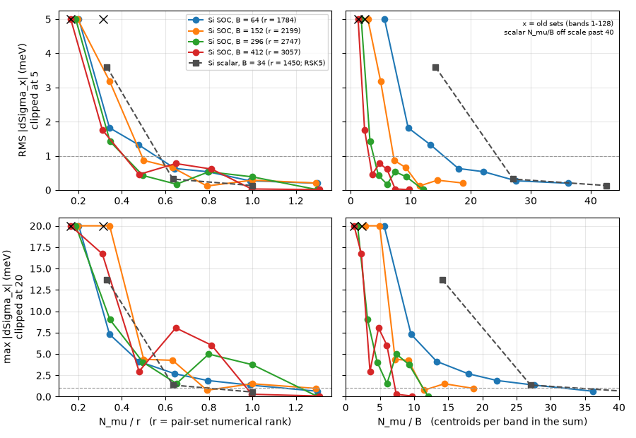
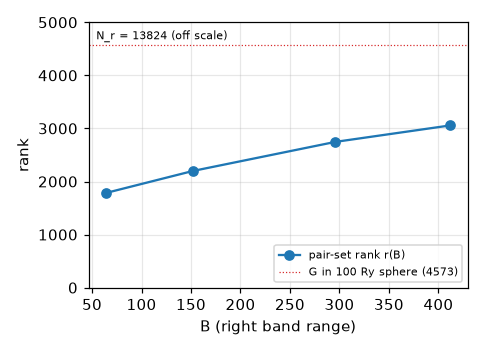
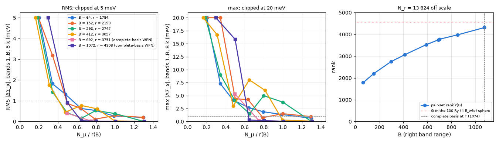

# ISDF exchange accuracy against centroid count and band range

!!! note "Measured"
    Si 4×4×4 SOC, 25 Ry, 460-band NSCF; Perlmutter A100, main ea047c3cc,
    2026-09-26 (sandbox run `runs/Si/110_bandtruth_20260926`, claim 2860).
    The complete-basis section uses a dense-H WFN of the same system
    (sandbox run `runs/Si/113_denseh_20260926`, claim 2865).
    A second system (Si scalar 4³, lane RSK5) is reported beside it.
    Read the numbers as a calibration, not a law.

How many centroids does the ISDF basis need before the bare exchange Σ_x is
exact, and how does that number grow with the band range a Σ sum reaches?
This page measures it against an exact plane-wave Σ_x. How centroids are
chosen is [centroid selection](centroid-selection.md). The ζ fit and V_q are
[ISDF](isdf-zeta-vq.md). The rule "select against the window Σ consumes" is
[basis adequacy](../dev/isdf_basis_adequacy_at_large_nband.md). This page
gives that rule its numbers.

## Definitions

**Pair set.** A ζ fit represents the products \(\psi^*_{m\mathbf k}\psi_{n\mathbf k'}\)
for \(m\) in a left window \(L\) and \(n\) in a right window \(R\)
(`gw_init.zeta_fit_band_ranges`). The left window holds all valence and the
QP window, \(L=[0,b_3)\). The right window holds every band the Σ/χ₀ sums
reach, \(R=[b_1,b_4)\). Here \(L\) = bands 1–24 (8 valence + 16 conduction)
and \(R\) = bands 1–\(B\). The centroids are selected on the same pair set:
`kmeans_cli --fit-window 0:24,0:B`.

**Band range \(B\).** The top of \(R\): the number of bands the Σ sum
includes.

**Pair-set rank \(r(B)\).** The numerical rank of the selector's positive
feature Gram \(K(\mathbf r,\mathbf r')\) (centroid selection, "What is being
optimized?"). The rank counts eigenvalues above \(\sqrt{\epsilon}\) times the
largest diagonal (`centroid/pivoted_cholesky.point_granularity_rank`). It is
measured on a 9000-point candidate pool (request \(N_c=6000\)) and printed as
"achieved numerical rank" in `kmeans.out`. Once \(N_\mu\ge r(B)\), extra points
add no new directions at that tolerance.

**Exact Σ_x.**

$$
\Sigma_x(n,\mathbf k)=-\frac{1}{N_k\Omega}\sum_{\mathbf k'}\sum_{v\le 8}
\sum_{0<|\mathbf Q|^2\le E_c}\bigl|M_{nv}(\mathbf Q)\bigr|^2\frac{8\pi}{|\mathbf Q|^2}
\quad(\text{Ry}),
$$

- \(M_{nv}(\mathbf Q)\) is the plane-wave pair matrix element. It is summed over spinor components and computed by FFT on the WFN box, with no ISDF.
- \(E_c = 25\) Ry is LORRAX's default bare-Coulomb sphere (`bare_coulomb_cutoff` = `ecutwfc`).
- The \(\mathbf Q=0\) head is excluded on both sides.
- The ISDF side runs `compute_mode = x_only`, `head_correction = off` and `mc_average_vcoul_body = false`. That configuration uses the same point Coulomb kernel on the same sphere.

**Error.** \(\Delta\Sigma_x = \Sigma_x^{\rm ISDF}-\Sigma_x^{\rm exact}\) over
the 8 IBZ k and the bands of one window. The tables give the max, the median
and the RMS of \(|\Delta\Sigma_x|\) in meV. Σ_x(n) for a band \(n>8\) is built
from valence × \(n\) pairs only, so it probes exactly the low × high products
that a Σ band sum consumes.

## Summary

- **Selection comes before count.** A basis selected on a different pair set fails at any size. The old 960-point set was weighted on bands 1–128 and is off by 360 meV. A 948-point set selected on the Σ pair set is off by 17 meV.
- **\(N_\mu/r\) is the variable.** Across a 6.4× range of \(B\), the error curves collapse when plotted against \(N_\mu/r(B)\). Against \(N_\mu/B\) they spread by 5×.
- **Where it becomes exact.** At \(N_\mu\approx 1.3\,r\), Σ_x is exact to 0.1 meV. "Every grid point" (\(N_r\)) adds nothing past \(r\), and \(r \le 0.22\,N_r\) here.

**Figure 1.** RMS (top) and max (bottom) of \(|\Delta\Sigma_x|\) over bands 1..B and 8 IBZ k.
- Left column: against \(N_\mu/r(B)\). Right column: against \(N_\mu/B\). Linear axes.
- RMS is clipped at 5 meV and max at 20 meV; clipped points sit on the top edge.
- Crosses are the two old sets (bands 1–128 selection).
- Grey squares are the second system (below), reported by lane RSK5 and not re-measured here.

## Which variable collapses the curves

| B | r(B) | N_μ for RMS ≤ 1 meV | as N_μ/r | as N_μ/B |
|---|---|---|---|---|
| 64 | 1784 | ≈ 990 | 0.55 | 15.5 |
| 152 | 2199 | ≈ 1080 | 0.49 | 7.1 |
| 296 | 2747 | ≈ 1130 | 0.41 | 3.8 |
| 412 | 3057 | ≈ 1250 | 0.41 | 3.0 |

- **RMS ≤ 1 meV.** The threshold sits at \(N_\mu/r = 0.41\)–\(0.55\) for every \(B\). In \(N_\mu/B\) it needs anywhere from 3 to 15.5 centroids per band. A rule stated per band (e.g. "\(N_\mu\approx 6\)–\(14\times n_{\rm band}\)") is therefore too few for small \(B\) and too many for large \(B\).
- **Max ≤ 1 meV.** The max is noisier, set by a few valence states. It needs \(N_\mu/r \approx 1.0\)–\(1.3\).
- **Scatter.** Between \(N_\mu/r = 0.5\) and 1.0 the max scatters by a few meV from one independently selected set to the next.

## Pair-set rank against band range

**Figure 2.** \(r(B)\) for left = bands 1–24. The dotted line is the plane-wave bound: the count of \(\mathbf G\) in the 100 Ry (\(4E_{\rm wfc}\)) sphere, 4512–4584 over the 64 q.

- **Growth.** \(r\) = 1784, 2199, 2747, 3057 at \(B\) = 64, 152, 296, 412. That is sublinear: ×1.71 for ×6.4 in \(B\), fitting \(r \approx 1784\,(B/64)^{0.29}\) within 5 %. The fit is empirical and should not be extrapolated past the sphere bound.
- **Against \(N_r\).** \(r(B)/N_r\) = 0.13–0.22 on the \(N_r = 24^3 = 13\,824\) grid.
- **Saturation.** The rank saturates: requests of 4000 and 6000 points both return rank 3057 at \(B = 412\). A basis of every grid point is therefore numerically the same as about \(1.3\,r\) selected points. Past \(r\), the ζ solve drops the extra directions (`isdf/cplus.factor`, rank truncation at `zeta_rcond` = 1e-8).

## Practical rule

On this system, with the centroids selected on the Σ pair set (`--fit-window` = the ζ fit's left × right windows):

| target | N_μ |
|---|---|
| Σ_x RMS ≤ 1 meV | ≈ 0.5 r(B) |
| Σ_x max ≤ 1 meV | ≈ 1.0–1.3 r(B) |
| Σ_x max ≤ 0.1 meV | ≈ 1.3 r(B) (measured at B = 296, 412; at B ≤ 152 a 0.5–1 meV floor on valence bands 1–8 remains at 1.3 r) |

**Procedure.**
1. Measure \(r(B)\) before choosing \(N_\mu\): run `kmeans_cli` with a large \(N_c\) and the deck's `--fit-window`, and read "achieved numerical rank" in `kmeans.out`. That costs about 30 s on one node here.
2. Take \(N_\mu\) as a fraction of \(r\).

The valence window (bands 1–8) carries the largest error at every \(N_\mu\), because valence–valence pairs have the largest \(|M|^2\) at small \(\mathbf Q\). The high-band windows (153–412) reach 0.1 meV median by \(0.5\,r\).

## Out to the complete basis

A 460-band NSCF stops at B = 412, 36 % of the spinor basis. `psp.run_dense_h`
diagonalizes the dense \(H_{\mathbf k}(sG,s'G')\) on each k's whole 25 Ry sphere
(1074–1176 states per k) and writes the first 1074 bands, which is every state
at Γ. The exact Σ_x above, recomputed on that WFN, matches the 460-band
reference on bands 1–412 to 0.002 meV (claim 2865).

**Figure 3.** Left, middle: RMS and max of \(|\Delta\Sigma_x|\) over bands 1..B against \(N_\mu/r(B)\). Linear axes; RMS clipped at 5 meV, max at 20 meV, clipped points on the top edge. Circles: B ≤ 412 on the QE WFN (Figure 1). Squares: B = 692 and 1072 on the complete-basis WFN. B = 1072 is the complete basis at Γ less its top Kramers pair: the Σ band sum refuses a cut at the WFN extent or through a multiplet. Right: \(r(B)\) up to the complete basis.

| B | r(B) | r / 4573 | N_μ for RMS ≤ 1 meV | N_μ for max ≤ 1 meV |
|---|---|---|---|---|
| 412 | 3069 | 0.67 | ≈ 0.41 r | ≈ 1.0 r |
| 692 | 3751 | 0.82 | ≤ 0.50 r | ≤ 0.75 r |
| 1072 | 4308–4335 | 0.94–0.95 | ≈ 0.50 r | ≤ 0.65 r |

- **The collapse holds to completeness.** At B = 692 and 1072 the curves fall on the B ≤ 412 set in \(N_\mu/r\). At \(N_\mu = r\) the max is 0.1 meV over all 1072 bands, and 0.0 meV at 1.3 r.
- **r(B) approaches the density sphere.** \(r\) grows to 4335 at the complete basis, 0.95 of the 4573 plane waves in the 100 Ry (\(4E_{\rm wfc}\)) sphere. The rank is measured on a candidate pool, so it is a lower bound. On an 8700-point pool, B = 1074 gives 4335; on 6503 points it gives 4167. At B = 412 the pool changes it by 0.3 % (9000 → 13 650 points); at B = 692, by 5.5 % (5670 → 13 650).
- **Consequence.** An all-band Σ_x needs \(N_\mu \approx r \approx N_G(4E_{\rm wfc})\). The ISDF basis is then as large as the plane-wave density basis, and its compression over that basis is gone. What remains is the factor \(N_r/N_G(4E_{\rm wfc}) \approx 3\) between the FFT grid and the sphere. ISDF compresses a truncated band sum: \(r(64) = 0.39\,N_G(4E_{\rm wfc})\).
- **Per band.** At the complete basis 1.0 r is 4 centroids per band, against 27.6 at B = 64.
- **Running it.** The pruner refuses a band window above half the plane-wave basis (`centroid/pivoted_cholesky.py`). The measurement hid that guard in a harness without a source edit. At B ≥ 850 a 13 650-point pool ran out of memory on 40 GB A100s, so the pool was 8700 points.

## Why the old 960-point set failed

The old sets came from a 128-band WFN. They were weighted on the density of bands 1–128, so they never saw the products of bands 129–412, and the valence products were not their target either. The table isolates the selection from the count:

| basis (B = 412) | 1–8 | 9–64 | 297–412 | all |
|---|---|---|---|---|
| 960, old selection | 360 / 98 / 173 | 329 / 23 / 73 | 55 / 4.7 / 9.2 | 360 / 3.8 / 37 |
| 948, selected on 1–24 × 1–412 | 12 / 8.9 / 8.0 | 12 / 1.3 / 2.6 | 17 / 0.5 / 1.3 | 17 / 0.5 / 1.8 |

Entries are max / median / RMS in meV. At the same count, the right selection is 30× better on the valence max. The effect on Σ_c at 412 bands:
- **Size.** The old set moves Σ_c by up to 1.2 eV, with band-edge medians of −55 meV (VB) and +171 meV (CB).
- **Tail.** Its error decays slowly with \(N\): the tail \(S(412)-S(296)\) is −26.6 meV against −5.1 meV on the rank-saturated basis. That produced a spurious slow band tail (local exponent 1.5–2.7 above \(N\approx 236\), against 5.5–6.7 converged).

## Second system: Si scalar 4³ (lane RSK5)

The same measurement was made by lane RSK5 on Si 4³ without SOC:
- 25 Ry, 34 bands, head off, plain v.
- Plane-wave reference: the ISDF-free pipeline.
- Pair set: left 1–4 × right 1–34, \(r = 1450\). The Σ_c pair set 1–34 × 1–34 has rank 1958.
- Evidence: `runs/Si_scalar/38_rsk5_sigma_c_20260926/`.

| N_μ | N_μ/r | N_μ/B | max | RMS (meV) |
|---|---|---|---|---|
| 480 | 0.33 | 14 | 13.7 | 3.6 |
| 920 | 0.63 | 27 | 1.36 | 0.32 |
| 1450 | 1.00 | 43 | 0.54 | 0.13 |
| 1450, ζ fit left widened to 1–34 | 1.00 | 43 | 2.1 | 0.63 |
| 368, not selected on the pair set | 0.25 | 11 | 334 | 83 |

- **Collapse.** In \(N_\mu/r\) the scalar points fall on the SOC curves within about 2× (Figure 1, left). In \(N_\mu/B\) they lie far to the right: the scalar set needs about 32 centroids per band for a 1 meV max, against 7–11 for the SOC set at \(B \ge 296\).
- **SOC against scalar.** The scalar pair set (4 left bands, 34 right) has \(r = 1450\). The SOC set with 24 left spinor bands already has \(r = 1784\) at \(B = 64\). \(r\) absorbs the width of the left window and the spinor structure, which \(N_\mu/B\) cannot see.
- **Narrowing the ζ fit's left range.** Fitting ζ on only the pairs Σ_x uses (left = valence) is 4–5× more accurate at the same points than fitting it on the full 1–34 square. A fit spread over more pairs spends its degrees of freedom on products the consumer never reads. The same presumably holds for the left range 1–24 used above against a 412-band QP window; that case was not measured on the SOC system (inference).

## Full table

Entries are max / median / RMS of \(|\Delta\Sigma_x|\) in meV over 8 IBZ k. N_μ is the number of points written (whole symmetry orbits). "(old)" marks the bands-1–128 sets.

| B | N_mu | N_mu/r(B) | N_mu/B | 1–8 | 9–64 | 65–152 | 153–296 | 297–412 | all bands ≤ B |
|---|---|---|---|---|---|---|---|---|---|
| 64 | 360 | 0.20 | 5.6 | 80.3 / 45.62 / 51.54 | 137.5 / 4.17 / 14.09 | — | — | — | 137.5 / 4.81 / 22.49 |
| 64 | 612 | 0.34 | 9.6 | 4.0 / 1.54 / 1.89 | 7.3 / 0.85 / 1.81 | — | — | — | 7.3 / 0.98 / 1.82 |
| 64 | 852 | 0.48 | 13.3 | 3.9 / 2.65 / 2.79 | 4.1 / 0.53 / 0.94 | — | — | — | 4.1 / 0.60 / 1.32 |
| 64 | 1148 | 0.64 | 17.9 | 1.8 / 0.70 / 0.89 | 2.7 / 0.28 / 0.58 | — | — | — | 2.7 / 0.32 / 0.63 |
| 64 | 1416 | 0.79 | 22.1 | 1.7 / 1.27 / 1.27 | 1.9 / 0.18 / 0.32 | — | — | — | 1.9 / 0.20 / 0.54 |
| 64 | 1764 | 0.99 | 27.6 | 1.4 / 0.23 / 0.65 | 0.5 / 0.08 / 0.15 | — | — | — | 1.4 / 0.09 / 0.27 |
| 64 | 2316 | 1.30 | 36.2 | 0.6 / 0.46 / 0.46 | 0.5 / 0.05 / 0.12 | — | — | — | 0.6 / 0.06 / 0.20 |
| 152 | 432 | 0.20 | 2.8 | 192.4 / 32.89 / 110.05 | 153.7 / 9.86 / 19.16 | 27.8 / 3.32 / 6.88 | — | — | 192.4 / 4.99 / 28.29 |
| 152 | 756 | 0.34 | 5.0 | 18.0 / 8.70 / 10.34 | 22.0 / 1.45 / 3.01 | 6.5 / 0.83 / 1.42 | — | — | 22.0 / 1.08 / 3.18 |
| 152 | 1100 | 0.50 | 7.2 | 4.4 / 2.48 / 2.46 | 2.3 / 0.38 / 0.73 | 3.8 / 0.27 / 0.64 | — | — | 4.4 / 0.35 / 0.87 |
| 152 | 1392 | 0.63 | 9.2 | 4.3 / 1.57 / 2.62 | 1.7 / 0.16 / 0.38 | 0.7 / 0.09 / 0.18 | — | — | 4.3 / 0.13 / 0.66 |
| 152 | 1740 | 0.79 | 11.4 | 0.8 / 0.12 / 0.34 | 0.3 / 0.07 / 0.10 | 0.4 / 0.04 / 0.08 | — | — | 0.8 / 0.05 / 0.12 |
| 152 | 2196 | 1.00 | 14.4 | 1.5 / 1.16 / 1.08 | 0.7 / 0.08 / 0.20 | 0.6 / 0.04 / 0.10 | — | — | 1.5 / 0.05 / 0.29 |
| 152 | 2844 | 1.29 | 18.7 | 1.0 / 0.80 / 0.80 | 0.4 / 0.05 / 0.13 | 0.3 / 0.02 / 0.06 | — | — | 1.0 / 0.04 / 0.20 |
| 296 | 516 | 0.19 | 1.7 | 139.8 / 18.56 / 75.86 | 144.1 / 13.15 / 22.72 | 27.3 / 6.41 / 9.37 | 27.3 / 3.73 / 6.66 | — | 144.1 / 5.56 / 17.34 |
| 296 | 948 | 0.35 | 3.2 | 9.0 / 4.50 / 5.73 | 5.7 / 1.29 / 1.83 | 3.5 / 0.44 / 0.82 | 8.0 / 0.37 / 0.80 | — | 9.0 / 0.48 / 1.42 |
| 296 | 1364 | 0.50 | 4.6 | 4.0 / 1.62 / 2.30 | 1.7 / 0.13 / 0.29 | 0.6 / 0.12 / 0.17 | 1.1 / 0.08 / 0.16 | — | 4.0 / 0.10 / 0.42 |
| 296 | 1788 | 0.65 | 6.0 | 1.5 / 0.54 / 0.80 | 1.3 / 0.06 / 0.17 | 0.4 / 0.04 / 0.08 | 1.1 / 0.04 / 0.09 | — | 1.5 / 0.04 / 0.17 |
| 296 | 2196 | 0.80 | 7.4 | 5.0 / 0.99 / 2.86 | 3.9 / 0.11 / 0.46 | 0.9 / 0.03 / 0.11 | 2.4 / 0.03 / 0.20 | — | 5.0 / 0.04 / 0.53 |
| 296 | 2748 | 1.00 | 9.3 | 3.7 / 0.59 / 2.06 | 2.9 / 0.06 / 0.30 | 0.7 / 0.03 / 0.09 | 2.1 / 0.03 / 0.17 | — | 3.7 / 0.03 / 0.38 |
| 296 | 3564 | 1.30 | 12.0 | 0.1 / 0.02 / 0.03 | 0.0 / 0.01 / 0.02 | 0.0 / 0.01 / 0.01 | 0.0 / 0.00 / 0.01 | — | 0.1 / 0.01 / 0.01 |
| 412 | 504 | 0.16 | 1.2 | 1308.7 / 886.35 / 899.88 | 579.7 / 102.98 / 185.63 | 173.7 / 35.49 / 41.82 | 74.5 / 13.40 / 19.15 | 113.3 / 9.32 / 20.41 | 1308.7 / 20.06 / 145.01 |
| 412 | 948 | 0.31 | 2.3 | 12.2 / 8.93 / 7.98 | 12.1 / 1.26 / 2.64 | 3.9 / 0.57 / 0.83 | 7.3 / 0.39 / 0.89 | 16.7 / 0.51 / 1.32 | 16.7 / 0.53 / 1.76 |
| 412 | 1464 | 0.48 | 3.6 | 2.8 / 1.36 / 1.76 | 2.7 / 0.39 / 0.71 | 1.0 / 0.12 / 0.26 | 2.2 / 0.11 / 0.28 | 3.0 / 0.12 / 0.37 | 3.0 / 0.14 / 0.46 |
| 412 | 1980 | 0.65 | 4.8 | 8.0 / 1.10 / 4.20 | 6.5 / 0.28 / 0.74 | 3.0 / 0.11 / 0.38 | 4.2 / 0.07 / 0.38 | 5.8 / 0.07 / 0.60 | 8.0 / 0.09 / 0.77 |
| 412 | 2484 | 0.81 | 6.0 | 6.0 / 0.70 / 3.29 | 4.1 / 0.16 / 0.52 | 2.6 / 0.09 / 0.34 | 3.4 / 0.06 / 0.28 | 5.4 / 0.08 / 0.51 | 6.0 / 0.08 / 0.61 |
| 412 | 3048 | 1.00 | 7.4 | 0.2 / 0.10 / 0.13 | 0.3 / 0.03 / 0.06 | 0.1 / 0.01 / 0.01 | 0.0 / 0.01 / 0.01 | 0.1 / 0.01 / 0.02 | 0.3 / 0.01 / 0.03 |
| 412 | 3996 | 1.31 | 9.7 | 0.1 / 0.05 / 0.05 | 0.0 / 0.01 / 0.02 | 0.0 / 0.01 / 0.01 | 0.0 / 0.00 / 0.01 | 0.0 / 0.00 / 0.01 | 0.1 / 0.00 / 0.01 |
| 412 | 504 (old) | 0.16 | 1.2 | 1120.3 / 474.68 / 591.54 | 938.0 / 107.46 / 223.66 | 150.8 / 28.92 / 45.30 | 73.3 / 12.58 / 18.45 | 80.0 / 7.34 / 15.34 | 1120.3 / 16.24 / 119.24 |
| 412 | 960 (old) | 0.31 | 2.3 | 360.0 / 98.45 / 172.62 | 329.4 / 23.05 / 72.64 | 91.3 / 3.96 / 11.27 | 27.8 / 1.83 / 4.95 | 55.0 / 4.73 / 9.18 | 360.0 / 3.81 / 36.81 |

## Caveats

- **Systems.** Two, both Si 4×4×4 at 25 Ry (\(N_r = 24^3 = 13\,824\)): SOC, measured here, and scalar, from RSK5. The ratio \(N_\mu/r\) should transfer to other systems better than absolute counts or \(N_\mu/B\). That is an inference; other materials and cutoffs have not been measured.
- **Pair set.** Left = the QP window (24 SOC bands) or the valence (4 scalar bands). A wider left window raises \(r(B)\), and the rule is stated in \(r\) for that reason.
- **Σ_x only.** Σ_c sums the same pair densities, weighted by W instead of v. On the SOC deck (GN-PPM, W at 64 bands, Σ at 412), truth curves on 948 and 1980 selected points agree with the rank-saturated 3996-point curve:
  - to 1–3 meV median and at most 28 meV max in \(\Sigma_c(N)\);
  - to 1.6 meV in the tail \(S(412)-S(296)\).
  The old 960 set, off by 360 meV in Σ_x, moves \(\Sigma_c(412)\) by up to 1.2 eV.
- **How it was run.** The measurement uses `head_correction = off` and `write_restart_tensors = false`.
