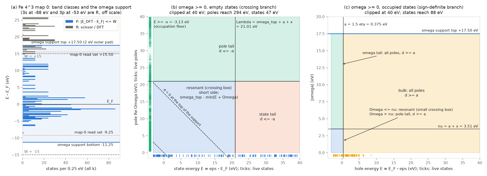

# Σ band classes, the ω support and the window boxes

**Status: proposed design, not implemented, for owner review.** It carries
the owner's ruling on padding (2026-09-27). If adopted, it replaces:
- the band treatment of [Self-consistency §2](../self_consistency.md#2-band-treatment);
- the window plan, the held rules and the out-of-grid policy of
  [§4](../self_consistency.md#4-grid-and-quadrature-across-maps);
- the grid-edge switch of §5;
- §9 of [the Σ(ω) quadrature problem](sigma-quadrature-problem.md#9-self-consistent-maps).

The product partition (§4 of that page) is unchanged. The measurements are
in sandbox claim 2884.

**The design.** One plan is made at iteration 0 and never changes. It fixes
the band classes, the ω support, the product windows and one rule per window.
- The support is the protected range plus the read stencil. Only the outer
  sides of the two crossing windows are padded, by 2 eV: upward at the top
  conduction edge, downward at the bottom valence edge.
- Every box comes from the partition's selector bounds on that support.
- No map repads, grows, extends, re-plans or refits.
- One check runs, at the fixed point.

*Fe 4³ charge, map 0, W = 15 eV, η = 0.25 eV, k_BT = 0.02 Ry. (a) The DFT
spectrum, split into the protected class P (|E − E_F| ≤ W) and the rotating
class R. The solid lines are the planned support. The dotted lines are map
0's read set, P ± 0.5 eV. (b) The crossing branch of the ω ≥ 0 half (empty
states) in the (E, Re Ω) plane, with ticks at the live states and poles. The
dashed lines are d = 0 at ω = 0 and at the top of the support. The resonant
crossing box lies between them, and both tails keep |d| ≥ a. (c) The
sign-definite branch of the same half (occupied states) in the (E, |ω|)
plane. Panels (b) and (c) are clipped at 40 eV. The ω < 0 half mirrors them,
with empty and occupied states exchanged.*

## 1 Band classes

$$
P = \{(k,n) : |E^{\rm DFT}_{nk} - E_F| \le W\}\ \text{closed over multiplets at each }k,
\qquad R = \text{every other band} < \texttt{number\_bands}.
$$

P is decided once, on the DFT ladder. W is `sigma_window_ev`.

| block | entry of $H'$ in the DFT basis |
|---|---|
| P–P | $E^{\rm DFT}\delta_{ij} + \Delta V_{H,ij} + \Sigma^{\rm QSGW}_{ij}$, with $\Sigma^{\rm QSGW}_{ij} = \tfrac12\,\mathrm{herm}[\Sigma_{ij}(E_i) + \Sigma_{ij}(E_j)] - V^{xc}_{ij}$; every off-diagonal is kept |
| R–R | diagonal only: $E^{\rm DFT}_j + \beta_{s(j)}$ (§6); β = 0 below the active depth |
| P–R | 0 |

- **Σ is read only at P energies.** Every Σ(E) a map reads belongs to a P
  state at a P energy. So there is no out-of-grid rule, no Σ(0) read and no
  grid-edge switch.
- **Everything outside P is R.** The former Σ-window tail, the sum-band tail
  and `sc_frozen_core_bands` all become R. They differ only in β, and they
  stay in the Σ_x and χ₀ sums.

**Where the class edge may sit.** Dropping the P–R block is exact only if
the R states that couple to P lie well above the edge. On Fe 4³ (§7) a
manifold at +16 to +17.5 eV couples to the d states through DFT-basis
elements of up to 2.4 eV.
- **W = 15** cuts through that manifold. At map 0 the error within 1 eV of
  E_F is 64 meV with no coupling (C). Keeping only the on-grid half of the
  coupling (B) makes it 107 meV.
- **W = 17.5, which protects the manifold,** brings both down to 0.0 meV
  within 0.5 eV of E_F. Within 1 eV the max is 8.8 meV (C) and 5.4 meV (B),
  set by one state at −0.75 eV whose k has R states at +20.3 and +23 eV.
  W = 25 leaves no R on this deck and reproduces the reference. With a
  1 meV budget on the ±1 eV shell, this deck therefore needs W = 25; on the
  ±0.5 eV shell W = 17.5 is enough.

Two consequences follow.
- **The on-grid half is not a usable coupling.** The QSGW element needs
  Σ_PR(E_R), and R reads no Σ.
- **The edge needs a certificate.** Map 0 can supply one. For each P
  state,

$$
\delta^{(2)}_i = \sum_{j\in R} \frac{|H_{ij}|^2}{E_i - E_j},
\qquad H_{ij} = \mathrm{herm}\,\Sigma_{ij}(E_i) - V^{xc}_{ij},
$$

  is its second-order shift from the dropped block. It is evaluated once on
  the map-0 grid, where every i ∈ P has its Σ. Its one extra cost is
  projecting the P rows of Σ onto the R columns at map 0. On Fe, Σ at E_i
  alone overstates |H_ij| against the QSGW half-sum, so there the estimate
  errs on the safe side. It is a proposal: it has not yet been compared with
  the measured C errors. If max δ⁽²⁾ over the states within 1 eV of E_F
  exceeds the budget, the plan refuses (`GATE sigma_class_edge_coupling`),
  naming the P states and the R partners that carry the shift. W is the
  dial, and it is never raised silently.

## 2 The ω support, planned once

$$
S = \Big[\min_{P} E^{\rm DFT} - h - p,\ \ \max_{P} E^{\rm DFT} + h + p\Big],
\qquad h = 0.5\ \mathrm{eV},\ \ p = 2\ \mathrm{eV}.
$$

- **h is the read half-width.** An SC map reads Σ only at its input energies
  $E^{\rm in}$ and the Z stencil ±h (`eqp_bgw.Z_FINITE_DIFFERENCE_EV`). It
  never solves the QP equation, so map n reads exactly
  $\mathcal R_n = \bigcup_{i\in P}[E^{\rm in}_{i,n} - h, E^{\rm in}_{i,n} + h]$.
- **p is the owner's allowance for the gap shift** (2026-09-27). It is
  applied only to the outer sides of the crossing windows: above the top
  conduction edge and below the bottom valence edge. It is never applied
  inside and never re-applied. Its job is to keep later read sets inside S,
  so that no map has to recompile.
- **S is measured from the current E_F** and sampled on the deck step. The
  deck edges `sigma_omega_min_ev` and `sigma_omega_max_ev` stop setting it.
- **Measured S:** Fe 4³ W15 [−11.25, +17.50] eV; Na 8³ W10 [−6.0, +12.5];
  MoS₂ 3×3 W10 [−9.25, +12.5]; Si 4³ W10 [−12.5, +12.5]. A metal's lower
  edge follows its band bottom (Fe −8.5 eV, Na −3.3 eV), not −W.
- **What p costs:** about 25–30 τ pairs per map per eV, over both halves.
  Against p = 0 that is +52 pairs on Fe, +53 on Na and +62 on MoS₂.

## 3 Boxes from selector bounds

On one plan the partition edges are constants:

$$
\Lambda_\pm = \omega_\pm + a + X,\qquad \nu = a + X,\qquad a = 1.5\,\eta,\qquad
X = k_BT\,\ln(1/f_{\rm floor})\ \ (0 \text{ for step occupations}).
$$

ω± are the edges of S. f_floor is `efermi.OCCUPATION_WEIGHT_FLOOR` = 10⁻⁵,
so X bounds every occupation-weighted state's wrong-side excursion: 3.13 eV on
Fe, 1.57 eV on Na. X follows the occupation scheme, not the material class,
so a metal ↔ insulator flip leaves the plan unchanged.

A window owns a state interval, a pole interval and an |ω| interval. Its box
is the range of d = ω − σ_b(E + Re Ω) over those intervals, cut to:

| edge | value | why it holds on every map |
|---|---|---|
| state floor | E ≥ −X | the occupation floor |
| pole floor | Re Ω > 0, or the selector edge Λ or ν | causal poles; the selectors |
| finite selector edges | Λ±, ν, a | S and X are fixed |
| far edge of an open selector | 4 × the map-0 top band; 4 × the map-0 top pole | a declared ceiling, checked at the fixed point |
| short side of an insulator's crossing box | the window's map-0 min(E + Re Ω) | the GW trend (the gap opens), checked at the fixed point |
| imaginary extent | η + [γ_min, γ_max] of the pole model; for shared real poles γ = 0 | the pole model |

The builder's 2 % margin (`sigma_box_plan._box`) stays, because it belongs
to the rule construction. Members are re-selected on every map. A state or
pole that crosses a selector edge changes window, and the new window's box
already covers it. Three consequences:

- **Every sign-definite box keeps |d| ≥ a on its zero side, by algebra.**
  A crossing-branch pole-tail tuple has d ≤ ω₊ − (−X) − Λ₊ = −a. No zero-side
  cap and no gap floor is needed.
- **A metal's crossing short side is ω_h + X.** A member box pays
  ω_h + x − Ω_min, so the design costs Ω_min (0.1–0.4 eV on Fe and Na, 2–3
  nodes per box) plus X − x (0.64 eV on Fe's occupied branch, 18 pairs).
- **An insulator's crossing short side uses the trend bound.** The provable
  bound E + Re Ω ≥ 0 would add 2.6 eV on MoS₂ (+61 pairs; Si +22). The trend
  holds for the sum only: on MoS₂ the valence E_min fell from 0.85 to 0.41 eV
  at map 1, while min(E + Re Ω) rose by at least 1.6 eV on every map. That is
  why insulator zero sides use the provable E ≥ 0.

**Checked on stored maps.** PAIRWIN's dumped trajectories were re-selected
with the fixed map-0 edges. Every member stayed inside its design box on Fe
maps 1–3, Na maps 1–2 and MoS₂ maps 1–3. On those trajectories R states move
more than a scissor would move them, because they read Σ at the clamped
edge.

## 4 Held maps: no changes after the plan

- **Rules and executables are built once.** Each rule is built once
  (derived rules, 0.3–1.4 s cold; claim 2880), and the window executables
  are compiled once. Every later map reuses them.
- **A P state outside S reads the edge.** A P state whose read set leaves S
  on an iterate reads Σ at the edge it crossed (clamp). The map stays
  continuous in H, so the Anderson history stays valid, and each map logs
  how many states it clamped.
- **A member outside its box stays on its rule.** It is evaluated with the
  planned rule, uncertified but continuous, and the log names the window.
  With fixed S and X this can happen only at a declared ceiling or at an
  insulator's short side.
- **The binding check runs at CONVERGED.** Every P read set must lie in S,
  and every window's members must lie in its box.
- **One rebuild, then refuse.** On a failed check the plan is rebuilt once,
  around the converged input, with the same h and p, and the loop continues.
  A second failure refuses (`GATE sigma_plan_fixed_point`, naming the state
  or window).

Why a rebuild and not a refusal: the quantity that must be right is the
fixed point, not the trajectory.
- **The rebuild centres on the answer.** A plan that misses the fixed point
  is a planning error, and the converged energies are the answer. A plan
  centred on them contains them, unless the fixed point moves by more than p
  when the plan changes.
- **A refusal would waste a converged run.** It would discard the run for an
  error the code can repair.
- **Mid-trajectory events are never repaired.** Each would be a jump in F,
  and most are transient. On Fe at W = 10 the top P state went 9.58 eV (DFT)
  → 8.62 (map-1 input) → 10.98 (map 2). A small map-1 pad had to extend at
  map 2, while the 2 eV map-0 pad held (claim 2876 legs).

**Expected rebuilds.** Fe and Na held P inside S on every stored map, with
margins of at least 1.3 and 2.0 eV. MoS₂ did not. Its top P state (DFT
+9.94 eV) sat at +13.4 to +13.6 eV on maps 1–3, 1.6 eV past S, so that deck
would clamp there and rebuild once if its fixed point stays there.

## 5 The one-shot

The one-shot reads Σ at $E^{\rm DFT} \pm h$ and solves the QP equation. Its
root lies in $[E^{\rm DFT}, \mathrm{eqp0}]$ (UNIFY M2). That bracket points
outward at the support edges, the same direction as p. There are two
options:

| option | one-shot support | SC map 0 = one-shot | cost |
|---|---|---|---|
| **pays the SC pad** (recommended) | S | bitwise | +52 to +62 pairs on its one map. Si 4³: 453 against 403 law pairs |
| **read set only** | P ± h | no; differs by rule noise, ≤ 0.04 meV median and 0.64 meV max between rule families (claim 2880) | 403 on Si. A root bracket past P ± h then needs an on-demand second pass restricted to the ω half it needs, costing about 40 % of a map |

Recommended: the one-shot pays the pad. The pad is the root bracket's own
direction (conduction up, valence down) and its own size (the 1–2 eV gap
shift). So in a one-shot it buys the answer's root, not only the identity.
It also keeps the bitwise test
`test_sc_iteration1_equals_one_shot`. At an SC fixed point the bracket
collapses into $\mathcal R_n$ and needs nothing more.

## 6 Shared-pole support and the scissor interface

**Shared-pole support.** Today the line sites cover the levels within ±5 eV
of E_F at offsets ±5 eV (`support_delivery_window_ev`), and states outside
that window are not converged in the model (claim 2868). In the design the
evaluated energies are the samples of S. The Σ plan and the W model then
read one owner, and every protected state is delivered. The recipe hash
changes, so shared-pole restarts rebuild once.

**Scissor.** The rigid shift of each side s is a function of the P states on
that side:

$$
\beta_s = \mathcal S\big(\{\delta_i, Z_i\}_{i\in P,\ s(i)=s}\big),\qquad s \in \{\text{above } E_F,\ \text{below } E_F\},
$$

with δ_i the QP correction of P state i and Z_i its renormalization.
- **Windows see β only through the R energies** $E^{\rm DFT}_j + \beta_{s(j)}$.
  These lie inside the 4× ceilings for any |β| below the band-set width. The
  support never reads R.
- **The law 𝒮 is a separate decision.** The candidates are today's
  Z-weighted mean of the conduction corrections and the DFT-basis diagonal
  of the QSGW correction.
- **The leak correction adds nothing here.** With the P–R block empty, the
  leak weight w_i is 0, so (δ_i − w_i β)/(1 − w_i) reduces to the plain fit.
- **Semicore stays at DFT.** β = 0 below the active depth
  (`shared_pole_recipe.active_band_mask`, E_F − 15 eV).

## 7 Measurements

**τ pairs per map.** These are QUADTHEORY's count laws on PAIRWIN's dumped
spectra and poles for every map (main 35468d927, ε = 3·10⁻⁵, η = 0.25 eV,
today's clamp decks). The laws sit about 5 % below the production
derived-rule counts. Today's receipts are given for calibration.

| deck | today, map 0 | today, held: main / QUADWIRE (receipts) | design, map 0 / held | design vs today held (main, QUADWIRE) |
|---|---|---|---|---|
| Fe 4³ charge SC, W 15 | 742 | 893 / 850 (942 / 903) | **761** / 761 | −15 %, −10 % |
| Na 8³ SC, W 10 | 513 | 663 / 632 (622 / 669) | **546** / 546 | −18 %, −14 % |
| MoS₂ 3×3 SC, W 10 | 318 | 395 / 384 (434 / 374) | **331** / 341 | −14 %, −11 % |
| Si 4³ one-shot, W 10 | 409 | – | **453** (403 without the pad) | – |

- **Where the saving comes from.** Most of it is S: a metal's lower edge is
  the band bottom, and there is no double pad at the top.
- **What the selector bounds cost.** Against the member boxes on the same S
  they cost +75 pairs on Fe, +81 on Na and +20 on MoS₂. That is the price of
  never refitting.
- **Held maps on the fixed S:** 0 escapes and 0 refits, and nothing compiles
  after map 0.
- **CrI₃ 8×8 is missing.** It has no stored dump, and its SC-2 turns metallic
  at map 1 without converging (claim 2880).

**Band classes, Fe 4³, map 0.** Each cell is eqp0 minus the all-requested
reference, as mean / std / max in meV. The 3s/3p semicore is identical in
every arm. Maps 1–2 of this deck are dominated by the trajectory, because
the reference itself 2-cycles.

| arm | W (eV) | R states above W | \|E−μ\| ≤ 0.5 eV | \|E−μ\| ≤ 1 eV | τ pairs, map 0 |
|---|---|---|---|---|---|
| today: R reads Σ(0) and mixes | 15 | – | −0.0 / 0.1 / 0.3 | −7.4 / 20.0 / 71.7 | 734 |
| B: P–R = herm Σ_PR(E_P) | 15 | 46 | −19.4 / 35.2 / 106.8 | −21.7 / 34.9 / 106.8 | 734 |
| C: P–R = 0 | 15 | 46 | +10.3 / 20.0 / 56.6 | +11.7 / 21.6 / 63.9 | 734 |
| C | 17.5 | 22 | 0.0 / 0.0 / 0.0 | +0.4 / 1.6 / 8.8 | 773 |
| B | 17.5 | 22 | 0.0 / 0.0 / 0.0 | −0.2 / 1.0 / 5.4 | 773 |
| C | 20 | 14 | 0.0 / 0.0 / 0.0 | +0.4 / 1.6 / 8.8 | 806 |
| B | 20 | 14 | 0.0 / 0.0 / 0.0 | −0.2 / 1.0 / 5.4 | 806 |
| B, C | 25 | 0 | 0 | 0 | 875 |
| reference: every state requested | – | 0 | 0 | 0 | 875 |

- **Why today's arm is good in the ±0.5 eV shell.** Its grid reaches
  +17 eV, so the R states at 16.2–17.0 eV read their own Σ and keep exact
  couplings. One off-grid state at +17.46 eV reads Σ(0), moves by 4.5 eV and
  pulls a d state at −1.36 eV by −184 meV.
- **B and C put the R states close.** Their R states land within 0.34 eV of
  the reference, where Σ(0) is 2.4 eV off. Their error is the coupling
  itself.

The scripts are in the sandbox:
`runs/DEV/565_windesign_20260927/scripts/{geometry,replan,figure}.py` and
`val_*.py`.

## 8 What this deletes

Line numbers are on main 05b2e4f73.

| site | what goes |
|---|---|
| `gw/scissor.py:289-293` | `sc_state_pad_ev`, 0.5 eV + 10 % \|E − μ\| |
| `gw/scissor.py:314` | `sc_padded_window_ev`, the clamp admission (W + 0.5)/0.9 |
| `gw/scissor.py:331-345` | `SC_WINDOW_PAD_EV`, `SC_WINDOW_PAD_FRACTION`, `sc_window_pad_ev` |
| `gw/scissor.py:359-462` | `grow_sigma_support_ev`, `extend_sc_omega_grid_ev` |
| `gw/scissor.py:233` | `apply_conduction_scissor_to_tail`, which becomes the R diagonal of §1 |
| `gw/gw_jax.py:852` | `_oneshot_sampled_support`; the one-shot reads the plan's S |
| `gw/sc_iteration.py:2643-2700` | `_sc_sampled_support`: the plan, re-plan, hold and extend events |
| `gw/sigma_box_plan.py:61, 65, 1199` | `_SC_POLE_PAD_FRACTION`, `_SC_ZERO_SIDE_CAP`, `_SC_FAR_POLE_FACTOR` |
| `gw/sigma_box_plan.py:1179, 1202-1300, 1330` | `_box_escape_reasons`, `_sc_padded_box_spec`, `_escape_attribution` |
| `gw/sigma_box_plan.py:1388-1550` | `_fit_fixed_sc_rules`: escape refits, validity refits and the class-flip re-initialization. A single plan-time build remains |
| `gw/sigma_box_plan.py:204, 1766-1778` | the live excursion and `sc_selector_gap_ry`; X and a replace them |
| `gw/mpa/sigma_windows.py:87` | `sigma_pole_edges` reads S and X, not the live grid and excursion |
| `gw/gw_config.py:1678` | `sigma_out_of_grid` (cover / clamp / static) refuses by name; `sigma_omega_min_ev` and `sigma_omega_max_ev` stop setting the support |
| `gw/qsgw_utils.py:58, 123` | the Σ(0) branch of `sigma_eval_omega`; `sigma_grid_edge_ambiguity` |
| `gw/shared_pole_recipe.py:40, 1043` | `support_delivery_window_ev`; the recipe reads S |
| branch `fix/sigma-window-requested-states-2026-09-27` (`gw/qp_support.py`) | the hold and extension path (`hold_support_ev`, `SUPPORT_BUFFER_EV`, the map-1 pad). Its requested-set owner stays and computes S |

When this lands, rewrite Self-consistency §2, §4 and §5, and the quadrature
page's §9.

## 9 Decisions for the owner

1. The one-shot pays the SC pad (§5; recommended) or reads its read set only.
2. The class-edge certificate of §1: its budget (1 meV proposed), with W as
   the one dial.
3. The insulator crossing short side: the trend bound (proposed) or the
   provable bound, which costs +61 pairs on MoS₂ and +22 on Si.
4. The far ceilings at 4× the map-0 extremes. Going from 2× to 4× costs
   +8–9 pairs per map. Fe's top shared pole reached 0.94 of the 2× ceiling
   at map 1.

## Appendix A: re-planning every map, and why it was not chosen

Because each map's read set $\mathcal R_n$ is known before the map runs, a
map could plan exactly on it: support $\min_P E^{\rm in} - h$ to
$\max_P E^{\rm in} + h$ with no pad, and member boxes snapped outward to a
0.25 eV lattice, so that the plan is piecewise constant in $E^{\rm in}$. The
executor already runs `n_active` nodes of a padded capacity
(`ppm_accumulators.integrate_window`), so padding the node count costs no
pairs. Only a raised capacity, or a longer ω axis, recompiles.

| deck | re-plan every map: mean (per map) | re-plan, selector boxes | plan once (the design) | capacity raises: re-plan / design |
|---|---|---|---|---|
| Fe 4³ W15 | 632 (631, 661, 601, 637) | 718 | 761 | 3 / 0 |
| Na 8³ W10 | 410 (413, 409, 409) | 487 | 546 | 0 / 0 |
| MoS₂ 3×3 W10 | 239 (258, 225, 242, 231) | 328 | 341 | 2 / 0, plus 1 rebuild |
| Si 4³ one-shot | 381 | 414 | 453 | – |

Re-planning saves 16–30 % of the pairs. It was not chosen for three reasons.
- **F changes as a function.** Its rule set steps when a member extremum or
  a support edge crosses a lattice line. Near convergence that happens on
  about 1 % of maps, and each step is the difference between two certified
  rules (≤ 0.64 meV between rule families, claim 2880). `sc_tol_ev` is
  0.1 meV, so a late step costs an extra map, and a fixed point on a lattice
  line could alternate between two rule sets.
- **It recompiles on early maps.** A 1.25× capacity margin at map 0 removes
  most of the raises; MoS₂ keeps one.
- **It plans every map.** That is cheap from the rule table but not free:
  Na's first plan builds a 1419-node box in 8.2 s.

Plan-once makes F one fixed function after iteration 0, which is what the
Anderson history and the CONVERGED test assume.
